# FastGuy — ERD schema hiện hành

## 1. Phạm vi, nguồn chuẩn và cách đọc

Tài liệu mô tả **39 bảng** SQL Server của `FastGuyDB` tại mốc migration `065_warehouse_operations_redesign`. Nguồn đối chiếu: `database/init.sql`, `database/DB_FastGuy.sql`, migrations đến 065 và mapping JPA. Không có kết nối runtime database; vì vậy đây là mô hình theo mã nguồn. `init.sql` là baseline tái tạo hiện hành; sai lệch với baseline còn lại được nêu tại mục 7.

Trong data dictionary, cột “Ràng buộc cột” giữ nguyên biểu thức DDL. Ràng buộc nhiều cột nằm dưới từng bảng. Cardinality không đặt trong Mermaid mà nằm ở mục 4.

## 2. Danh mục 39 bảng

| Nhóm | Bảng |
|---|---|
| Danh mục và bán hàng | `Category` |
| Danh mục và bán hàng | `Product` |
| Danh mục và bán hàng | `ProductVariant` |
| Danh mục và bán hàng | `ProductModifierGroup` |
| Danh mục và bán hàng | `ProductModifierOption` |
| Danh mục và bán hàng | `Banner` |
| Người dùng và cấu hình | `Users` |
| Người dùng và cấu hình | `Address` |
| Người dùng và cấu hình | `PasswordResetToken` |
| Người dùng và cấu hình | `ShippingConfig` |
| Người dùng và cấu hình | `ActivityLog` |
| Giỏ hàng, đơn, thanh toán và khách hàng | `Cart` |
| Giỏ hàng, đơn, thanh toán và khách hàng | `CartItem` |
| Giỏ hàng, đơn, thanh toán và khách hàng | `Orders` |
| Giỏ hàng, đơn, thanh toán và khách hàng | `OrderItem` |
| Giỏ hàng, đơn, thanh toán và khách hàng | `OrderStatusHistory` |
| Giỏ hàng, đơn, thanh toán và khách hàng | `PaymentAttempt` |
| Giỏ hàng, đơn, thanh toán và khách hàng | `Coupon` |
| Giỏ hàng, đơn, thanh toán và khách hàng | `CouponRedemption` |
| Giỏ hàng, đơn, thanh toán và khách hàng | `Review` |
| Giỏ hàng, đơn, thanh toán và khách hàng | `LoyaltyTransaction` |
| Kho và nhập hàng | `InventoryItem` |
| Kho và nhập hàng | `VariantInventoryItem` |
| Kho và nhập hàng | `Recipe` |
| Kho và nhập hàng | `RecipeItem` |
| Kho và nhập hàng | `InventoryReservation` |
| Kho và nhập hàng | `InventoryReservationItem` |
| Kho và nhập hàng | `InventoryReservationLegacyHistory` |
| Kho và nhập hàng | `InventoryTransaction` |
| Kho và nhập hàng | `GoodsReceipt` |
| Kho và nhập hàng | `GoodsReceiptItem` |
| Kho và nhập hàng | `StockCount` |
| Kho và nhập hàng | `StockCountItem` |
| Nhân sự và tài chính | `WorkShift` |
| Nhân sự và tài chính | `StaffPayRate` |
| Nhân sự và tài chính | `CodSettlement` |
| Nhân sự và tài chính | `OperatingExpense` |
| Nhân sự và tài chính | `FixedAsset` |
| Kỹ thuật | `SchemaMigrationHistory` |

## 3. ERD Level 1

Sơ đồ dưới đây chứa đủ 39 thực thể hiện hành. Mỗi node chỉ hiển thị tên thực thể; nhãn cạnh là động từ tiếng Anh mô tả quan hệ nghiệp vụ. Cardinality và khóa ngoại được trình bày riêng tại mục 4.

```mermaid
flowchart TB
    subgraph Infrastructure[Infrastructure]
        SchemaMigrationHistory
    end

    subgraph Identity[Identity and configuration]
        Users
        Address
        PasswordResetToken
        ShippingConfig
        ActivityLog
    end

    subgraph Catalog[Catalog and sales]
        Category
        Product
        ProductVariant
        ProductModifierGroup
        ProductModifierOption
        Banner
    end

    subgraph Commerce[Cart, orders, payment and engagement]
        Cart
        CartItem
        Coupon
        Orders
        PaymentAttempt
        CouponRedemption
        OrderItem
        Review
        LoyaltyTransaction
        OrderStatusHistory
    end

    subgraph Warehouse[Inventory and warehouse]
        InventoryItem
        VariantInventoryItem
        Recipe
        RecipeItem
        InventoryReservation
        InventoryReservationLegacyHistory
        InventoryReservationItem
        GoodsReceipt
        GoodsReceiptItem
        StockCount
        StockCountItem
        InventoryTransaction
    end

    subgraph Workforce[Workforce and finance]
        WorkShift
        StaffPayRate
        CodSettlement
        OperatingExpense
        FixedAsset
    end

    Category -- "has" --> Product
    Product -- "has" --> ProductVariant
    Product -- "has" --> ProductModifierGroup
    ProductModifierGroup -- "contains" --> ProductModifierOption

    Users -- "has" --> Address
    Users -- "has" --> PasswordResetToken
    Users -- "owns" --> Cart
    Cart -- "contains" --> CartItem
    CartItem -- "belongs to" --> Product
    CartItem -- "selects" --> ProductVariant

    Users -- "places" --> Orders
    Users -- "processes" --> Orders
    Users -- "delivers" --> Orders
    WorkShift -- "owns" --> Orders
    Orders -- "contains" --> OrderItem
    OrderItem -- "references" --> Product
    OrderItem -- "selects" --> ProductVariant
    Orders -- "has" --> PaymentAttempt
    Orders -- "records" --> OrderStatusHistory
    Users -- "creates" --> OrderStatusHistory

    Coupon -- "has" --> CouponRedemption
    Users -- "claims" --> CouponRedemption
    Orders -- "uses" --> CouponRedemption
    Users -- "earns" --> LoyaltyTransaction
    Orders -- "creates" --> LoyaltyTransaction
    Users -- "writes" --> Review
    Orders -- "receives" --> Review
    Product -- "receives" --> Review

    ProductVariant -- "maps to" --> VariantInventoryItem
    InventoryItem -- "maps to" --> VariantInventoryItem
    ProductVariant -- "has" --> Recipe
    Recipe -- "contains" --> RecipeItem
    RecipeItem -- "uses" --> InventoryItem
    Orders -- "has" --> InventoryReservation
    InventoryReservation -- "contains" --> InventoryReservationItem
    InventoryReservationItem -- "reserves" --> InventoryItem
    InventoryReservationLegacyHistory -- "references" --> InventoryItem

    Users -- "creates" --> GoodsReceipt
    Users -- "approves" --> GoodsReceipt
    GoodsReceipt -- "contains" --> GoodsReceiptItem
    GoodsReceiptItem -- "receives" --> InventoryItem
    Users -- "creates" --> StockCount
    Users -- "approves" --> StockCount
    StockCount -- "contains" --> StockCountItem
    StockCountItem -- "counts" --> InventoryItem
    InventoryItem -- "has" --> InventoryTransaction
    Orders -- "creates" --> InventoryTransaction
    GoodsReceipt -- "creates" --> InventoryTransaction
    StockCount -- "creates" --> InventoryTransaction
    Users -- "records" --> InventoryTransaction

    Users -- "has" --> StaffPayRate
    Users -- "creates" --> StaffPayRate
    Users -- "works" --> WorkShift
    Users -- "approves" --> WorkShift
    WorkShift -- "has" --> CodSettlement
    Users -- "submits" --> CodSettlement
    Users -- "settles" --> CodSettlement
    Users -- "records" --> OperatingExpense
    Users -- "records" --> FixedAsset
    Users -- "creates" --> ActivityLog
```

## 4. Quan hệ, cardinality và khóa ngoại

| Thực thể nguồn | Động từ | Thực thể đích | Cardinality nguồn → đích | FK |
|---|---|---|---|---|
| `Category` | phân loại | `Product` | 1 → 0..N | `Product.category_id → Category.category_id` |
| `Product` | có biến thể | `ProductVariant` | 1 → 0..N | `ProductVariant.product_id → Product.product_id` |
| `Product` | cấu hình | `ProductModifierGroup` | 1 → 0..N | `ProductModifierGroup.product_id → Product.product_id` |
| `ProductModifierGroup` | gồm lựa chọn | `ProductModifierOption` | 1 → 0..N | `ProductModifierOption.modifier_group_id → ProductModifierGroup.modifier_group_id` |
| `Users` | thực hiện | `ActivityLog` | 1 → 0..N | `ActivityLog.actor_user_id → Users.user_id` |
| `Users` | tham chiếu | `PasswordResetToken` | 1 → 0..N | `PasswordResetToken.user_id → Users.user_id` |
| `Users` | tham chiếu | `Address` | 1 → 0..N | `Address.user_id → Users.user_id` |
| `Users` | tham chiếu | `Cart` | 1 → 0..N | `Cart.user_id → Users.user_id` |
| `Cart` | tham chiếu | `CartItem` | 1 → 0..N | `CartItem.cart_id → Cart.cart_id` |
| `Product` | tham chiếu | `CartItem` | 1 → 0..N | `CartItem.product_id → Product.product_id` |
| `ProductVariant` | tham chiếu | `CartItem` | 1 → 0..N | `CartItem.variant_id → ProductVariant.variant_id` |
| `Users` | đặt hoặc xử lý | `Orders` | 1 → 0..N | `Orders.user_id → Users.user_id` |
| `Users` | đặt hoặc xử lý | `Orders` | 1 → 0..N | `Orders.staff_id → Users.user_id` |
| `WorkShift` | tham chiếu | `Orders` | 1 → 0..N | `Orders.staff_shift_id → WorkShift.shift_id` |
| `Users` | đặt hoặc xử lý | `Orders` | 1 → 0..N | `Orders.shipper_id → Users.user_id` |
| `Users` | đặt hoặc xử lý | `Orders` | 1 → 0..N | `Orders.refund_processed_by → Users.user_id` |
| `Orders` | được thanh toán qua | `PaymentAttempt` | 1 → 0..1 | `PaymentAttempt.order_id → Orders.order_id` |
| `ProductVariant` | ánh xạ tồn kho | `VariantInventoryItem` | 1 → 0..1 | `VariantInventoryItem.variant_id → ProductVariant.variant_id` |
| `InventoryItem` | ánh xạ biến thể | `VariantInventoryItem` | 1 → 0..1 | `VariantInventoryItem.inventory_item_id → InventoryItem.inventory_item_id` |
| `ProductVariant` | có công thức | `Recipe` | 1 → 0..1 | `Recipe.variant_id → ProductVariant.variant_id` |
| `Recipe` | tham chiếu | `RecipeItem` | 1 → 0..N | `RecipeItem.recipe_id → Recipe.recipe_id` |
| `InventoryItem` | tham chiếu | `RecipeItem` | 1 → 0..N | `RecipeItem.inventory_item_id → InventoryItem.inventory_item_id` |
| `Orders` | giữ kho bằng | `InventoryReservation` | 1 → 0..1 | `InventoryReservation.order_id → Orders.order_id` |
| `InventoryItem` | tham chiếu | `InventoryReservationLegacyHistory` | 1 → 0..N | `InventoryReservationLegacyHistory.inventory_item_id → InventoryItem.inventory_item_id` |
| `InventoryReservation` | gồm | `InventoryReservationItem` | 1 → 0..N | `InventoryReservationItem.reservation_id → InventoryReservation.reservation_id` |
| `InventoryItem` | tham chiếu | `InventoryReservationItem` | 1 → 0..N | `InventoryReservationItem.inventory_item_id → InventoryItem.inventory_item_id` |
| `Users` | tham chiếu | `GoodsReceipt` | 1 → 0..N | `GoodsReceipt.created_by → Users.user_id` |
| `Users` | tham chiếu | `GoodsReceipt` | 1 → 0..N | `GoodsReceipt.approved_by → Users.user_id` |
| `GoodsReceipt` | gồm | `GoodsReceiptItem` | 1 → 0..N | `GoodsReceiptItem.goods_receipt_id → GoodsReceipt.goods_receipt_id` |
| `InventoryItem` | tham chiếu | `GoodsReceiptItem` | 1 → 0..N | `GoodsReceiptItem.inventory_item_id → InventoryItem.inventory_item_id` |
| `Users` | tham chiếu | `StockCount` | 1 → 0..N | `StockCount.created_by → Users.user_id` |
| `Users` | tham chiếu | `StockCount` | 1 → 0..N | `StockCount.approved_by → Users.user_id` |
| `StockCount` | gồm | `StockCountItem` | 1 → 0..N | `StockCountItem.stock_count_id → StockCount.stock_count_id` |
| `InventoryItem` | tham chiếu | `StockCountItem` | 1 → 0..N | `StockCountItem.inventory_item_id → InventoryItem.inventory_item_id` |
| `InventoryItem` | phát sinh | `InventoryTransaction` | 1 → 0..N | `InventoryTransaction.inventory_item_id → InventoryItem.inventory_item_id` |
| `Orders` | tham chiếu | `InventoryTransaction` | 1 → 0..N | `InventoryTransaction.order_id → Orders.order_id` |
| `GoodsReceipt` | tham chiếu | `InventoryTransaction` | 1 → 0..N | `InventoryTransaction.goods_receipt_id → GoodsReceipt.goods_receipt_id` |
| `StockCount` | tham chiếu | `InventoryTransaction` | 1 → 0..N | `InventoryTransaction.stock_count_id → StockCount.stock_count_id` |
| `Users` | tham chiếu | `InventoryTransaction` | 1 → 0..N | `InventoryTransaction.created_by → Users.user_id` |
| `Users` | tham chiếu | `OperatingExpense` | 1 → 0..N | `OperatingExpense.created_by → Users.user_id` |
| `Users` | tham chiếu | `FixedAsset` | 1 → 0..N | `FixedAsset.created_by → Users.user_id` |
| `Users` | tham chiếu | `LoyaltyTransaction` | 1 → 0..N | `LoyaltyTransaction.user_id → Users.user_id` |
| `Orders` | tham chiếu | `LoyaltyTransaction` | 1 → 0..N | `LoyaltyTransaction.order_id → Orders.order_id` |
| `Users` | tham chiếu | `StaffPayRate` | 1 → 0..N | `StaffPayRate.user_id → Users.user_id` |
| `Users` | tham chiếu | `StaffPayRate` | 1 → 0..N | `StaffPayRate.created_by → Users.user_id` |
| `Users` | làm | `WorkShift` | 1 → 0..N | `WorkShift.user_id → Users.user_id` |
| `Users` | làm | `WorkShift` | 1 → 0..N | `WorkShift.approved_by → Users.user_id` |
| `Coupon` | tham chiếu | `CouponRedemption` | 1 → 0..N | `CouponRedemption.coupon_id → Coupon.coupon_id` |
| `Users` | tham chiếu | `CouponRedemption` | 1 → 0..N | `CouponRedemption.user_id → Users.user_id` |
| `Orders` | áp dụng | `CouponRedemption` | 1 → 0..1 | `CouponRedemption.order_id → Orders.order_id` |
| `Orders` | gồm | `OrderItem` | 1 → 0..N | `OrderItem.order_id → Orders.order_id` |
| `Product` | tham chiếu | `OrderItem` | 1 → 0..N | `OrderItem.product_id → Product.product_id` |
| `ProductVariant` | tham chiếu | `OrderItem` | 1 → 0..N | `OrderItem.variant_id → ProductVariant.variant_id` |
| `Users` | tham chiếu | `Review` | 1 → 0..N | `Review.user_id → Users.user_id` |
| `Orders` | tham chiếu | `Review` | 1 → 0..N | `Review.order_id → Orders.order_id` |
| `Product` | tham chiếu | `Review` | 1 → 0..N | `Review.product_id → Product.product_id` |
| `Orders` | ghi nhận | `OrderStatusHistory` | 1 → 0..N | `OrderStatusHistory.order_id → Orders.order_id` |
| `Users` | tham chiếu | `OrderStatusHistory` | 1 → 0..N | `OrderStatusHistory.actor_user_id → Users.user_id` |

## 5. Data dictionary đầy đủ

### 5.1. `dbo.SchemaMigrationHistory`

| Cột | Kiểu SQL | Nullability | Ràng buộc cột |
|---|---|---|---|
| `migration_id` | `varchar(100)` | NOT NULL | PK `PK_SchemaMigrationHistory` |
| `applied_at` | `datetime2(0)` | NOT NULL | DEFAULT `SYSUTCDATETIME()` (`DF_SchemaMigrationHistory_AppliedAt`) |
| `applied_by` | `sysname` | NOT NULL | DEFAULT `ORIGINAL_LOGIN()` (`DF_SchemaMigrationHistory_AppliedBy`) |
| `details` | `nvarchar(1000)` | NULL | — |

**Ràng buộc cấp bảng:** Không có.

**Index:** Không có index tường minh ngoài index do PK/UNIQUE tạo.

### 5.2. `dbo.Category`

| Cột | Kiểu SQL | Nullability | Ràng buộc cột |
|---|---|---|---|
| `category_id` | `int IDENTITY(1,1)` | NOT NULL | PK `PK_Category` |
| `name` | `nvarchar(255)` | NOT NULL | — |
| `description` | `nvarchar(500)` | NULL | — |
| `image_url` | `nvarchar(1000)` | NULL | — |
| `sort_order` | `int` | NOT NULL | DEFAULT `0` (`DF_Category_SortOrder`) |
| `status` | `varchar(20)` | NOT NULL | DEFAULT `'ACTIVE'` (`DF_Category_Status`) |

**Ràng buộc cấp bảng:** `CONSTRAINT CK_Category_Status CHECK (status IN ('ACTIVE', 'INACTIVE'))`

**Index:** Không có index tường minh ngoài index do PK/UNIQUE tạo.

### 5.3. `dbo.Product`

| Cột | Kiểu SQL | Nullability | Ràng buộc cột |
|---|---|---|---|
| `product_id` | `int IDENTITY(1,1)` | NOT NULL | PK `PK_Product` |
| `category_id` | `int` | NOT NULL | FK `FK_Product_Category` → `Category(category_id)` |
| `name` | `nvarchar(255)` | NOT NULL | — |
| `description` | `nvarchar(1000)` | NULL | — |
| `base_price` | `decimal(18,2)` | NOT NULL | — |
| `image_url` | `varchar(500)` | NULL | — |
| `gallery_images` | `nvarchar(max)` | NOT NULL | DEFAULT `N'[]'` (`DF_Product_Gallery`) |
| `is_new` | `bit` | NOT NULL | DEFAULT `0` (`DF_Product_IsNew`) |
| `spice_level` | `tinyint` | NOT NULL | DEFAULT `0` (`DF_Product_SpiceLevel`) |
| `status` | `varchar(20)` | NOT NULL | DEFAULT `'AVAILABLE'` (`DF_Product_Status`) |
| `available_from` | `time(0)` | NULL | — |
| `available_to` | `time(0)` | NULL | — |
| `created_at` | `datetime2(0)` | NOT NULL | DEFAULT `GETDATE()` (`DF_Product_Created`) |
| `updated_at` | `datetime2(0)` | NOT NULL | DEFAULT `GETDATE()` (`DF_Product_Updated`) |

**Ràng buộc cấp bảng:** `CONSTRAINT CK_Product_BasePrice CHECK (base_price >= 0)`; `CONSTRAINT CK_Product_SpiceLevel CHECK (spice_level BETWEEN 0 AND 3)`; `CONSTRAINT CK_Product_Status CHECK (status IN ('AVAILABLE', 'UNAVAILABLE', 'INACTIVE'))`

**Index:** `IX_Product_Category (category_id)`

### 5.4. `dbo.ProductVariant`

| Cột | Kiểu SQL | Nullability | Ràng buộc cột |
|---|---|---|---|
| `variant_id` | `int IDENTITY(1,1)` | NOT NULL | PK `PK_ProductVariant` |
| `product_id` | `int` | NOT NULL | FK `FK_ProductVariant_Product` → `Product(product_id)` |
| `variant_name` | `nvarchar(255)` | NOT NULL | — |
| `price` | `decimal(18,2)` | NOT NULL | — |
| `original_price` | `decimal(18,2)` | NULL | — |
| `sku` | `varchar(100)` | NULL | — |
| `quantity_available` | `int` | NULL | — |
| `inventory_mode` | `varchar(20)` | NOT NULL | DEFAULT `'UNTRACKED'` (`DF_ProductVariant_InventoryMode`) |
| `weight` | `decimal(10,2)` | NOT NULL | DEFAULT `500` (`DF_ProductVariant_Weight`) |
| `length` | `decimal(10,2)` | NOT NULL | DEFAULT `20` (`DF_ProductVariant_Length`) |
| `width` | `decimal(10,2)` | NOT NULL | DEFAULT `20` (`DF_ProductVariant_Width`) |
| `height` | `decimal(10,2)` | NOT NULL | DEFAULT `10` (`DF_ProductVariant_Height`) |
| `is_default` | `bit` | NOT NULL | DEFAULT `0` (`DF_ProductVariant_Default`) |
| `status` | `varchar(20)` | NOT NULL | DEFAULT `'AVAILABLE'` (`DF_ProductVariant_Status`) |
| `created_at` | `datetime2(0)` | NOT NULL | DEFAULT `GETDATE()` (`DF_ProductVariant_Created`) |
| `updated_at` | `datetime2(0)` | NOT NULL | DEFAULT `GETDATE()` (`DF_ProductVariant_Updated`) |

**Ràng buộc cấp bảng:** `CONSTRAINT CK_ProductVariant_Price CHECK (price >= 0 AND (original_price IS NULL OR original_price >= 0))`; `CONSTRAINT CK_ProductVariant_Quantity CHECK (quantity_available IS NULL OR quantity_available >= 0)`; `CONSTRAINT CK_ProductVariant_InventoryMode CHECK (inventory_mode IN ('INGREDIENT','FINISHED_GOOD','UNTRACKED','SUSPENDED'))`; `CONSTRAINT CK_ProductVariant_Dimensions CHECK (weight > 0 AND length > 0 AND width > 0 AND height > 0)`; `CONSTRAINT CK_ProductVariant_Status CHECK (status IN ('AVAILABLE', 'UNAVAILABLE', 'INACTIVE'))`

**Index:** `UNIQUE UX_ProductVariant_Sku (sku) WHERE sku IS NOT NULL`; `UNIQUE UX_ProductVariant_Default (product_id) WHERE is_default = 1`; `IX_ProductVariant_Product (product_id)`

### 5.5. `dbo.ProductModifierGroup`

| Cột | Kiểu SQL | Nullability | Ràng buộc cột |
|---|---|---|---|
| `modifier_group_id` | `int IDENTITY(1,1)` | NOT NULL | PK `PK_ProductModifierGroup` |
| `product_id` | `int` | NOT NULL | FK `FK_ProductModifierGroup_Product` → `Product(product_id)` |
| `name` | `nvarchar(255)` | NOT NULL | — |
| `min_selections` | `int` | NOT NULL | DEFAULT `0` (`DF_ProductModifierGroup_Min`) |
| `max_selections` | `int` | NOT NULL | DEFAULT `1` (`DF_ProductModifierGroup_Max`) |
| `is_active` | `bit` | NOT NULL | DEFAULT `1` (`DF_ProductModifierGroup_Active`) |
| `sort_order` | `int` | NOT NULL | DEFAULT `0` (`DF_ProductModifierGroup_Sort`) |

**Ràng buộc cấp bảng:** `CONSTRAINT CK_ProductModifierGroup_Selections CHECK (min_selections >= 0 AND max_selections >= min_selections)`

**Index:** `IX_ProductModifierGroup_Product (product_id)`

### 5.6. `dbo.ProductModifierOption`

| Cột | Kiểu SQL | Nullability | Ràng buộc cột |
|---|---|---|---|
| `modifier_option_id` | `int IDENTITY(1,1)` | NOT NULL | PK `PK_ProductModifierOption` |
| `modifier_group_id` | `int` | NOT NULL | FK `FK_ProductModifierOption_Group` → `ProductModifierGroup(modifier_group_id)` |
| `name` | `nvarchar(255)` | NOT NULL | — |
| `price` | `decimal(18,2)` | NOT NULL | DEFAULT `0` (`DF_ProductModifierOption_Price`) |
| `is_active` | `bit` | NOT NULL | DEFAULT `1` (`DF_ProductModifierOption_Active`) |
| `sort_order` | `int` | NOT NULL | DEFAULT `0` (`DF_ProductModifierOption_Sort`) |

**Ràng buộc cấp bảng:** `CONSTRAINT CK_ProductModifierOption_Price CHECK (price >= 0)`

**Index:** `IX_ProductModifierOption_Group (modifier_group_id)`

### 5.7. `dbo.ShippingConfig`

| Cột | Kiểu SQL | Nullability | Ràng buộc cột |
|---|---|---|---|
| `config_id` | `int IDENTITY(1,1)` | NOT NULL | PK `PK_ShippingConfig` |
| `config_key` | `varchar(100)` | NOT NULL | UNIQUE `UQ_ShippingConfig_Key` |
| `config_value` | `varchar(500)` | NOT NULL | — |

**Ràng buộc cấp bảng:** Không có.

**Index:** Không có index tường minh ngoài index do PK/UNIQUE tạo.

### 5.8. `dbo.Users`

| Cột | Kiểu SQL | Nullability | Ràng buộc cột |
|---|---|---|---|
| `user_id` | `int IDENTITY(1,1)` | NOT NULL | PK `PK_Users` |
| `role_name` | `varchar(20)` | NOT NULL | DEFAULT `'USER'` (`DF_Users_Role`) |
| `email` | `varchar(255)` | NULL | — |
| `phone` | `varchar(20)` | NOT NULL | — |
| `password_hash` | `varchar(255)` | NOT NULL | — |
| `full_name` | `nvarchar(255)` | NOT NULL | — |
| `avatar_url` | `varchar(500)` | NULL | — |
| `status` | `varchar(20)` | NOT NULL | DEFAULT `'ACTIVE'` (`DF_Users_Status`) |
| `loyalty_points` | `int` | NOT NULL | DEFAULT `0` (`DF_Users_Loyalty`) |
| `favorite_ids_json` | `nvarchar(max)` | NOT NULL | DEFAULT `N'[]'` (`DF_Users_Favorites`) |
| `created_at` | `datetime2(0)` | NOT NULL | DEFAULT `GETDATE()` (`DF_Users_Created`) |
| `updated_at` | `datetime2(0)` | NOT NULL | DEFAULT `GETDATE()` (`DF_Users_Updated`) |
| `failed_login_attempts` | `int` | NOT NULL | DEFAULT `0` (`DF_Users_FailedLoginAttempts`) |
| `locked_until` | `datetime2(0)` | NULL | — |

**Ràng buộc cấp bảng:** `CONSTRAINT CK_Users_FailedLoginAttempts CHECK (failed_login_attempts >= 0)`; `CONSTRAINT CK_Users_Role CHECK (role_name IN ('ADMIN', 'STAFF', 'SHIPPER', 'USER'))`; `CONSTRAINT CK_Users_Status CHECK (status IN ('ACTIVE', 'INACTIVE', 'BLOCKED'))`; `CONSTRAINT CK_Users_Loyalty CHECK (loyalty_points >= 0)`

**Index:** `UNIQUE UX_Users_Email (email) WHERE email IS NOT NULL`; `UNIQUE UX_Users_Phone (phone)`

### 5.9. `dbo.ActivityLog`

| Cột | Kiểu SQL | Nullability | Ràng buộc cột |
|---|---|---|---|
| `activity_log_id` | `bigint IDENTITY(1,1)` | NOT NULL | PK `PK_ActivityLog` |
| `actor_user_id` | `int` | NOT NULL | FK `FK_ActivityLog_ActorUser` → `Users(user_id)` |
| `action_type` | `varchar(100)` | NOT NULL | CHECK `CK_ActivityLog_ActionType`: `(LEN(LTRIM(RTRIM(action_type))) BETWEEN 1 AND 100)` |
| `target_type` | `varchar(100)` | NOT NULL | CHECK `CK_ActivityLog_TargetType`: `(LEN(LTRIM(RTRIM(target_type))) BETWEEN 1 AND 100)` |
| `target_id` | `nvarchar(255)` | NULL | CHECK `CK_ActivityLog_TargetId`: `(target_id IS NULL OR LEN(LTRIM(RTRIM(target_id))) BETWEEN 1 AND 255)` |
| `summary` | `nvarchar(500)` | NOT NULL | CHECK `CK_ActivityLog_Summary`: `(LEN(LTRIM(RTRIM(summary))) BETWEEN 1 AND 500)` |
| `metadata_json` | `nvarchar(max)` | NULL | CHECK `CK_ActivityLog_MetadataJson`: `(metadata_json IS NULL OR ISJSON(metadata_json) = 1)` |
| `created_at` | `datetime2(0)` | NOT NULL | DEFAULT `SYSUTCDATETIME()` (`DF_ActivityLog_CreatedAt`) |

**Ràng buộc cấp bảng:** Không có.

**Index:** `IX_ActivityLog_CreatedAt (created_at DESC, activity_log_id DESC)`; `IX_ActivityLog_ActionType_CreatedAt (action_type, created_at DESC, activity_log_id DESC)`; `IX_ActivityLog_ActorUser_CreatedAt (actor_user_id, created_at DESC, activity_log_id DESC)`

### 5.10. `dbo.PasswordResetToken`

| Cột | Kiểu SQL | Nullability | Ràng buộc cột |
|---|---|---|---|
| `reset_token_id` | `int IDENTITY(1,1)` | NOT NULL | PK `PK_PasswordResetToken` |
| `user_id` | `int` | NOT NULL | FK `FK_PasswordResetToken_User` → `Users(user_id)` |
| `token_hash` | `varchar(64)` | NOT NULL | UNIQUE `UQ_PasswordResetToken_Hash` |
| `expires_at` | `datetime2(0)` | NOT NULL | — |
| `used_at` | `datetime2(0)` | NULL | — |
| `created_at` | `datetime2(0)` | NOT NULL | DEFAULT `GETDATE()` (`DF_PasswordResetToken_Created`) |
| `updated_at` | `datetime2(0)` | NOT NULL | DEFAULT `GETDATE()` (`DF_PasswordResetToken_Updated`) |

**Ràng buộc cấp bảng:** Không có.

**Index:** `IX_PasswordResetToken_User (user_id)`

### 5.11. `dbo.Banner`

| Cột | Kiểu SQL | Nullability | Ràng buộc cột |
|---|---|---|---|
| `banner_id` | `int IDENTITY(1,1)` | NOT NULL | PK `PK_Banner` |
| `title` | `nvarchar(255)` | NULL | — |
| `subtitle` | `nvarchar(500)` | NULL | — |
| `image_url` | `varchar(500)` | NOT NULL | — |
| `link` | `varchar(500)` | NULL | — |
| `sort_order` | `int` | NOT NULL | DEFAULT `0` (`DF_Banner_Sort`) |
| `is_active` | `bit` | NOT NULL | DEFAULT `1` (`DF_Banner_Active`) |
| `created_at` | `datetime2(0)` | NOT NULL | DEFAULT `GETDATE()` (`DF_Banner_Created`) |
| `updated_at` | `datetime2(0)` | NOT NULL | DEFAULT `GETDATE()` (`DF_Banner_Updated`) |

**Ràng buộc cấp bảng:** Không có.

**Index:** Không có index tường minh ngoài index do PK/UNIQUE tạo.

### 5.12. `dbo.Address`

| Cột | Kiểu SQL | Nullability | Ràng buộc cột |
|---|---|---|---|
| `address_id` | `int IDENTITY(1,1)` | NOT NULL | PK `PK_Address` |
| `user_id` | `int` | NOT NULL | FK `FK_Address_User` → `Users(user_id)` |
| `recipient_name` | `nvarchar(255)` | NOT NULL | — |
| `phone` | `varchar(20)` | NOT NULL | — |
| `street` | `nvarchar(255)` | NOT NULL | — |
| `ward_name` | `nvarchar(100)` | NULL | — |
| `district_name` | `nvarchar(100)` | NULL | — |
| `province_name` | `nvarchar(100)` | NULL | — |
| `ghn_province_id` | `int` | NULL | — |
| `ghn_district_id` | `int` | NULL | — |
| `ghn_ward_code` | `varchar(50)` | NULL | — |
| `city` | `nvarchar(100)` | NOT NULL | DEFAULT `N'TP. Ho Chi Minh'` (`DF_Address_City`) |
| `is_default` | `bit` | NOT NULL | DEFAULT `0` (`DF_Address_Default`) |
| `created_at` | `datetime2(0)` | NOT NULL | DEFAULT `GETDATE()` (`DF_Address_Created`) |
| `updated_at` | `datetime2(0)` | NOT NULL | DEFAULT `GETDATE()` (`DF_Address_Updated`) |

**Ràng buộc cấp bảng:** Không có.

**Index:** `UNIQUE UX_Address_Default (user_id) WHERE is_default = 1`; `IX_Address_User (user_id)`

### 5.13. `dbo.Cart`

| Cột | Kiểu SQL | Nullability | Ràng buộc cột |
|---|---|---|---|
| `cart_id` | `int IDENTITY(1,1)` | NOT NULL | PK `PK_Cart` |
| `user_id` | `int` | NULL | FK `FK_Cart_User` → `Users(user_id)` |
| `session_id` | `varchar(128)` | NULL | — |
| `created_at` | `datetime2(0)` | NOT NULL | DEFAULT `GETDATE()` (`DF_Cart_Created`) |
| `updated_at` | `datetime2(0)` | NOT NULL | DEFAULT `GETDATE()` (`DF_Cart_Updated`) |

**Ràng buộc cấp bảng:** `CONSTRAINT CK_Cart_Owner CHECK (user_id IS NOT NULL OR session_id IS NOT NULL)`

**Index:** `UNIQUE UX_Cart_User (user_id) WHERE user_id IS NOT NULL`; `UNIQUE UX_Cart_Session (session_id) WHERE session_id IS NOT NULL`

### 5.14. `dbo.CartItem`

| Cột | Kiểu SQL | Nullability | Ràng buộc cột |
|---|---|---|---|
| `cart_item_id` | `int IDENTITY(1,1)` | NOT NULL | PK `PK_CartItem` |
| `cart_id` | `int` | NOT NULL | FK `FK_CartItem_Cart` → `Cart(cart_id)` |
| `product_id` | `int` | NOT NULL | FK `FK_CartItem_Product` → `Product(product_id)` |
| `variant_id` | `int` | NOT NULL | FK `FK_CartItem_Variant` → `ProductVariant(variant_id)` |
| `quantity` | `int` | NOT NULL | — |
| `unit_price` | `decimal(18,2)` | NOT NULL | — |
| `modifiers_json` | `nvarchar(max)` | NOT NULL | DEFAULT `N'[]'` (`DF_CartItem_Modifiers`) |
| `created_at` | `datetime2(0)` | NOT NULL | DEFAULT `GETDATE()` (`DF_CartItem_Created`) |
| `updated_at` | `datetime2(0)` | NOT NULL | DEFAULT `GETDATE()` (`DF_CartItem_Updated`) |

**Ràng buộc cấp bảng:** `CONSTRAINT CK_CartItem_Quantity CHECK (quantity > 0)`; `CONSTRAINT CK_CartItem_Price CHECK (unit_price >= 0)`

**Index:** `IX_CartItem_Cart (cart_id)`; `IX_CartItem_Product (product_id)`; `IX_CartItem_Variant (variant_id)`

### 5.15. `dbo.Coupon`

| Cột | Kiểu SQL | Nullability | Ràng buộc cột |
|---|---|---|---|
| `coupon_id` | `int IDENTITY(1,1)` | NOT NULL | PK `PK_Coupon` |
| `code` | `varchar(50)` | NOT NULL | UNIQUE `UQ_Coupon_Code` |
| `type` | `varchar(20)` | NOT NULL | — |
| `value` | `decimal(18,2)` | NOT NULL | — |
| `min_order` | `decimal(18,2)` | NOT NULL | DEFAULT `0` (`DF_Coupon_MinOrder`) |
| `max_discount` | `decimal(18,2)` | NULL | — |
| `max_uses` | `int` | NOT NULL | DEFAULT `0` (`DF_Coupon_MaxUses`) |
| `used_count` | `int` | NOT NULL | DEFAULT `0` (`DF_Coupon_UsedCount`) |
| `expires_at` | `datetime2(0)` | NULL | — |
| `is_active` | `bit` | NOT NULL | DEFAULT `1` (`DF_Coupon_Active`) |
| `is_public` | `bit` | NOT NULL | DEFAULT `1` (`DF_Coupon_Public`) |
| `created_at` | `datetime2(0)` | NOT NULL | DEFAULT `GETDATE()` (`DF_Coupon_Created`) |
| `updated_at` | `datetime2(0)` | NOT NULL | DEFAULT `GETDATE()` (`DF_Coupon_Updated`) |

**Ràng buộc cấp bảng:** `CONSTRAINT CK_Coupon_Type CHECK (type IN ('PERCENT', 'FIXED', 'FREE_SHIPPING'))`; `CONSTRAINT CK_Coupon_Amounts CHECK (value >= 0 AND min_order >= 0 AND (max_discount IS NULL OR max_discount >= 0))`; `CONSTRAINT CK_Coupon_Usage CHECK (max_uses >= 0 AND used_count >= 0 AND (max_uses = 0 OR used_count <= max_uses))`

**Index:** Không có index tường minh ngoài index do PK/UNIQUE tạo.

### 5.16. `dbo.Orders`

| Cột | Kiểu SQL | Nullability | Ràng buộc cột |
|---|---|---|---|
| `order_id` | `int IDENTITY(1,1)` | NOT NULL | PK `PK_Orders` |
| `order_code` | `varchar(50)` | NOT NULL | UNIQUE `UQ_Orders_Code` |
| `idempotency_key` | `varchar(100)` | NULL | — |
| `request_hash` | `varchar(64)` | NULL | — |
| `idempotency_owner` | `varchar(100)` | NULL | — |
| `user_id` | `int` | NULL | FK `FK_Orders_User` → `Users(user_id)` |
| `customer_name` | `nvarchar(255)` | NOT NULL | — |
| `customer_phone` | `varchar(20)` | NOT NULL | — |
| `customer_address` | `nvarchar(500)` | NOT NULL | — |
| `to_province_name` | `nvarchar(100)` | NULL | — |
| `to_district_name` | `nvarchar(100)` | NULL | — |
| `to_ward_name` | `nvarchar(100)` | NULL | — |
| `ghn_province_id` | `int` | NULL | — |
| `ghn_district_id` | `int` | NULL | — |
| `ghn_ward_code` | `varchar(50)` | NULL | — |
| `total_amount` | `decimal(18,2)` | NOT NULL | — |
| `shipping_fee` | `decimal(18,2)` | NOT NULL | DEFAULT `0` (`DF_Orders_ShippingFee`) |
| `service_fee` | `decimal(18,2)` | NOT NULL | DEFAULT `0` (`DF_Orders_ServiceFee`) |
| `final_amount` | `decimal(18,2)` | NOT NULL | — |
| `cod_collected_amount` | `decimal(18,2)` | NULL | — |
| `cod_collected_at` | `datetime2(0)` | NULL | — |
| `shipping_provider` | `varchar(30)` | NOT NULL | DEFAULT `'GHN'` (`DF_Orders_ShippingProvider`) |
| `shipping_service_id` | `int` | NULL | — |
| `shipping_service_type_id` | `int` | NULL | — |
| `expected_delivery_time` | `datetime2(0)` | NULL | — |
| `ghn_order_code` | `varchar(50)` | NULL | — |
| `ghn_tracking_url` | `varchar(500)` | NULL | — |
| `ghn_status` | `varchar(30)` | NULL | — |
| `from_district_id` | `int` | NULL | — |
| `from_ward_code` | `varchar(50)` | NULL | — |
| `payment_method` | `varchar(50)` | NOT NULL | — |
| `payment_status` | `varchar(20)` | NOT NULL | DEFAULT `'UNPAID'` (`DF_Orders_PaymentStatus`) |
| `payos_payment_link_id` | `varchar(100)` | NULL | — |
| `payos_checkout_url` | `varchar(500)` | NULL | — |
| `guest_return_proof_hash` | `varchar(64)` | NULL | — |
| `order_status` | `varchar(30)` | NOT NULL | DEFAULT `'PENDING'` (`DF_Orders_Status`) |
| `status_entered_at` | `datetime2(0)` | NOT NULL | DEFAULT `SYSDATETIME()` (`DF_Orders_StatusEnteredAt`) |
| `staff_id` | `int` | NULL | FK `FK_Orders_Staff` → `Users(user_id)` |
| `staff_shift_id` | `int` | NULL | FK `FK_Orders_StaffShift` → `WorkShift(shift_id)` |
| `shipper_id` | `int` | NULL | FK `FK_Orders_Shipper` → `Users(user_id)` |
| `assigned_at` | `datetime2(0)` | NULL | — |
| `confirmed_at` | `datetime2(0)` | NULL | — |
| `ready_at` | `datetime2(0)` | NULL | — |
| `picked_up_at` | `datetime2(0)` | NULL | — |
| `paid_at` | `datetime2(0)` | NULL | — |
| `delivered_at` | `datetime2(0)` | NULL | — |
| `cancelled_at` | `datetime2(0)` | NULL | — |
| `failure_reason` | `nvarchar(500)` | NULL | — |
| `delivery_attempt_count` | `int` | NOT NULL | DEFAULT `0` (`DF_Orders_DeliveryAttemptCount`) |
| `delivery_attempt_limit` | `int` | NOT NULL | DEFAULT `2` (`DF_Orders_DeliveryAttemptLimit`) |
| `delivery_failure_code` | `varchar(30)` | NULL | — |
| `delivery_failed_at` | `datetime2(0)` | NULL | — |
| `retry_scheduled_at` | `datetime2(0)` | NULL | — |
| `returned_to_store_at` | `datetime2(0)` | NULL | — |
| `cancelled_by` | `varchar(20)` | NULL | — |
| `refund_status` | `varchar(20)` | NULL | — |
| `refund_amount` | `decimal(18,2)` | NULL | — |
| `refunded_at` | `datetime2(0)` | NULL | — |
| `refund_note` | `nvarchar(500)` | NULL | — |
| `refund_processed_by` | `int` | NULL | FK `FK_Orders_RefundProcessedBy` → `Users(user_id)` |
| `refund_reference` | `nvarchar(200)` | NULL | — |
| `refund_proof_public_id` | `nvarchar(255)` | NULL | — |
| `refund_proof_content_type` | `varchar(50)` | NULL | — |
| `refund_proof_uploaded_at` | `datetime2(0)` | NULL | — |
| `internal_note` | `nvarchar(1000)` | NULL | — |
| `coupon_code` | `varchar(50)` | NULL | — |
| `discount_amount` | `decimal(18,2)` | NOT NULL | DEFAULT `0` (`DF_Orders_Discount`) |
| `delivery_note` | `nvarchar(500)` | NULL | — |
| `created_at` | `datetime2(0)` | NOT NULL | DEFAULT `GETDATE()` (`DF_Orders_Created`) |
| `updated_at` | `datetime2(0)` | NOT NULL | DEFAULT `GETDATE()` (`DF_Orders_Updated`) |

**Ràng buộc cấp bảng:** `CONSTRAINT CK_Orders_Amounts CHECK (total_amount >= 0 AND shipping_fee >= 0 AND service_fee >= 0 AND final_amount >= 0 AND discount_amount >= 0 AND (cod_collected_amount IS NULL OR cod_collected_amount >= 0) AND (refund_amount IS NULL OR refund_amount >= 0))`; `CONSTRAINT CK_Orders_PaymentMethod CHECK (payment_method IN ('COD', 'BANK_TRANSFER'))`; `CONSTRAINT CK_Orders_PaymentStatus CHECK (payment_status IN ('UNPAID', 'PAID', 'FAILED', 'REFUNDED'))`; `CONSTRAINT CK_Orders_GuestReturnProofHash CHECK (guest_return_proof_hash IS NULL OR (LEN(guest_return_proof_hash)=64 AND guest_return_proof_hash NOT LIKE '%[^0-9a-f]%'))`; `CONSTRAINT CK_Orders_Status CHECK (order_status IN ('PENDING', 'CONFIRMED', 'PREPARING', 'READY', 'ASSIGNED', 'PICKED_UP', 'DELIVERY_FAILED', 'RETURNED_TO_STORE', 'DELIVERED', 'CANCELLED'))`; `CONSTRAINT CK_Orders_DeliveryAttempts CHECK (delivery_attempt_count >= 0 AND delivery_attempt_limit > 0 AND delivery_attempt_count <= delivery_attempt_limit)`; `CONSTRAINT CK_Orders_DeliveryFailureCode CHECK (delivery_failure_code IS NULL OR delivery_failure_code IN ('CUSTOMER_UNREACHABLE', 'INVALID_ADDRESS', 'CUSTOMER_RESCHEDULED', 'CUSTOMER_REJECTED', 'SHIPPER_INCIDENT', 'PRODUCT_INCIDENT'))`; `CONSTRAINT CK_Orders_CancelledBy CHECK (cancelled_by IS NULL OR cancelled_by IN ('CUSTOMER', 'USER', 'STAFF', 'ADMIN', 'SYSTEM'))`; `CONSTRAINT CK_Orders_RefundStatus CHECK (refund_status IS NULL OR refund_status IN ('PENDING', 'REFUNDED', 'REJECTED'))`

**Index:** `UNIQUE UX_Orders_Idempotency (idempotency_key) WHERE idempotency_key IS NOT NULL`; `IX_Orders_User (user_id)`; `IX_Orders_Staff_Status (staff_id, order_status)`; `IX_Orders_StaffShift_Status (staff_shift_id, order_status)`; `IX_Orders_Status_StatusEnteredAt (order_status,status_entered_at)`; `IX_Orders_PaymentStatus_OrderStatus_StatusEnteredAt (payment_status,order_status,status_entered_at)`; `IX_Orders_Shipper_Status (shipper_id, order_status)`; `IX_Orders_Status_Created (order_status, created_at)`

**Trigger:** `TR_Orders_AssignmentRoleGuard` — AFTER INSERT, UPDATE AS.

### 5.17. `dbo.PaymentAttempt`

| Cột | Kiểu SQL | Nullability | Ràng buộc cột |
|---|---|---|---|
| `payment_attempt_id` | `int IDENTITY(1,1)` | NOT NULL | PK `PK_PaymentAttempt` |
| `order_id` | `int` | NOT NULL | FK `FK_PaymentAttempt_Order` → `Orders(order_id)` |
| `provider` | `varchar(20)` | NOT NULL | — |
| `provider_reference` | `varchar(100)` | NULL | — |
| `checkout_url` | `varchar(500)` | NULL | — |
| `amount` | `decimal(18,2)` | NOT NULL | — |
| `status` | `varchar(20)` | NOT NULL | — |
| `lease_token` | `varchar(36)` | NULL | — |
| `created_at` | `datetime2(0)` | NOT NULL | DEFAULT `GETDATE()` (`DF_PaymentAttempt_Created`) |
| `updated_at` | `datetime2(0)` | NOT NULL | DEFAULT `GETDATE()` (`DF_PaymentAttempt_Updated`) |

**Ràng buộc cấp bảng:** `CONSTRAINT UQ_PaymentAttempt_Order UNIQUE (order_id)`; `CONSTRAINT CK_PaymentAttempt_Amount CHECK (amount >= 0)`; `CONSTRAINT CK_PaymentAttempt_Status CHECK (status IN ('CREATING', 'READY', 'PENDING', 'PAID', 'FAILED', 'EXPIRED', 'CANCELLED'))`

**Index:** Không có index tường minh ngoài index do PK/UNIQUE tạo.

### 5.18. `dbo.InventoryItem`

| Cột | Kiểu SQL | Nullability | Ràng buộc cột |
|---|---|---|---|
| `inventory_item_id` | `int IDENTITY(1,1)` | NOT NULL | PK `PK_InventoryItem` |
| `name` | `nvarchar(255)` | NOT NULL | — |
| `item_type` | `varchar(20)` | NOT NULL | — |
| `base_unit` | `varchar(10)` | NOT NULL | — |
| `inventory_code` | `varchar(30)` | NOT NULL | — |
| `count_frequency` | `varchar(10)` | NOT NULL | DEFAULT `'WEEKLY'` (`DF_InventoryItem_CountFrequency`) |
| `average_unit_cost` | `decimal(19,4)` | NOT NULL | DEFAULT `0` (`DF_InventoryItem_AverageUnitCost`) |
| `last_counted_at` | `datetime2(0)` | NULL | — |
| `on_hand_quantity` | `decimal(19,4)` | NOT NULL | DEFAULT `0` (`DF_InventoryItem_OnHand`) |
| `reserved_quantity` | `decimal(19,4)` | NOT NULL | DEFAULT `0` (`DF_InventoryItem_Reserved`) |
| `minimum_quantity` | `decimal(19,4)` | NOT NULL | DEFAULT `0` (`DF_InventoryItem_Minimum`) |
| `active` | `bit` | NOT NULL | DEFAULT `1` (`DF_InventoryItem_Active`) |
| `created_at` | `datetime2(0)` | NOT NULL | DEFAULT `GETDATE()` (`DF_InventoryItem_Created`) |
| `updated_at` | `datetime2(0)` | NOT NULL | DEFAULT `GETDATE()` (`DF_InventoryItem_Updated`) |

**Ràng buộc cấp bảng:** `CONSTRAINT CK_InventoryItem_Type CHECK (item_type IN ('INGREDIENT','FINISHED_GOOD'))`; `CONSTRAINT CK_InventoryItem_BaseUnit CHECK (base_unit IN ('G','ML','PIECE'))`; `CONSTRAINT UQ_InventoryItem_Code UNIQUE (inventory_code)`; `CONSTRAINT CK_InventoryItem_CountFrequency CHECK (count_frequency IN ('DAILY','WEEKLY'))`; `CONSTRAINT CK_InventoryItem_AverageUnitCost CHECK (average_unit_cost >= 0)`; `CONSTRAINT CK_InventoryItem_OnHand CHECK (on_hand_quantity >= 0)`; `CONSTRAINT CK_InventoryItem_Reserved CHECK (reserved_quantity >= 0)`; `CONSTRAINT CK_InventoryItem_Minimum CHECK (minimum_quantity >= 0)`

**Index:** `IX_InventoryItem_ActiveType (active, item_type)`

### 5.19. `dbo.VariantInventoryItem`

| Cột | Kiểu SQL | Nullability | Ràng buộc cột |
|---|---|---|---|
| `variant_inventory_item_id` | `int IDENTITY(1,1)` | NOT NULL | PK `PK_VariantInventoryItem` |
| `variant_id` | `int` | NOT NULL | FK `FK_VariantInventoryItem_Variant` → `ProductVariant(variant_id)` |
| `inventory_item_id` | `int` | NOT NULL | FK `FK_VariantInventoryItem_Item` → `InventoryItem(inventory_item_id)` |

**Ràng buộc cấp bảng:** `CONSTRAINT UQ_VariantInventoryItem_Variant UNIQUE (variant_id)`; `CONSTRAINT UQ_VariantInventoryItem_Item UNIQUE (inventory_item_id)`

**Index:** Không có index tường minh ngoài index do PK/UNIQUE tạo.

### 5.20. `dbo.Recipe`

| Cột | Kiểu SQL | Nullability | Ràng buộc cột |
|---|---|---|---|
| `recipe_id` | `int IDENTITY(1,1)` | NOT NULL | PK `PK_Recipe` |
| `variant_id` | `int` | NOT NULL | FK `FK_Recipe_Variant` → `ProductVariant(variant_id)` |
| `yield_quantity` | `decimal(19,4)` | NOT NULL | DEFAULT `1` (`DF_Recipe_Yield`) |
| `active` | `bit` | NOT NULL | DEFAULT `1` (`DF_Recipe_Active`) |
| `created_at` | `datetime2(0)` | NOT NULL | DEFAULT `GETDATE()` (`DF_Recipe_Created`) |
| `updated_at` | `datetime2(0)` | NOT NULL | DEFAULT `GETDATE()` (`DF_Recipe_Updated`) |

**Ràng buộc cấp bảng:** `CONSTRAINT UQ_Recipe_Variant UNIQUE (variant_id)`; `CONSTRAINT CK_Recipe_Yield CHECK (yield_quantity > 0)`

**Index:** Không có index tường minh ngoài index do PK/UNIQUE tạo.

### 5.21. `dbo.RecipeItem`

| Cột | Kiểu SQL | Nullability | Ràng buộc cột |
|---|---|---|---|
| `recipe_item_id` | `int IDENTITY(1,1)` | NOT NULL | PK `PK_RecipeItem` |
| `recipe_id` | `int` | NOT NULL | FK `FK_RecipeItem_Recipe` → `Recipe(recipe_id)` |
| `inventory_item_id` | `int` | NOT NULL | FK `FK_RecipeItem_Item` → `InventoryItem(inventory_item_id)` |
| `quantity` | `decimal(19,4)` | NOT NULL | — |

**Ràng buộc cấp bảng:** `CONSTRAINT UQ_RecipeItem_RecipeInventoryItem UNIQUE (recipe_id, inventory_item_id)`; `CONSTRAINT CK_RecipeItem_Quantity CHECK (quantity > 0)`

**Index:** `IX_RecipeItem_InventoryItem (inventory_item_id)`

### 5.22. `dbo.InventoryReservation`

| Cột | Kiểu SQL | Nullability | Ràng buộc cột |
|---|---|---|---|
| `reservation_id` | `int IDENTITY(1,1)` | NOT NULL | PK `PK_InventoryReservation` |
| `order_id` | `int` | NOT NULL | FK `FK_InventoryReservation_Order` → `Orders(order_id)` |
| `status` | `varchar(20)` | NOT NULL | — |
| `created_at` | `datetime2(0)` | NOT NULL | DEFAULT `GETDATE()` (`DF_InventoryReservation_Created`) |
| `updated_at` | `datetime2(0)` | NOT NULL | DEFAULT `GETDATE()` (`DF_InventoryReservation_Updated`) |

**Ràng buộc cấp bảng:** `CONSTRAINT UQ_InventoryReservation_Order UNIQUE (order_id)`; `CONSTRAINT CK_InventoryReservation_Status CHECK (status IN ('RESERVED','CONSUMED','RELEASED','WASTED'))`

**Index:** Không có index tường minh ngoài index do PK/UNIQUE tạo.

### 5.23. `dbo.InventoryReservationLegacyHistory`

| Cột | Kiểu SQL | Nullability | Ràng buộc cột |
|---|---|---|---|
| `legacy_reservation_id` | `int` | NOT NULL | PK `PK_InventoryReservationLegacyHistory` |
| `canonical_reservation_id` | `int` | NOT NULL | — |
| `order_id` | `int` | NOT NULL | — |
| `variant_id` | `int` | NOT NULL | — |
| `inventory_item_id` | `int` | NOT NULL | FK `FK_InventoryReservationLegacyHistory_Item` → `InventoryItem(inventory_item_id)` |
| `quantity` | `decimal(19,4)` | NOT NULL | — |
| `status` | `varchar(20)` | NOT NULL | — |
| `created_at` | `datetime2(0)` | NOT NULL | — |
| `updated_at` | `datetime2(0)` | NOT NULL | — |

**Ràng buộc cấp bảng:** Không có.

**Index:** Không có index tường minh ngoài index do PK/UNIQUE tạo.

### 5.24. `dbo.InventoryReservationItem`

| Cột | Kiểu SQL | Nullability | Ràng buộc cột |
|---|---|---|---|
| `reservation_item_id` | `int IDENTITY(1,1)` | NOT NULL | PK `PK_InventoryReservationItem` |
| `reservation_id` | `int` | NOT NULL | FK `FK_InventoryReservationItem_Reservation` → `InventoryReservation(reservation_id)` |
| `inventory_item_id` | `int` | NOT NULL | FK `FK_InventoryReservationItem_Item` → `InventoryItem(inventory_item_id)` |
| `quantity` | `decimal(19,4)` | NOT NULL | — |

**Ràng buộc cấp bảng:** `CONSTRAINT UQ_InventoryReservationItem_ReservationInventoryItem UNIQUE (reservation_id, inventory_item_id)`; `CONSTRAINT CK_InventoryReservationItem_Quantity CHECK (quantity > 0)`

**Index:** `IX_InventoryReservationItem_InventoryItem (inventory_item_id)`

### 5.25. `dbo.GoodsReceipt`

| Cột | Kiểu SQL | Nullability | Ràng buộc cột |
|---|---|---|---|
| `goods_receipt_id` | `int IDENTITY(1,1)` | NOT NULL | PK `PK_GoodsReceipt` |
| `supplier_name` | `nvarchar(150)` | NOT NULL | — |
| `invoice_number` | `nvarchar(100)` | NULL | — |
| `received_at` | `datetime2(0)` | NOT NULL | — |
| `status` | `varchar(10)` | NOT NULL | DEFAULT `'DRAFT'` (`DF_GoodsReceipt_Status`) |
| `created_by` | `int` | NOT NULL | FK `FK_GoodsReceipt_CreatedBy` → `Users(user_id)` |
| `approved_by` | `int` | NULL | FK `FK_GoodsReceipt_ApprovedBy` → `Users(user_id)` |
| `created_at` | `datetime2(0)` | NOT NULL | DEFAULT `GETDATE()` (`DF_GoodsReceipt_CreatedAt`) |
| `approved_at` | `datetime2(0)` | NULL | — |

**Ràng buộc cấp bảng:** `CONSTRAINT CK_GoodsReceipt_Status CHECK (status IN ('DRAFT','APPROVED'))`; `CONSTRAINT CK_GoodsReceipt_Approval CHECK ((status='DRAFT' AND approved_by IS NULL AND approved_at IS NULL) OR (status='APPROVED' AND approved_by IS NOT NULL AND approved_at IS NOT NULL))`

**Index:** `IX_GoodsReceipt_StatusReceived (status, received_at DESC)`

### 5.26. `dbo.GoodsReceiptItem`

| Cột | Kiểu SQL | Nullability | Ràng buộc cột |
|---|---|---|---|
| `goods_receipt_item_id` | `int IDENTITY(1,1)` | NOT NULL | PK `PK_GoodsReceiptItem` |
| `goods_receipt_id` | `int` | NOT NULL | FK `FK_GoodsReceiptItem_Receipt` → `GoodsReceipt(goods_receipt_id)` |
| `inventory_item_id` | `int` | NOT NULL | FK `FK_GoodsReceiptItem_Item` → `InventoryItem(inventory_item_id)` |
| `purchase_quantity` | `decimal(19,4)` | NOT NULL | — |
| `purchase_unit` | `nvarchar(30)` | NOT NULL | — |
| `conversion_factor` | `decimal(19,4)` | NOT NULL | — |
| `base_quantity` | `decimal(19,4)` | NOT NULL | — |
| `purchase_unit_price` | `decimal(19,4)` | NOT NULL | — |
| `line_total` | `decimal(19,4)` | NOT NULL | — |
| `average_cost_before` | `decimal(19,4)` | NULL | — |
| `average_cost_after` | `decimal(19,4)` | NULL | — |

**Ràng buộc cấp bảng:** `CONSTRAINT UQ_GoodsReceiptItem_ReceiptItem UNIQUE (goods_receipt_id,inventory_item_id)`; `CONSTRAINT CK_GoodsReceiptItem_Positive CHECK (purchase_quantity>0 AND conversion_factor>0 AND base_quantity>0 AND purchase_unit_price>0 AND line_total>0)`; `CONSTRAINT CK_GoodsReceiptItem_Cost CHECK ((average_cost_before IS NULL AND average_cost_after IS NULL) OR (average_cost_before>=0 AND average_cost_after>=0))`

**Index:** Không có index tường minh ngoài index do PK/UNIQUE tạo.

### 5.27. `dbo.StockCount`

| Cột | Kiểu SQL | Nullability | Ràng buộc cột |
|---|---|---|---|
| `stock_count_id` | `int IDENTITY(1,1)` | NOT NULL | PK `PK_StockCount` |
| `count_date` | `date` | NOT NULL | — |
| `frequency` | `varchar(10)` | NOT NULL | — |
| `status` | `varchar(10)` | NOT NULL | DEFAULT `'DRAFT'` (`DF_StockCount_Status`) |
| `created_by` | `int` | NOT NULL | FK `FK_StockCount_CreatedBy` → `Users(user_id)` |
| `approved_by` | `int` | NULL | FK `FK_StockCount_ApprovedBy` → `Users(user_id)` |
| `created_at` | `datetime2(0)` | NOT NULL | DEFAULT `GETDATE()` (`DF_StockCount_CreatedAt`) |
| `approved_at` | `datetime2(0)` | NULL | — |

**Ràng buộc cấp bảng:** `CONSTRAINT CK_StockCount_Frequency CHECK (frequency IN ('DAILY','WEEKLY'))`; `CONSTRAINT CK_StockCount_Status CHECK (status IN ('DRAFT','APPROVED'))`; `CONSTRAINT CK_StockCount_Approval CHECK ((status='DRAFT' AND approved_by IS NULL AND approved_at IS NULL) OR (status='APPROVED' AND approved_by IS NOT NULL AND approved_at IS NOT NULL))`

**Index:** `IX_StockCount_StatusDate (status, count_date DESC)`

### 5.28. `dbo.StockCountItem`

| Cột | Kiểu SQL | Nullability | Ràng buộc cột |
|---|---|---|---|
| `stock_count_item_id` | `int IDENTITY(1,1)` | NOT NULL | PK `PK_StockCountItem` |
| `stock_count_id` | `int` | NOT NULL | FK `FK_StockCountItem_Count` → `StockCount(stock_count_id)` |
| `inventory_item_id` | `int` | NOT NULL | FK `FK_StockCountItem_Item` → `InventoryItem(inventory_item_id)` |
| `theoretical_quantity` | `decimal(19,4)` | NOT NULL | — |
| `actual_quantity` | `decimal(19,4)` | NULL | — |
| `variance_quantity` | `decimal(19,4)` | NULL | — |
| `unit_cost_snapshot` | `decimal(19,4)` | NULL | — |
| `reserved_quantity_snapshot` | `decimal(19,4)` | NOT NULL | DEFAULT `0` (`DF_StockCountItem_ReservedSnapshot`) |
| `variance_cost` | `decimal(19,4)` | NULL | — |
| `reason_code` | `varchar(50)` | NULL | — |
| `note` | `nvarchar(500)` | NULL | — |

**Ràng buộc cấp bảng:** `CONSTRAINT UQ_StockCountItem_CountItem UNIQUE (stock_count_id,inventory_item_id)`; `CONSTRAINT CK_StockCountItem_Quantity CHECK (theoretical_quantity>=0 AND (actual_quantity IS NULL OR actual_quantity>=0))`; `CONSTRAINT CK_StockCountItem_Cost CHECK (unit_cost_snapshot IS NULL OR unit_cost_snapshot>=0)`

**Index:** Không có index tường minh ngoài index do PK/UNIQUE tạo.

### 5.29. `dbo.InventoryTransaction`

| Cột | Kiểu SQL | Nullability | Ràng buộc cột |
|---|---|---|---|
| `inventory_transaction_id` | `int IDENTITY(1,1)` | NOT NULL | PK `PK_InventoryTransaction` |
| `inventory_item_id` | `int` | NOT NULL | FK `FK_InventoryTransaction_Item` → `InventoryItem(inventory_item_id)` |
| `order_id` | `int` | NULL | FK `FK_InventoryTransaction_Order` → `Orders(order_id)` |
| `transaction_type` | `varchar(20)` | NOT NULL | — |
| `quantity` | `decimal(19,4)` | NOT NULL | — |
| `quantity_before` | `decimal(19,4)` | NULL | — |
| `quantity_after` | `decimal(19,4)` | NULL | — |
| `reference_type` | `varchar(30)` | NULL | — |
| `reference_id` | `varchar(100)` | NULL | — |
| `reason_code` | `varchar(50)` | NULL | — |
| `note` | `nvarchar(500)` | NULL | — |
| `unit_cost_snapshot` | `decimal(19,4)` | NULL | — |
| `total_cost` | `decimal(19,4)` | NULL | — |
| `goods_receipt_id` | `int` | NULL | FK `FK_InventoryTransaction_GoodsReceipt` → `GoodsReceipt(goods_receipt_id)` |
| `stock_count_id` | `int` | NULL | FK `FK_InventoryTransaction_StockCount` → `StockCount(stock_count_id)` |
| `created_by` | `int` | NULL | FK `FK_InventoryTransaction_CreatedBy` → `Users(user_id)` |
| `created_at` | `datetime2(0)` | NOT NULL | DEFAULT `GETDATE()` (`DF_InventoryTransaction_Created`) |

**Ràng buộc cấp bảng:** `CONSTRAINT CK_InventoryTransaction_Quantity CHECK (quantity <> 0)`; `CONSTRAINT CK_InventoryTransaction_Type CHECK (transaction_type IN ('RECEIPT','RESERVE','RELEASE','CONSUME','ADJUSTMENT','WASTE','RETURN'))`; `CONSTRAINT CK_InventoryTransaction_Cost CHECK ((unit_cost_snapshot IS NULL OR unit_cost_snapshot>=0) AND (total_cost IS NULL OR total_cost>=0))`

**Index:** `IX_InventoryTransaction_GoodsReceipt (goods_receipt_id) WHERE goods_receipt_id IS NOT NULL`; `IX_InventoryTransaction_StockCount (stock_count_id) WHERE stock_count_id IS NOT NULL`; `IX_InventoryTransaction_Order (order_id)`; `IX_InventoryTransaction_ItemCreated (inventory_item_id, created_at DESC)`

### 5.30. `dbo.OperatingExpense`

| Cột | Kiểu SQL | Nullability | Ràng buộc cột |
|---|---|---|---|
| `expense_id` | `int IDENTITY(1,1)` | NOT NULL | PK `PK_OperatingExpense` |
| `expense_date` | `date` | NOT NULL | — |
| `category` | `varchar(20)` | NOT NULL | — |
| `description` | `nvarchar(500)` | NOT NULL | — |
| `amount` | `decimal(18,2)` | NOT NULL | — |
| `created_by` | `int` | NOT NULL | FK `FK_OperatingExpense_CreatedBy` → `Users(user_id)` |
| `created_at` | `datetime2(0)` | NOT NULL | DEFAULT `SYSUTCDATETIME()` (`DF_OperatingExpense_CreatedAt`) |
| `updated_at` | `datetime2(0)` | NOT NULL | DEFAULT `SYSUTCDATETIME()` (`DF_OperatingExpense_UpdatedAt`) |

**Ràng buộc cấp bảng:** `CONSTRAINT CK_OperatingExpense_Category CHECK (category IN ('RENT','UTILITIES','SALARY','MARKETING','MAINTENANCE','OTHER'))`; `CONSTRAINT CK_OperatingExpense_Amount CHECK (amount > 0)`

**Index:** `IX_OperatingExpense_ExpenseDate (expense_date, category)`

### 5.31. `dbo.FixedAsset`

| Cột | Kiểu SQL | Nullability | Ràng buộc cột |
|---|---|---|---|
| `asset_id` | `int IDENTITY(1,1)` | NOT NULL | PK `PK_FixedAsset` |
| `asset_name` | `nvarchar(255)` | NOT NULL | — |
| `acquisition_cost` | `decimal(18,2)` | NOT NULL | — |
| `salvage_value` | `decimal(18,2)` | NOT NULL | — |
| `depreciation_start_date` | `date` | NOT NULL | — |
| `useful_life_months` | `int` | NOT NULL | — |
| `status` | `varchar(20)` | NOT NULL | DEFAULT `'ACTIVE'` (`DF_FixedAsset_Status`) |
| `retired_at` | `datetime2(0)` | NULL | — |
| `created_by` | `int` | NOT NULL | FK `FK_FixedAsset_CreatedBy` → `Users(user_id)` |
| `created_at` | `datetime2(0)` | NOT NULL | DEFAULT `SYSUTCDATETIME()` (`DF_FixedAsset_CreatedAt`) |
| `updated_at` | `datetime2(0)` | NOT NULL | DEFAULT `SYSUTCDATETIME()` (`DF_FixedAsset_UpdatedAt`) |

**Ràng buộc cấp bảng:** `CONSTRAINT CK_FixedAsset_Value CHECK (acquisition_cost > 0 AND salvage_value >= 0 AND salvage_value < acquisition_cost)`; `CONSTRAINT CK_FixedAsset_UsefulLife CHECK (useful_life_months > 0)`; `CONSTRAINT CK_FixedAsset_Status CHECK (status IN ('ACTIVE','RETIRED'))`; `CONSTRAINT CK_FixedAsset_Retirement CHECK ((status = 'ACTIVE' AND retired_at IS NULL) OR (status = 'RETIRED' AND retired_at IS NOT NULL))`

**Index:** `IX_FixedAsset_Status_DepreciationStartDate (status, depreciation_start_date)`

### 5.32. `dbo.LoyaltyTransaction`

| Cột | Kiểu SQL | Nullability | Ràng buộc cột |
|---|---|---|---|
| `loyalty_transaction_id` | `int IDENTITY(1,1)` | NOT NULL | PK `PK_LoyaltyTransaction` |
| `user_id` | `int` | NOT NULL | FK `FK_LoyaltyTransaction_User` → `Users(user_id)` |
| `order_id` | `int` | NOT NULL | FK `FK_LoyaltyTransaction_Order` → `Orders(order_id)` |
| `transaction_type` | `varchar(20)` | NOT NULL | — |
| `points` | `int` | NOT NULL | — |
| `created_at` | `datetime2(0)` | NOT NULL | DEFAULT `GETDATE()` (`DF_LoyaltyTransaction_Created`) |

**Ràng buộc cấp bảng:** `CONSTRAINT UQ_LoyaltyTransaction_OrderType UNIQUE (order_id, transaction_type)`; `CONSTRAINT CK_LoyaltyTransaction_Type CHECK (transaction_type IN ('EARN', 'REDEEM', 'REVERSE', 'REFUND', 'ADJUSTMENT'))`; `CONSTRAINT CK_LoyaltyTransaction_Points CHECK (points <> 0)`

**Index:** `IX_LoyaltyTransaction_User_Created (user_id, created_at)`

### 5.33. `dbo.StaffPayRate`

| Cột | Kiểu SQL | Nullability | Ràng buộc cột |
|---|---|---|---|
| `pay_rate_id` | `int IDENTITY(1,1)` | NOT NULL | PK `PK_StaffPayRate` |
| `user_id` | `int` | NOT NULL | FK `FK_StaffPayRate_User` → `Users(user_id)` |
| `effective_from` | `date` | NOT NULL | — |
| `regular_hourly_rate` | `decimal(18,2)` | NOT NULL | — |
| `overtime_hourly_rate` | `decimal(18,2)` | NOT NULL | — |
| `created_by` | `int` | NOT NULL | FK `FK_StaffPayRate_CreatedBy` → `Users(user_id)` |
| `created_at` | `datetime2(0)` | NOT NULL | DEFAULT `SYSDATETIME()` (`DF_StaffPayRate_CreatedAt`) |

**Ràng buộc cấp bảng:** `CONSTRAINT UQ_StaffPayRate_User_EffectiveFrom UNIQUE(user_id,effective_from)`; `CONSTRAINT CK_StaffPayRate_Positive CHECK(regular_hourly_rate>0 AND overtime_hourly_rate>0)`

**Index:** `IX_StaffPayRate_User_EffectiveFrom (user_id,effective_from DESC) INCLUDE(regular_hourly_rate,overtime_hourly_rate)`

### 5.34. `dbo.WorkShift`

| Cột | Kiểu SQL | Nullability | Ràng buộc cột |
|---|---|---|---|
| `shift_id` | `int IDENTITY(1,1)` | NOT NULL | PK `PK_WorkShift` |
| `user_id` | `int` | NOT NULL | FK `FK_WorkShift_User` → `Users(user_id)` |
| `shift_date` | `date` | NOT NULL | — |
| `start_time` | `time(0)` | NOT NULL | — |
| `end_time` | `time(0)` | NOT NULL | — |
| `shift_code` | `varchar(10)` | NOT NULL | — |
| `check_in_source` | `varchar(10)` | NULL | — |
| `check_out_source` | `varchar(10)` | NULL | — |
| `staff_role_snapshot` | `varchar(10)` | NOT NULL | DEFAULT `'NON_STAFF'` (`DF_WorkShift_StaffRoleSnapshot`) |
| `check_in_at` | `datetime2(0)` | NULL | — |
| `check_out_at` | `datetime2(0)` | NULL | — |
| `status` | `varchar(20)` | NOT NULL | DEFAULT `'SCHEDULED'` (`DF_WorkShift_Status`) |
| `attendance_status` | `varchar(20)` | NULL | — |
| `approved_minutes` | `int` | NULL | — |
| `approved_overtime_minutes` | `int` | NULL | — |
| `attendance_note` | `nvarchar(500)` | NULL | — |
| `approved_by` | `int` | NULL | FK `FK_WorkShift_ApprovedBy` → `Users(user_id)` |
| `approved_at` | `datetime2(0)` | NULL | — |
| `pay_snapshot_status` | `varchar(30)` | NULL | — |
| `regular_hourly_rate_snapshot` | `decimal(18,2)` | NULL | — |
| `overtime_hourly_rate_snapshot` | `decimal(18,2)` | NULL | — |
| `regular_pay_amount` | `decimal(18,2)` | NULL | — |
| `overtime_pay_amount` | `decimal(18,2)` | NULL | — |
| `total_pay_amount` | `decimal(18,2)` | NULL | — |
| `created_at` | `datetime2(0)` | NOT NULL | DEFAULT `GETDATE()` (`DF_WorkShift_Created`) |
| `updated_at` | `datetime2(0)` | NOT NULL | DEFAULT `GETDATE()` (`DF_WorkShift_Updated`) |

**Ràng buộc cấp bảng:** `CONSTRAINT CK_WorkShift_Time CHECK (start_time < end_time)`; `CONSTRAINT CK_WorkShift_ShiftCode CHECK (shift_code IN ('MORNING','AFTERNOON','EVENING'))`; `CONSTRAINT CK_WorkShift_CheckInSource CHECK (check_in_source IS NULL OR check_in_source IN ('MANUAL','AUTO'))`; `CONSTRAINT CK_WorkShift_CheckOutSource CHECK (check_out_source IS NULL OR check_out_source IN ('MANUAL','AUTO'))`; `CONSTRAINT CK_WorkShift_StaffRoleSnapshot CHECK (staff_role_snapshot IN ('STAFF','NON_STAFF'))`; `CONSTRAINT CK_WorkShift_StaffFixedTimes CHECK (staff_role_snapshot<>'STAFF' OR (shift_code='MORNING' AND start_time='08:00' AND end_time='12:00') OR (shift_code='AFTERNOON' AND start_time='12:00' AND end_time='16:00') OR (shift_code='EVENING' AND start_time='16:00' AND end_time='21:00'))`; `CONSTRAINT CK_WorkShift_Status CHECK (status IN ('SCHEDULED', 'CHECKED_IN', 'CHECKED_OUT', 'ABSENT', 'CANCELLED'))`; `CONSTRAINT CK_WorkShift_CheckTimes CHECK (check_out_at IS NULL OR (check_in_at IS NOT NULL AND check_out_at >= check_in_at))`; `CONSTRAINT CK_WorkShift_AttendanceStatus CHECK (attendance_status IS NULL OR attendance_status IN ('PENDING','APPROVED'))`; `CONSTRAINT CK_WorkShift_ApprovedMinutes CHECK ((approved_minutes IS NULL OR approved_minutes >= 0) AND (approved_overtime_minutes IS NULL OR approved_overtime_minutes >= 0))`; `CONSTRAINT CK_WorkShift_AttendanceApproval CHECK ((attendance_status IS NULL AND approved_minutes IS NULL AND approved_overtime_minutes IS NULL AND attendance_note IS NULL AND approved_by IS NULL AND approved_at IS NULL) OR (attendance_status = 'PENDING' AND approved_minutes IS NULL AND approved_overtime_minutes IS NULL AND approved_by IS NULL AND approved_at IS NULL) OR (attendance_status = 'APPROVED' AND approved_minutes IS NOT NULL AND approved_overtime_minutes IS NOT NULL AND approved_by IS NOT NULL AND approved_at IS NOT NULL))`; `CONSTRAINT CK_WorkShift_PaySnapshot CHECK ((pay_snapshot_status IS NULL AND regular_hourly_rate_snapshot IS NULL AND overtime_hourly_rate_snapshot IS NULL AND regular_pay_amount IS NULL AND overtime_pay_amount IS NULL AND total_pay_amount IS NULL) OR (pay_snapshot_status='LEGACY_UNAVAILABLE' AND regular_hourly_rate_snapshot IS NULL AND overtime_hourly_rate_snapshot IS NULL AND regular_pay_amount IS NULL AND overtime_pay_amount IS NULL AND total_pay_amount IS NULL) OR (pay_snapshot_status='CALCULATED' AND regular_hourly_rate_snapshot>0 AND overtime_hourly_rate_snapshot>0 AND regular_pay_amount>=0 AND overtime_pay_amount>=0 AND total_pay_amount=regular_pay_amount+overtime_pay_amount))`

**Index:** `UNIQUE UX_WorkShift_Staff_Date_Code (shift_date,shift_code) WHERE staff_role_snapshot='STAFF'`; `IX_WorkShift_User_Date (user_id, shift_date)`; `IX_WorkShift_Date_Status (shift_date, status)`; `IX_WorkShift_AttendanceReview (attendance_status, shift_date, user_id) INCLUDE(updated_at, approved_minutes, approved_overtime_minutes)`

### 5.35. `dbo.CodSettlement`

| Cột | Kiểu SQL | Nullability | Ràng buộc cột |
|---|---|---|---|
| `settlement_id` | `int IDENTITY(1,1)` | NOT NULL | PK `PK_CodSettlement` |
| `shipper_id` | `int` | NOT NULL | — |
| `shift_id` | `int` | NOT NULL | — |
| `received_by` | `int` | NULL | — |
| `status` | `varchar(20)` | NOT NULL | DEFAULT `'SUBMITTED'` (`DF_CodSettlement_Status`) |
| `expected_amount` | `decimal(18,2)` | NOT NULL | — |
| `submitted_amount` | `decimal(18,2)` | NOT NULL | — |
| `verified_amount` | `decimal(18,2)` | NULL | — |
| `reason` | `nvarchar(500)` | NULL | — |
| `submitted_at` | `datetime2(0)` | NOT NULL | DEFAULT `SYSUTCDATETIME()` (`DF_CodSettlement_SubmittedAt`) |
| `verified_at` | `datetime2(0)` | NULL | — |
| `created_at` | `datetime2(0)` | NOT NULL | DEFAULT `SYSUTCDATETIME()` (`DF_CodSettlement_CreatedAt`) |
| `updated_at` | `datetime2(0)` | NOT NULL | DEFAULT `SYSUTCDATETIME()` (`DF_CodSettlement_UpdatedAt`) |

**Ràng buộc cấp bảng:** `CONSTRAINT FK_CodSettlement_Shipper FOREIGN KEY (shipper_id) REFERENCES dbo.Users(user_id)`; `CONSTRAINT FK_CodSettlement_Shift FOREIGN KEY (shift_id) REFERENCES dbo.WorkShift(shift_id)`; `CONSTRAINT FK_CodSettlement_ReceivedBy FOREIGN KEY (received_by) REFERENCES dbo.Users(user_id)`; `CONSTRAINT UQ_CodSettlement_ShipperShift UNIQUE (shipper_id, shift_id)`; `CONSTRAINT CK_CodSettlement_Status CHECK (status IN ('SUBMITTED','SETTLED','SHORT','OVER'))`; `CONSTRAINT CK_CodSettlement_Amounts CHECK (expected_amount >= 0 AND submitted_amount >= 0 AND (verified_amount IS NULL OR verified_amount >= 0))`; `CONSTRAINT CK_CodSettlement_Verification CHECK ( (status = 'SUBMITTED' AND received_by IS NULL AND verified_amount IS NULL AND verified_at IS NULL) OR (status = 'SETTLED' AND received_by IS NOT NULL AND verified_amount = submitted_amount AND verified_at IS NOT NULL) OR (status = 'SHORT' AND received_by IS NOT NULL AND verified_amount < submitted_amount AND NULLIF(LTRIM(RTRIM(reason)), N'') IS NOT NULL AND verified_at IS NOT NULL) OR (status = 'OVER' AND received_by IS NOT NULL AND verified_amount > submitted_amount AND NULLIF(LTRIM(RTRIM(reason)), N'') IS NOT NULL AND verified_at IS NOT NULL) )`

**Index:** `IX_CodSettlement_StatusSubmittedAt (status, submitted_at DESC)`; `IX_CodSettlement_ShipperSubmittedAt (shipper_id, submitted_at DESC)`

### 5.36. `dbo.CouponRedemption`

| Cột | Kiểu SQL | Nullability | Ràng buộc cột |
|---|---|---|---|
| `redemption_id` | `int IDENTITY(1,1)` | NOT NULL | PK `PK_CouponRedemption` |
| `coupon_id` | `int` | NOT NULL | FK `FK_CouponRedemption_Coupon` → `Coupon(coupon_id)` |
| `user_id` | `int` | NOT NULL | FK `FK_CouponRedemption_User` → `Users(user_id)` |
| `order_id` | `int` | NULL | FK `FK_CouponRedemption_Order` → `Orders(order_id)` |
| `claimed_at` | `datetime2(0)` | NOT NULL | DEFAULT `GETDATE()` (`DF_CouponRedemption_Claimed`) |
| `used_at` | `datetime2(0)` | NULL | — |
| `discount_amount` | `decimal(18,2)` | NULL | — |
| `created_at` | `datetime2(0)` | NOT NULL | DEFAULT `GETDATE()` (`DF_CouponRedemption_Created`) |
| `updated_at` | `datetime2(0)` | NOT NULL | DEFAULT `GETDATE()` (`DF_CouponRedemption_Updated`) |

**Ràng buộc cấp bảng:** `CONSTRAINT UQ_CouponRedemption_UserCoupon UNIQUE (user_id, coupon_id)`; `CONSTRAINT CK_CouponRedemption_Discount CHECK (discount_amount IS NULL OR discount_amount >= 0)`

**Index:** `UNIQUE UX_CouponRedemption_Order (order_id) WHERE order_id IS NOT NULL`; `IX_CouponRedemption_Coupon (coupon_id)`

### 5.37. `dbo.OrderItem`

| Cột | Kiểu SQL | Nullability | Ràng buộc cột |
|---|---|---|---|
| `order_item_id` | `int IDENTITY(1,1)` | NOT NULL | PK `PK_OrderItem` |
| `order_id` | `int` | NOT NULL | FK `FK_OrderItem_Order` → `Orders(order_id)` |
| `product_id` | `int` | NULL | FK `FK_OrderItem_Product` → `Product(product_id)` |
| `variant_id` | `int` | NULL | FK `FK_OrderItem_Variant` → `ProductVariant(variant_id)` |
| `product_name` | `nvarchar(255)` | NOT NULL | — |
| `variant_name` | `nvarchar(255)` | NULL | — |
| `quantity` | `int` | NOT NULL | — |
| `unit_price` | `decimal(18,2)` | NOT NULL | — |
| `total_price` | `decimal(18,2)` | NOT NULL | — |
| `unit_cost_snapshot` | `decimal(18,2)` | NULL | — |
| `total_cost_snapshot` | `decimal(18,2)` | NULL | — |
| `modifiers_json` | `nvarchar(max)` | NOT NULL | DEFAULT `N'[]'` (`DF_OrderItem_Modifiers`) |

**Ràng buộc cấp bảng:** `CONSTRAINT CK_OrderItem_Quantity CHECK (quantity > 0)`; `CONSTRAINT CK_OrderItem_Amounts CHECK (unit_price >= 0 AND total_price >= 0)`; `CONSTRAINT CK_OrderItem_CostSnapshot CHECK ((unit_cost_snapshot IS NULL AND total_cost_snapshot IS NULL) OR (unit_cost_snapshot >= 0 AND total_cost_snapshot >= 0))`

**Index:** `IX_OrderItem_Order (order_id)`; `IX_OrderItem_Product (product_id)`; `IX_OrderItem_Variant (variant_id)`

### 5.38. `dbo.Review`

| Cột | Kiểu SQL | Nullability | Ràng buộc cột |
|---|---|---|---|
| `review_id` | `int IDENTITY(1,1)` | NOT NULL | PK `PK_Review` |
| `user_id` | `int` | NOT NULL | FK `FK_Review_User` → `Users(user_id)` |
| `order_id` | `int` | NOT NULL | FK `FK_Review_Order` → `Orders(order_id)` |
| `product_id` | `int` | NOT NULL | FK `FK_Review_Product` → `Product(product_id)` |
| `rating` | `int` | NOT NULL | — |
| `comment` | `nvarchar(1000)` | NULL | — |
| `is_featured` | `bit` | NOT NULL | DEFAULT `0` (`DF_Review_IsFeatured`) |
| `homepage_consent` | `bit` | NOT NULL | DEFAULT `0` (`DF_Review_HomepageConsent`) |
| `created_at` | `datetime2(0)` | NOT NULL | DEFAULT `GETDATE()` (`DF_Review_Created`) |
| `updated_at` | `datetime2(0)` | NOT NULL | DEFAULT `GETDATE()` (`DF_Review_Updated`) |

**Ràng buộc cấp bảng:** `CONSTRAINT UQ_Review_UserOrderProduct UNIQUE (user_id, order_id, product_id)`; `CONSTRAINT CK_Review_Rating CHECK (rating BETWEEN 1 AND 5)`; `CONSTRAINT CK_Review_FeaturedConsent CHECK (is_featured = 0 OR homepage_consent = 1)`

**Index:** `IX_Review_Order (order_id)`; `IX_Review_ProductCreatedAt (product_id, created_at DESC, review_id DESC)`; `IX_Review_FeaturedCreatedAt (is_featured, created_at DESC) WHERE is_featured = 1`

### 5.39. `dbo.OrderStatusHistory`

| Cột | Kiểu SQL | Nullability | Ràng buộc cột |
|---|---|---|---|
| `history_id` | `int IDENTITY(1,1)` | NOT NULL | PK `PK_OrderStatusHistory` |
| `order_id` | `int` | NOT NULL | FK `FK_OrderStatusHistory_Order` → `Orders(order_id)` |
| `actor_user_id` | `int` | NULL | FK `FK_OrderStatusHistory_Actor` → `Users(user_id)` |
| `actor_role` | `varchar(50)` | NULL | — |
| `from_status` | `varchar(30)` | NULL | — |
| `to_status` | `varchar(30)` | NOT NULL | — |
| `note` | `nvarchar(500)` | NULL | — |
| `created_at` | `datetime2(0)` | NOT NULL | DEFAULT `GETDATE()` (`DF_OrderStatusHistory_Created`) |

**Ràng buộc cấp bảng:** `CONSTRAINT CK_OrderStatusHistory_From CHECK (from_status IS NULL OR from_status IN ('PENDING', 'CONFIRMED', 'PREPARING', 'READY', 'ASSIGNED', 'PICKED_UP', 'DELIVERY_FAILED', 'RETURNED_TO_STORE', 'DELIVERED', 'CANCELLED'))`; `CONSTRAINT CK_OrderStatusHistory_To CHECK (to_status IN ('PENDING', 'CONFIRMED', 'PREPARING', 'READY', 'ASSIGNED', 'PICKED_UP', 'DELIVERY_FAILED', 'RETURNED_TO_STORE', 'DELIVERED', 'CANCELLED'))`; `CONSTRAINT CK_OrderStatusHistory_Role CHECK (actor_role IS NULL OR actor_role IN ('ADMIN', 'STAFF', 'SHIPPER', 'USER', 'GUEST', 'SYSTEM', 'PAYOS'))`

**Index:** `IX_OrderStatusHistory_Order_Created (order_id, created_at)`; `IX_OrderStatusHistory_Actor (actor_user_id)`

## 6. Ràng buộc và đối tượng quan trọng

- Các `CHECK`, `DEFAULT`, `PK`, `FK`, `UNIQUE` được ghi nguyên văn tại mục 5; filtered/covering index cũng được liệt kê theo từng bảng.
- Trigger `TR_Orders_AssignmentRoleGuard` chặn `staff_id` không thuộc STAFF/ADMIN, `shipper_id` không thuộc SHIPPER và `staff_shift_id` không phải ca STAFF.
- `InventoryReservationLegacyHistory` là bảng archive kỹ thuật của chuyển đổi reservation; chỉ `inventory_item_id` có FK vật lý, các ID legacy còn lại được giữ làm dấu vết.
- `SchemaMigrationHistory` là bảng kỹ thuật theo dõi migration; `ShippingConfig` là bảng cấu hình key/value.

## 7. Mapping JPA và sai lệch nguồn

- JPA có 36 entity cho 39 bảng. Ba bảng không có entity riêng: `SchemaMigrationHistory`, `ShippingConfig` (được truy cập như cấu hình) và `InventoryReservationLegacyHistory` (archive).
- `DB_FastGuy.sql` có thêm `CK_Orders_FinalAmount`, `CK_Orders_AssignmentTimes` và `CK_OrderItem_Total`; `database/init.sql` tại mốc hiện tại không khai báo ba check này dù migration 040 yêu cầu chúng. Vì hai baseline khác nhau, tài liệu không nhập ba check đó vào định nghĩa canonical của `init.sql`; chúng được ghi nhận là sai lệch cần đồng bộ.
- `DB_FastGuy.sql` chỉ khai báo một tập con index so với `init.sql`; danh sách index tại mục 5 theo `init.sql`. Dữ liệu seed giữa hai baseline cũng khác nhau nhưng không làm đổi cấu trúc bảng.
- Mapping JPA xác nhận 36 bảng nghiệp vụ hiện hành; ràng buộc vật lý vẫn lấy từ DDL vì annotation không biểu diễn đầy đủ filtered index, CHECK, trigger và default SQL.

## 8. Ghi chú lịch sử

Migration 051 đã xóa năm bảng cũ `ProductCombo`, `ProductComboItem`, `SupportTicket`, `Notification`, `NotificationReadReceipt`. Chúng không thuộc danh mục, ERD, quan hệ hoặc data dictionary schema hiện hành.
