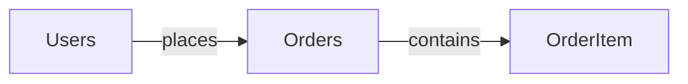

# Thiết kế cập nhật ERD FastGuy hiện hành

## Mục tiêu

Cập nhật `docs/erd.md` để phản ánh schema FastGuy hiện tại, phục vụ cả tra cứu kỹ thuật và trình bày bảo vệ dự án.

## Nguồn đối chiếu

- `database/init.sql` và `database/DB_FastGuy.sql`.
- Chuỗi migration đến `065_warehouse_operations_redesign.sql`.
- Các validator migration liên quan.
- Mapping JPA trong `Backend/FastGuy-FastFoodSite/src/main/java/entity/`.

Không kết nối hoặc thay đổi database. Khi hai baseline SQL khác nhau, tài liệu phải ghi rõ sai lệch thay vì tự chọn một bên làm sự thật.

## Nội dung

- Liệt kê đủ 39 bảng hiện tại, gồm 38 bảng nghiệp vụ/hỗ trợ và `SchemaMigrationHistory`.
- Với mỗi bảng, ghi đầy đủ cột, kiểu dữ liệu, NULL/NOT NULL, default, PK, FK, UNIQUE, CHECK và index.
- Loại khỏi schema hiện hành các bảng đã bị migration 051 xóa: `ProductCombo`, `ProductComboItem`, `SupportTicket`, `Notification`, `NotificationReadReceipt`.
- Bổ sung các bảng kho nguyên liệu, kiểm kê, nhập hàng, nhân sự, tài chính, audit và migration còn thiếu.
- Ghi chú các bảng kỹ thuật hoặc lưu lịch sử chuyển đổi.

## ERD Level 1

Dùng đúng một Mermaid `flowchart` chứa đủ 39 thực thể, không hiển thị thuộc tính hoặc cardinality. Dùng `subgraph` để nhóm nghiệp vụ và giữ sơ đồ dễ đọc.

Quan hệ được đặt nhãn bằng động từ tiếng Anh tự nhiên theo quy ước giảng viên:

```text
Entity ──[relationship verb]── Entity
```

Ví dụ Mermaid:



Các động từ điển hình gồm `has`, `places`, `contains`, `belongs to`, `records`, `uses`, `creates`, `approves` và `settles`. Bảng không có FK vẫn xuất hiện như node độc lập trong nhóm phù hợp; không tạo quan hệ giả. Cardinality và tính tùy chọn chỉ được giải thích bằng bảng quan hệ riêng.

## Cấu trúc tài liệu

1. Phạm vi, nguồn chuẩn và cách đọc.
2. Danh sách 39 bảng theo nhóm.
3. ERD Level 1 tổng quan và các sơ đồ theo nhóm.
4. Bảng quan hệ chi tiết, động từ và cardinality.
5. Data dictionary đầy đủ của 39 bảng.
6. Tổng hợp enum, ràng buộc, index và trigger quan trọng.
7. Bảng kỹ thuật, mapping JPA và sai lệch nguồn schema đã biết.

## Tiêu chí hoàn thành

- Đủ 39 bảng hiện hành và không còn bảng đã xóa trong danh sách schema hiện tại.
- Mỗi bảng có toàn bộ cột và ràng buộc theo nguồn SQL.
- ERD Level 1 chỉ dùng nhãn động từ, không dùng ký hiệu cardinality trong sơ đồ.
- Quan hệ quan trọng của order, payment, kho, ca làm và tài chính được thể hiện.
- Mermaid hợp lệ về cú pháp văn bản.
- Chỉ sửa `docs/erd.md` và tạo tài liệu thiết kế/kế hoạch của công việc này; không commit.
