# Luồng nghiệp vụ website FastGuy

> Tài liệu học và trình bày bảo vệ dự án, tập trung vào quy tắc nghiệp vụ đang có trong hệ thống.

## Cách dùng tài liệu khi bảo vệ

1. Học phần **Tóm tắt một trang** trước để nắm câu chuyện tổng thể.
2. Khi demo, đi theo một đơn từ lúc chọn món đến lúc báo cáo.
3. Khi hội đồng hỏi ngoại lệ, dùng bảng **Nếu... thì...**.
4. Khi giải thích một quyết định, nói theo mẫu: **Bối cảnh → Quy tắc → Xử lý → Kết quả → Lý do**.
5. Phần có nhãn **Chưa triển khai/Đề xuất** không được trình bày như chức năng hiện có.

## Mục lục

- [1. Tổng quan FastGuy](#1-tổng-quan-fastguy)
- [2. Luồng nghiệp vụ chung](#2-luồng-nghiệp-vụ-chung)
- [3. Trách nhiệm bốn vai trò](#3-trách-nhiệm-bốn-vai-trò)
- [4. Vòng đời đơn hàng](#4-vòng-đời-đơn-hàng)
- [5. Luồng USER và khách hàng](#5-luồng-user-và-khách-hàng)
- [6. Luồng STAFF](#6-luồng-staff)
- [7. Luồng SHIPPER](#7-luồng-shipper)
- [8. Luồng ADMIN](#8-luồng-admin)
- [9. Các luồng liên vai trò quan trọng](#9-các-luồng-liên-vai-trò-quan-trọng)
- [10. Logic tự động của hệ thống](#10-logic-tự-động-của-hệ-thống)
- [11. Bảng Nếu thì](#11-bảng-nếu-thì)
- [12. Hai mươi câu nói mẫu](#12-hai-mươi-câu-nói-mẫu)
- [13. Mười lăm tình huống phản biện](#13-mười-lăm-tình-huống-phản-biện)
- [14. Checklist demo nghiệp vụ](#14-checklist-demo-nghiệp-vụ)
- [15. Tóm tắt một trang](#15-tóm-tắt-một-trang)

## 1. Tổng quan FastGuy

### Vấn đề

FastGuy hỗ trợ cửa hàng đồ ăn nhanh quản lý xuyên suốt việc bán món, nhận đơn, chuẩn bị món, phân công giao hàng, thu tiền, xử lý ngoại lệ và tổng hợp báo cáo. Giá trị chính là mọi bên cùng nhìn một trạng thái đơn thống nhất, giảm xử lý trùng và giảm bàn giao bằng lời nói.

### Bốn vai trò

- **USER:** khách có tài khoản; mua hàng, quản lý thông tin cá nhân, theo dõi quyền lợi và phản hồi.
- **STAFF:** nhân viên cửa hàng; tiếp nhận, xác nhận, chuẩn bị, đưa đơn sang trạng thái sẵn sàng, phân công giao và xử lý sự cố.
- **SHIPPER:** nhân viên giao hàng; nhận đúng đơn được gán, lấy món, giao, thu COD và bàn giao tiền theo ca.
- **ADMIN:** quản trị; quản lý người dùng, danh mục bán hàng, ca, tồn kho, đơn, hoàn tiền, đối soát và báo cáo.

**Guest không phải role trong cơ sở dữ liệu.** Guest là khách chưa đăng nhập nhưng vẫn có thể đặt và tra cứu đơn bằng thông tin xác minh.

### Phạm vi

Hệ thống hiện có: tài khoản, menu, cấu hình món, giỏ, địa chỉ, phí GHN, coupon, checkout COD hoặc PayOS, xử lý bếp, giao hàng nội bộ, tồn kho, điểm thưởng, review, hỗ trợ, thông báo, đối soát COD và báo cáo quản trị.

Không được suy rộng thành quản lý nhiều chi nhánh, tối ưu tuyến giao tự động hoặc vận hành vòng đời đơn theo ngày đóng cửa. **Chưa triển khai/Đề xuất:** tự đóng đơn cuối ngày, tự phân shipper và điều phối đa chi nhánh.

## 2. Luồng nghiệp vụ chung

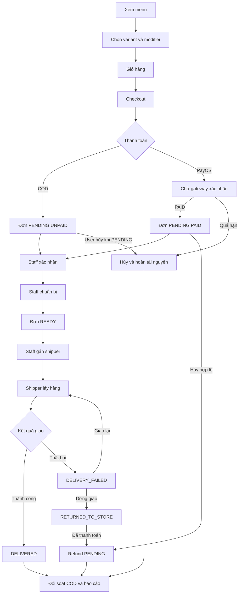

Câu chuyện dễ nói: khách tạo nhu cầu; hệ thống giữ tài nguyên; staff biến nhu cầu thành món sẵn sàng; shipper nhận trách nhiệm giao; admin kiểm soát tiền, ngoại lệ và số liệu. Mỗi điểm bàn giao đều có điều kiện, không đổi trạng thái tùy ý.

## 3. Trách nhiệm bốn vai trò

| Vai trò | Được làm gì | Không được làm gì | Điều kiện hoạt động |
|---|---|---|---|
| USER | Mua hàng, hủy đơn PENDING của mình, xem lịch sử, nhận coupon, xem điểm, review, gửi hỗ trợ | Không xử lý bếp, không gán shipper, không tự xác nhận đã thanh toán | Tài khoản ACTIVE; một số chức năng yêu cầu đăng nhập |
| STAFF | Xác nhận, chuẩn bị, đưa đơn READY, gán shipper, ghi chú, xử lý giao thất bại và ticket | Không pickup, không deliver, không quản trị toàn hệ thống | Tài khoản ACTIVE và ca đang CHECKED_IN |
| SHIPPER | Xem đơn được gán, pickup, báo giao thành công hoặc thất bại, bàn giao COD | Không xử lý đơn chưa gán; không xác nhận bếp; không gán đơn cho mình | Tài khoản ACTIVE; ca hôm nay CHECKED_IN, chưa checkout, còn trong cửa sổ ca |
| ADMIN | Quản trị dữ liệu, đơn, tồn, hoàn tiền, đối soát, báo cáo | Không được làm mất admin ACTIVE cuối cùng; không bỏ qua điều kiện tài chính | Tài khoản ADMIN ACTIVE; thao tác nhạy cảm được kiểm tra lại quyền |

## 4. Vòng đời đơn hàng

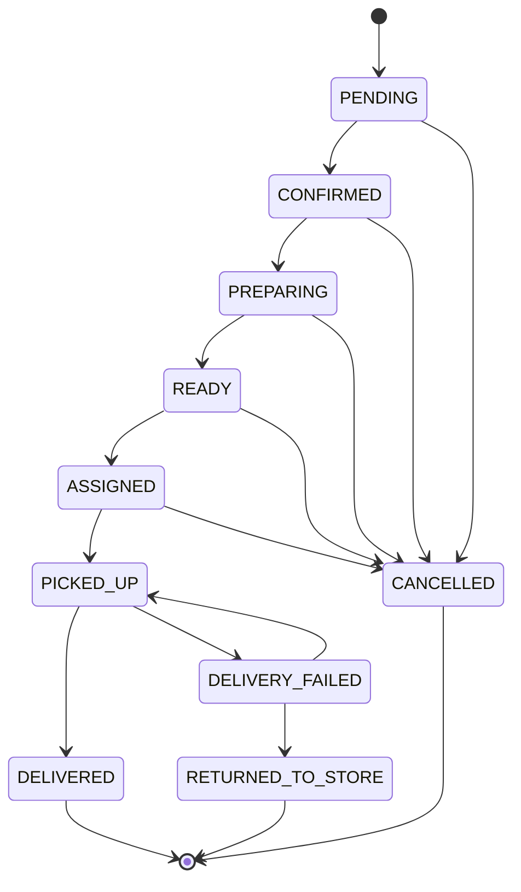

### Ý nghĩa trạng thái

- **PENDING:** đơn đã tạo, đang chờ cửa hàng xác nhận; stock đã được giữ.
- **CONFIRMED:** cửa hàng chấp nhận đơn; PayOS chỉ đến đây khi payment là PAID.
- **PREPARING:** bếp bắt đầu làm; phần tồn đã giữ chuyển thành đã sử dụng.
- **READY:** món hoàn tất, chờ phân người giao.
- **ASSIGNED:** đơn READY đã được gán cho một shipper hợp lệ.
- **PICKED_UP:** shipper của đơn đã nhận món và đang giao.
- **DELIVERY_FAILED:** lần giao không thành công, có lý do và số lần thử.
- **RETURNED_TO_STORE:** dừng giao và đưa đơn về cửa hàng; là trạng thái kết thúc.
- **DELIVERED:** giao thành công; COD được ghi nhận PAID khi số tiền thu khớp.
- **CANCELLED:** đơn bị hủy hợp lệ; tài nguyên được hoàn theo giai đoạn.

### Bảng chuyển trạng thái

| Từ | Hành động | Sang | Vai trò | Điều kiện | Tác động phụ |
|---|---|---|---|---|---|
| PENDING | Xác nhận | CONFIRMED | STAFF | Staff đủ điều kiện; PayOS phải PAID | Lưu thời điểm, lịch sử, thông báo |
| PENDING | Hủy | CANCELLED | USER | Đơn của mình, đúng PENDING | Release stock giữ, release coupon; paid tạo refund pending |
| PENDING | Hủy | CANCELLED | STAFF/ADMIN/Hệ thống | Quyền hợp lệ, trạng thái chưa kết thúc | Hoàn tài nguyên; ghi lý do |
| CONFIRMED | Bắt đầu chuẩn bị | PREPARING | STAFF | Ca hợp lệ, trạng thái chưa bị đổi | Consume stock đã reserve |
| CONFIRMED | Hủy | CANCELLED | STAFF/ADMIN | Điều kiện hủy hợp lệ | Hoàn/điều chỉnh tài nguyên theo giai đoạn |
| PREPARING | Hoàn tất món | READY | STAFF | Đơn đang PREPARING | Ghi thời điểm sẵn sàng |
| PREPARING | Hủy | CANCELLED | STAFF/ADMIN | Lý do hợp lệ | Stock đã consume có thể ghi waste theo policy |
| READY | Gán shipper | ASSIGNED | STAFF | Chỉ READY; shipper ACTIVE, đúng ca | Gắn shipper, thời điểm gán, thông báo |
| READY | Hủy | CANCELLED | STAFF/ADMIN | User không được hủy ở đây | Xử lý tài nguyên và refund nếu paid |
| ASSIGNED | Nhận món | PICKED_UP | SHIPPER | Đúng shipper của đơn, ca hợp lệ | Ghi thời điểm pickup |
| ASSIGNED | Hủy | CANCELLED | STAFF/ADMIN | Hủy hợp lệ | Kết thúc trách nhiệm giao |
| PICKED_UP | Giao COD thành công | DELIVERED | SHIPPER | Thu đúng finalAmount | payment PAID, ghi tiền COD, cộng điểm |
| PICKED_UP | Giao PayOS thành công | DELIVERED | SHIPPER | Payment đã PAID | Ghi delivered, cộng điểm |
| PICKED_UP | Báo thất bại | DELIVERY_FAILED | SHIPPER | Đúng đơn; reason hợp lệ; chưa hết attempt | Tăng attempt, ghi lý do và thời điểm |
| DELIVERY_FAILED | Retry ngay | PICKED_UP | STAFF | Staff và shipper đúng ca; còn lượt | Gán người giao lại, ghi lịch sử |
| DELIVERY_FAILED | Hẹn retry | DELIVERY_FAILED | STAFF | Thời gian hẹn hợp lệ, còn lượt | Lưu retryScheduledAt |
| DELIVERY_FAILED | Bắt đầu lượt hẹn | PICKED_UP | STAFF | Đã đến lịch, trạng thái chưa đổi | Tiếp tục giao |
| DELIVERY_FAILED | Trả cửa hàng | RETURNED_TO_STORE | STAFF | Không tiếp tục giao; ghi chú hợp lệ | Paid tạo refund pending; xử lý waste theo policy |

Các thao tác đồng thời được kiểm soát theo trạng thái mà người thao tác vừa nhìn thấy. Nếu người khác đã xử lý trước, thao tác sau bị từ chối và màn hình phải tải lại; mục tiêu nghiệp vụ là tránh xác nhận, giao, hủy hoặc hoàn tiền hai lần.

## 5. Luồng USER và khách hàng

### 5.1 Đăng ký, đăng nhập, khôi phục mật khẩu

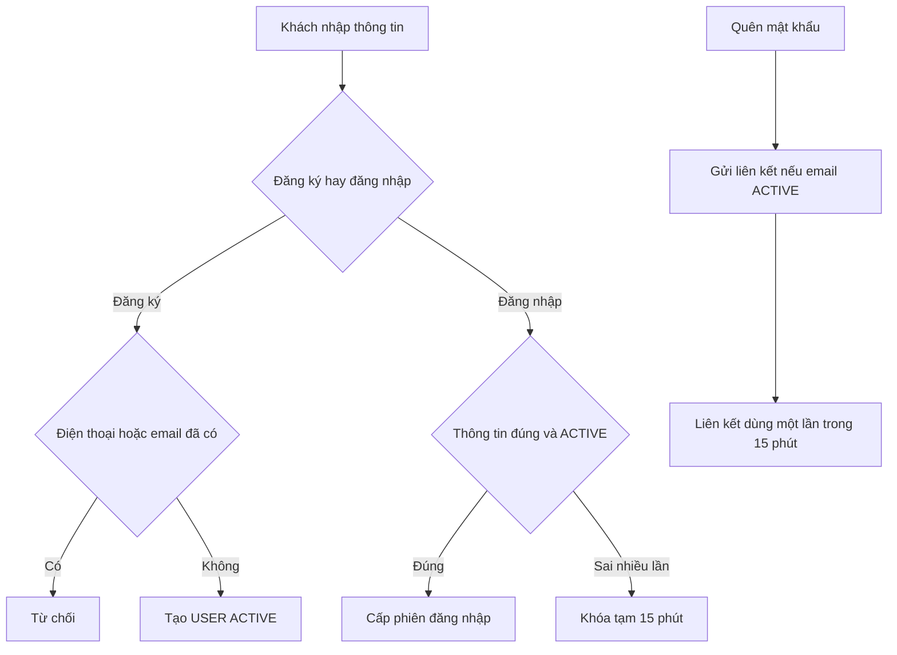

- **Mục tiêu:** tạo và truy cập tài khoản an toàn.
- **Các bước:** nhập thông tin; hệ thống kiểm tra; tạo USER hoặc xác thực; chuyển đến khu vực phù hợp vai trò. Quên mật khẩu tạo liên kết một lần và gửi email.
- **Điều kiện:** số điện thoại và email không trùng; mật khẩu 8–72 ký tự, có chữ và số; tài khoản ACTIVE. Năm lần sai dẫn đến khóa 15 phút.
- **Ngoại lệ:** yêu cầu khôi phục với email không tồn tại vẫn không tiết lộ tài khoản; liên kết sai, hết hạn hoặc đã dùng bị từ chối.
- **Dữ liệu/kết quả cuối:** tài khoản USER ACTIVE hoặc phiên đăng nhập; mật khẩu mới được lưu an toàn.

Giới hạn hiện tại: logout chỉ xóa phiên phía trình duyệt; không có danh sách khóa token sau logout và không có refresh token.

### 5.2 Xem menu, tìm kiếm, category, variant, modifier, combo, favorite

- **Mục tiêu:** giúp khách tìm đúng cấu hình món trước khi mua.
- **Các bước:** xem menu; tìm từ khóa; lọc category, giá, khả dụng, giảm giá, bán chạy; mở món; chọn variant; chọn modifier hợp lệ; xem combo; thêm hoặc bỏ favorite.
- **Điều kiện:** sản phẩm và cấu hình phải đang khả dụng; variant xác định mức giá/cỡ; modifier thuộc sản phẩm; favorite gắn với USER đăng nhập.
- **Ngoại lệ:** cấu hình cũ không còn bán không được dùng để tạo đơn mới; favorite không thay thế giỏ hàng.
- **Dữ liệu/kết quả cuối:** cấu hình món hoàn chỉnh hoặc danh sách yêu thích.

### 5.3 Giỏ hàng

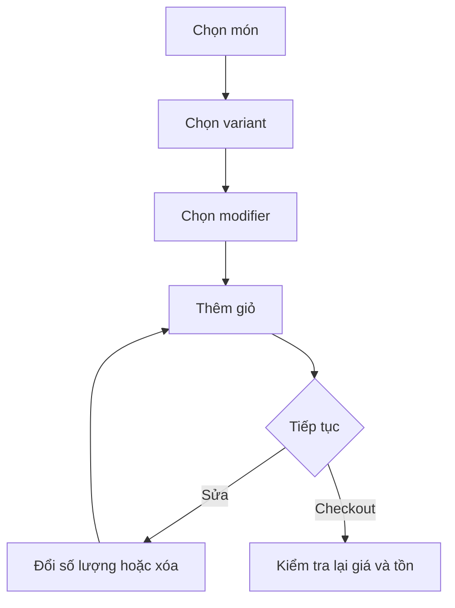

- **Mục tiêu:** gom các món dự định mua trước checkout.
- **Các bước:** thêm món; thay số lượng; xóa; xem tạm tính.
- **Điều kiện:** số lượng hợp lệ; variant và modifier đúng món.
- **Ngoại lệ:** giỏ có thể thay đổi trước checkout; giá và tồn cuối cùng được kiểm tra lại khi đặt.
- **Dữ liệu/kết quả cuối:** danh sách món, cấu hình, số lượng và chữ ký giỏ dùng để phát hiện giỏ đã đổi.

### 5.4 Địa chỉ và phí GHN

- **Mục tiêu:** có địa chỉ giao chuẩn và phí giao tương ứng.
- **Các bước:** USER thêm/sửa/xóa/chọn mặc định; chọn tỉnh, quận/huyện, phường/xã từ GHN; nhập số nhà; checkout yêu cầu tính phí.
- **Điều kiện:** tên người nhận, điện thoại, địa chỉ và mã vùng GHN hợp lệ.
- **Ngoại lệ:** GHN lỗi hoặc vùng không hỗ trợ thì không được đoán phí; khách cần thử lại/chọn địa chỉ khác.
- **Dữ liệu/kết quả cuối:** địa chỉ hiển thị, mã vùng GHN và shippingFee.

### 5.5 Coupon claim và verify

- **Mục tiêu:** nhận mã vào ví rồi áp dụng đúng điều kiện.
- **Các bước:** USER xem coupon công khai; claim; chọn mã trong ví; hệ thống verify khi checkout.
- **Điều kiện:** coupon public, active, chưa hết hạn/lượt; USER chưa claim trước; đơn đạt tối thiểu; mã còn chưa dùng.
- **Ngoại lệ:** guest không dùng coupon vì quy trình yêu cầu đăng nhập và claim trước; mã hết hạn/hết lượt/vượt số lần bị từ chối.
- **Dữ liệu/kết quả cuối:** discount theo PERCENT, FIXED hoặc FREE_SHIPPING; redemption được bind với đơn.

### 5.6 Checkout USER và guest

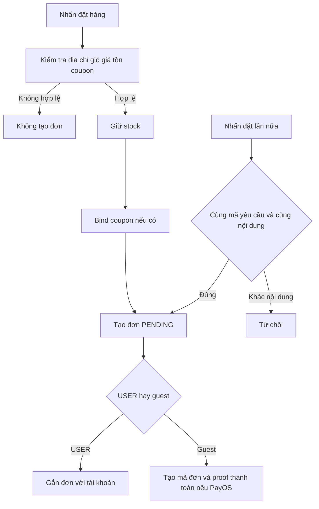

- **Mục tiêu:** tạo đúng một đơn cho một ý định mua.
- **Các bước:** kiểm tra giờ bán và phí dịch vụ; thông tin giao; giỏ; tồn; modifier; phí GHN; coupon; phương thức; giữ stock; tạo đơn.
- **Điều kiện:** COD hoặc BANK_TRANSFER; giỏ không trống; thông tin giao hợp lệ; tồn đủ.
- **Ngoại lệ:** double click hoặc gửi lại cùng yêu cầu không tạo thêm đơn. “Idempotency” nói dễ hiểu là **một lần bấm đặt hàng chỉ được tính thành một đơn**, kể cả mạng chậm làm trình duyệt gửi lại. Nếu cùng mã yêu cầu nhưng nội dung khác, hệ thống từ chối để tránh nhập nhằng.
- **Dữ liệu/kết quả cuối:** orderCode, PENDING, tổng tiền, phí, giảm giá, payment status; stock RESERVED.

USER checkout dùng giỏ tài khoản. Guest gửi trực tiếp danh sách món và không trở thành role DB.

### 5.7 COD

- **Mục tiêu:** trả tiền khi nhận món.
- **Các bước:** chọn COD; tạo đơn PENDING và UNPAID; staff xử lý; shipper thu tiền; xác nhận giao.
- **Điều kiện:** khi deliver, số tiền shipper nhập phải bằng `finalAmount`.
- **Ngoại lệ:** sai tiền thì không chuyển DELIVERED; giao thất bại đi vào luồng phục hồi.
- **Dữ liệu/kết quả cuối:** DELIVERED, payment PAID, số tiền và thời điểm thu COD; số tiền vào đối soát ca.

### 5.8 BANK_TRANSFER qua PayOS

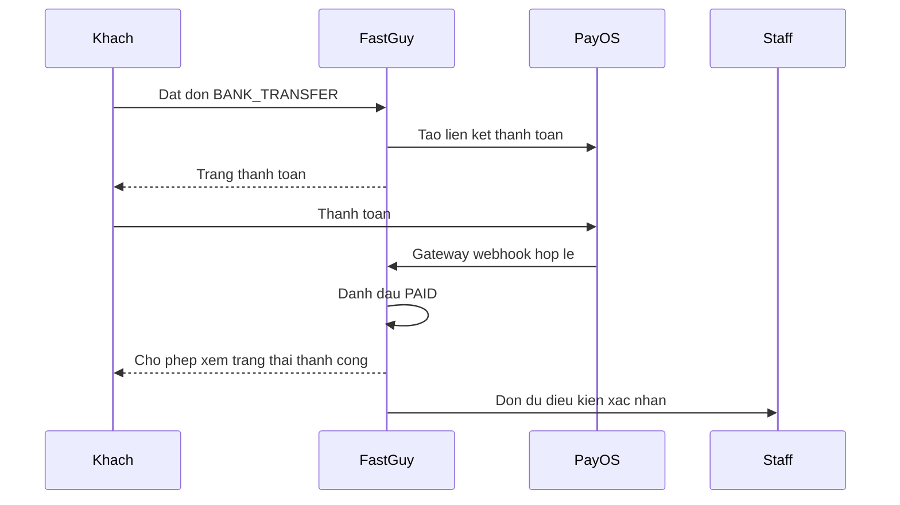

- **Mục tiêu:** chỉ xử lý bếp khi tiền được cổng thanh toán xác nhận.
- **Các bước:** tạo đơn; mở PayOS; PayOS gửi kết quả; FastGuy kiểm tra thông báo; cập nhật PAID; staff mới confirm.
- **Điều kiện:** chữ ký/thông báo gateway hợp lệ; giá trị khớp đơn.
- **Ngoại lệ:** client gọi “confirm payment” luôn bị từ chối; quay lại trang thành công không tự biến đơn thành PAID; quá 15 phút vẫn PENDING và UNPAID thì scheduler hủy.
- **Dữ liệu/kết quả cuối:** payment PAID hoặc đơn CANCELLED; guest nhận proof token để polling trạng thái thanh toán.

### 5.9 Theo dõi đơn USER và guest

- **Mục tiêu:** biết đơn đang ở đâu mà không can thiệp sai quyền.
- **Các bước:** USER mở đơn trong tài khoản; guest nhập order code và 4 số cuối điện thoại; trang tự hỏi lại trạng thái khi đơn chưa kết thúc.
- **Điều kiện:** USER chỉ xem đơn của mình; guest phải khớp hai thông tin. Guest PayOS polling cần proof token.
- **Ngoại lệ:** mã đơn đúng nhưng 4 số cuối sai không trả dữ liệu; proof thiếu/sai không trả trạng thái thanh toán guest.
- **Dữ liệu/kết quả cuối:** trạng thái, timeline, món, thời gian dự kiến và lịch giao lại nếu có.

### 5.10 Hủy đơn

- **Mục tiêu:** cho khách dừng đơn trước khi cửa hàng nhận xử lý.
- **Các bước:** USER mở đơn PENDING; nhập lý do; xác nhận hủy.
- **Điều kiện:** đúng chủ đơn và chỉ trạng thái PENDING.
- **Ngoại lệ:** từ CONFIRMED trở đi USER bị từ chối; thao tác đồng thời với staff được giải quyết theo trạng thái mới nhất.
- **Dữ liệu/kết quả cuối:** CANCELLED; stock/coupon được hoàn theo giai đoạn; nếu đã paid thì refund PENDING.

### 5.11 Lịch sử mua hàng

- **Mục tiêu:** tra cứu các đơn đã và đang mua, xem chi tiết, trạng thái thanh toán và hoàn tiền.
- **Các bước:** USER mở danh sách, chọn đơn, xem timeline; có thể đặt lại các cấu hình còn hợp lệ.
- **Điều kiện:** đăng nhập, đúng chủ đơn.
- **Ngoại lệ:** món cũ/variant/modifier ngừng bán có thể không đặt lại được.
- **Dữ liệu/kết quả cuối:** danh sách và chi tiết đơn của USER.

### 5.12 Điểm thưởng

- **Mục tiêu:** ghi nhận khách mua thành công và thể hiện hạng thành viên.
- **Các bước:** đơn USER DELIVERED được cộng điểm; USER xem tổng, lịch sử và tier; refund hoàn tất đảo điểm đã cộng của đơn.
- **Điều kiện:** đơn gắn USER và giao thành công; mỗi nghiệp vụ có lịch sử để tránh cộng/đảo lặp.
- **Ngoại lệ:** guest không có tài khoản để nhận điểm; **Chưa triển khai:** tiêu điểm tại checkout.
- **Dữ liệu/kết quả cuối:** balance, lịch sử earn/reverse và tier.

### 5.13 Review

- **Mục tiêu:** thu phản hồi sau trải nghiệm thật.
- **Các bước:** USER mở đơn DELIVERED; chấm 1–5 sao; nhập bình luận tùy chọn; chọn consent cho homepage; gửi.
- **Điều kiện:** đúng USER, đúng đơn DELIVERED, một review cho mỗi USER/order; bình luận tối đa 1000 ký tự.
- **Ngoại lệ:** review trùng hoặc đơn chưa giao bị từ chối; muốn nổi bật homepage phải có consent, bình luận, USER ACTIVE, tên và thời điểm hợp lệ.
- **Dữ liệu/kết quả cuối:** rating, comment, consent; admin có thể bật featured khi đủ điều kiện.

### 5.14 Support ticket

- **Mục tiêu:** tạo kênh xử lý yêu cầu sau bán.
- **Các bước:** USER tạo ticket với nội dung; staff xem hàng đợi; chuyển PROCESSING; xử lý và RESOLVED.
- **Điều kiện:** USER đăng nhập; nội dung hợp lệ; staff ACTIVE và checked-in.
- **Ngoại lệ:** không được bỏ qua thứ tự xử lý trạng thái hoặc sửa ticket người khác bằng quyền USER.
- **Dữ liệu/kết quả cuối:** ticket, trạng thái, nội dung trao đổi/xử lý và lịch sử.

### 5.15 Notification

- **Mục tiêu:** báo đúng người khi có sự kiện cần biết.
- **Các bước:** hệ thống tạo thông báo cho USER cụ thể hoặc toàn role; người nhận mở danh sách; đánh dấu đã đọc.
- **Điều kiện:** đúng đối tượng nhận; mỗi người có trạng thái đọc riêng.
- **Ngoại lệ:** đọc thông báo không thay thế thao tác nghiệp vụ; thông báo cũ không cấp quyền mới.
- **Dữ liệu/kết quả cuối:** nội dung, loại, liên kết liên quan và read receipt.

## 6. Luồng STAFF

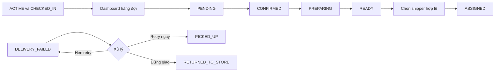

### Điều kiện vào nghiệp vụ

STAFF phải có account ACTIVE và ca đã CHECKED_IN. Chỉ đăng nhập đúng role nhưng chưa check-in không đủ để xử lý đơn/ticket. Ca được xét theo giờ nghiệp vụ `Asia/Ho_Chi_Minh`.

### Dashboard hàng đợi và bếp

- Tách hàng đợi PENDING, CONFIRMED, PREPARING, READY để staff ưu tiên công việc.
- Chuỗi chuẩn: `PENDING → CONFIRMED → PREPARING → READY`.
- BANK_TRANSFER PENDING chỉ CONFIRMED khi PAID.
- Khi vào PREPARING, tồn RESERVED chuyển CONSUMED.
- Staff không pickup và không deliver; đây là ranh giới trách nhiệm với shipper.

### Phân công shipper

Chỉ đơn READY được gán. Shipper phải role SHIPPER, account ACTIVE, có ca hôm nay CHECKED_IN, đã check-in thực tế, chưa checkout và thời điểm hiện tại nằm trong cửa sổ hợp lệ của ca. Danh sách có thể kèm số đơn đang phụ trách để staff cân nhắc.

**Chưa triển khai:** auto assignment. Hiện staff chọn thủ công; hệ thống chỉ kiểm tra người được chọn có đủ điều kiện.

### Ghi chú nội bộ

Staff thêm ghi chú vào đơn để bàn giao thông tin vận hành. Ghi chú không thay đổi trạng thái và không phải thông báo cho khách. Nội dung trống không được lưu.

### Delivery failure

- **Retry ngay:** chọn shipper đủ ca; còn lượt; đơn chuyển lại PICKED_UP.
- **Hẹn retry:** lưu thời gian hợp lệ; đơn vẫn DELIVERY_FAILED; khi bắt đầu lượt hẹn mới chuyển PICKED_UP.
- **Return to store:** khi không tiếp tục giao; chuyển trạng thái kết thúc RETURNED_TO_STORE; paid order tạo refund pending.
- Attempt limit mặc định là 2. Admin có luồng override có lý do; staff không tự vượt giới hạn.

### Support ticket

Chuỗi chuẩn `OPEN → PROCESSING → RESOLVED`. Staff tiếp nhận, cập nhật tiến độ, ghi kết quả. Điều kiện account ACTIVE và ca checked-in vẫn áp dụng.

### Lịch sử và export

Staff xem lịch sử xử lý và có chức năng export theo giao diện hiện có. Dữ liệu lịch sử phục vụ đối chiếu ai làm, lúc nào, từ trạng thái nào sang trạng thái nào; export không làm thay đổi đơn.

## 7. Luồng SHIPPER

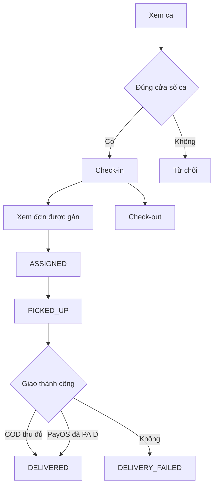

### Ca làm

- Thời gian nghiệp vụ dùng `Asia/Ho_Chi_Minh`.
- Shipper xem ca của mình, check-in và check-out.
- Grace check-in là 15 phút theo chính sách hiện có.
- Sau checkout hoặc ngoài cửa sổ hợp lệ, shipper không tiếp tục thao tác nghiệp vụ cần ca hoạt động.

### Đơn được gán và pickup

Shipper chỉ thấy/thao tác các đơn thuộc mình. Từ ASSIGNED, shipper xác nhận lấy món để sang PICKED_UP. Không thể pickup đơn READY chưa gán hoặc đơn gán cho người khác.

### Giao COD

Shipper nhập số tiền thực thu. Hệ thống yêu cầu bằng chính xác `finalAmount`; đúng thì đơn DELIVERED, payment PAID, lưu số tiền và thời điểm thu. Sai thì từ chối, tránh báo cáo và đối soát lệch.

### Giao PayOS

Đơn phải có payment PAID từ gateway. Shipper xác nhận giao thực tế từ PICKED_UP sang DELIVERED; không thu COD.

### Giao thất bại

Shipper chọn reason, nhập ghi chú khi quy tắc yêu cầu và gửi từ PICKED_UP. Hệ thống tăng attempt, mặc định giới hạn 2. Khi hết lượt, staff phải chọn return hoặc admin override có lý do trước khi retry tiếp.

### COD settlement theo ca

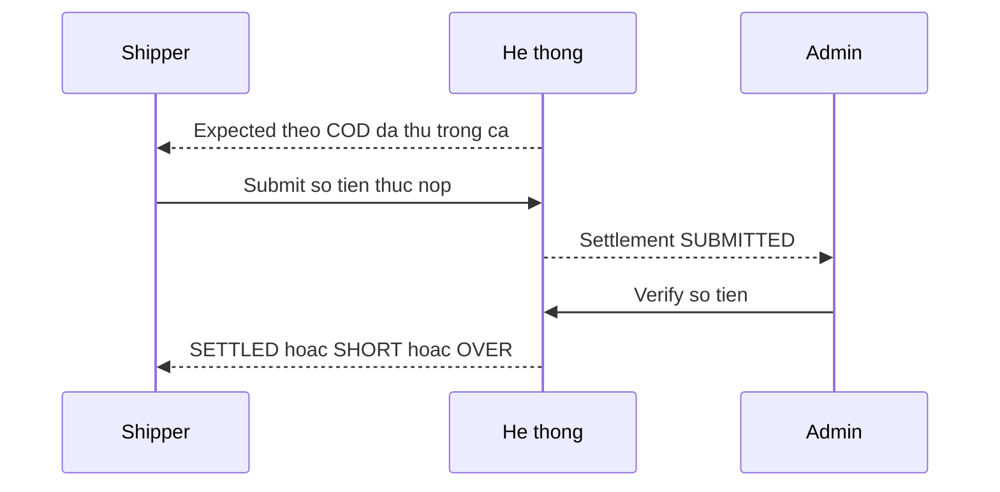

- `expected`: tổng COD hệ thống ghi nhận thuộc ca.
- Shipper gửi `submittedAmount`; sau khi gửi không sửa lại.
- Trạng thái `SUBMITTED`: chờ admin kiểm đếm.
- `SETTLED`: khớp; `SHORT`: thiếu; `OVER`: thừa.
- Admin nhập số xác nhận và lý do khi có chênh lệch.

## 8. Luồng ADMIN

### User CRUD, status và role

Admin xem, tạo, sửa thông tin; thay status/role theo giao diện quản trị. Quyền nhạy cảm kiểm tra account admin còn ACTIVE. Hệ thống bảo vệ admin ACTIVE cuối cùng: không được vô hiệu hóa, xóa hoặc đổi role làm hệ thống mất quản trị viên hoạt động cuối.

### Product, category, variant, modifier, combo

Admin quản lý danh mục món, sản phẩm, biến thể, tùy chọn thêm và combo. Không xóa category đang có product; cần chuyển/xử lý product trước. Cấu hình khả dụng quyết định khách có thể chọn khi mua.

Ảnh được upload trực tiếp từ browser lên Cloudinary bằng unsigned preset; backend nhận và lưu URL. Đây là giới hạn hiện tại, không mô tả thành backend ký upload.

### Coupon, banner, settings

Admin tạo/sửa/trạng thái coupon; quản lý banner và thiết lập cửa hàng như giờ bán/phí dịch vụ theo phần hiện có. Coupon phải giữ đúng giới hạn ngày, lượt, đơn tối thiểu và kiểu giảm.

### Shift

Admin tạo, cập nhật, xóa ca cho STAFF/SHIPPER ACTIVE. Hệ thống chống ca overlap cho cùng nhân viên. Ca đang ảnh hưởng vận hành không được tùy tiện sửa/xóa trái điều kiện.

### Inventory

Admin ghi adjustment tăng/giảm, waste và xem ledger. Có kiểm tra số lượng kỳ vọng để tránh ghi đè khi tồn vừa bị người khác thay đổi. Mọi biến động cần reason/note theo loại nghiệp vụ.

### Order management

Admin xem toàn bộ đơn; hủy hợp lệ; cập nhật trạng thái trong phạm vi cho phép; thêm note; quản lý featured review; override delivery attempt có lý do. Admin không được biến chuỗi trạng thái thành tùy ý: trạng thái kết thúc và điều kiện payment/tồn vẫn được bảo vệ.

### Refund

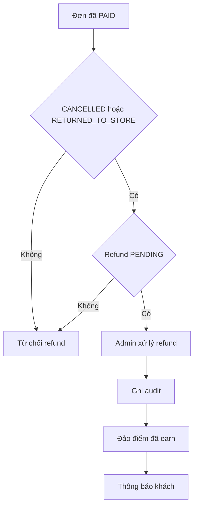

Chỉ order đã paid, ở CANCELLED hoặc RETURNED_TO_STORE và refund đang PENDING mới đủ điều kiện bắt đầu. Kết quả được audit; khi hoàn tất, payment/refund được cập nhật và điểm đã cộng từ đơn được đảo. Thao tác lặp hoặc trạng thái đã đổi bị từ chối.

### COD settlement verify

Admin mở settlement SUBMITTED, kiểm đếm, nhập verified amount và chọn SETTLED/SHORT/OVER. Chênh lệch phải có lý do; settlement đã xác nhận không được xác nhận lại như một giao dịch mới.

### Dashboard và report

Admin xem gross, refund, net; top product; category; khung giờ/ngày; payment; exceptions. Cách nói: gross là giá trị trước hoàn, refund là phần hoàn, net là phần còn lại theo phạm vi báo cáo. Không khẳng định số liệu kế toán ngoài dữ liệu FastGuy.

## 9. Các luồng liên vai trò quan trọng

### 9.1 Hoàn thành đơn COD

- **Ai bắt đầu:** USER/guest tạo đơn COD.
- **Ai tiếp nhận:** STAFF nhận PENDING, chuẩn bị đến READY.
- **Điểm bàn giao:** STAFF gán shipper; shipper pickup; trách nhiệm vật lý chuyển sang shipper.
- **Kết thúc:** shipper thu đúng finalAmount, DELIVERED; tiền vào expected settlement; admin verify và report phản ánh doanh thu.

### 9.2 Hoàn thành đơn PayOS

- **Ai bắt đầu:** USER/guest chọn BANK_TRANSFER.
- **Ai tiếp nhận:** PayOS nhận thanh toán; gateway báo FastGuy; STAFF chỉ nhận xử lý sau PAID.
- **Điểm bàn giao:** gateway xác nhận tiền; STAFF làm món; STAFF gán; shipper pickup.
- **Kết thúc:** shipper DELIVERED; không có tiền COD trong settlement; report ghi theo payment method.

### 9.3 Hủy đơn và hoàn tài nguyên

- **Ai bắt đầu:** USER khi PENDING; STAFF/ADMIN hoặc scheduler theo quyền/quy tắc.
- **Ai tiếp nhận:** hệ thống khóa trạng thái, xác định giai đoạn tồn và coupon.
- **Điểm bàn giao:** trước consume thì release stock; sau consume có thể waste theo policy; coupon redemption được release.
- **Kết thúc:** CANCELLED; nếu paid tạo refund PENDING để admin xử lý.

### 9.4 Giao thất bại

- **Ai bắt đầu:** shipper đang giữ đơn PICKED_UP.
- **Ai tiếp nhận:** STAFF thấy hàng đợi DELIVERY_FAILED.
- **Điểm bàn giao:** reason, note, attempt count; staff quyết định retry ngay, hẹn retry hoặc return.
- **Kết thúc:** DELIVERED sau retry hoặc RETURNED_TO_STORE; paid return đi tiếp refund.

### 9.5 Refund

- **Ai bắt đầu:** việc hủy/return của paid order tạo refund PENDING; ADMIN mở xử lý.
- **Ai tiếp nhận:** admin kiểm tra điều kiện và thực hiện quy trình hoàn.
- **Điểm bàn giao:** trạng thái đơn, payment, refund và bằng chứng audit.
- **Kết thúc:** refund hoàn tất/thất bại được lưu; điểm đã earn được đảo khi hoàn tất; USER nhận thông báo.

### 9.6 Khiếu nại hỗ trợ

- **Ai bắt đầu:** USER tạo ticket OPEN.
- **Ai tiếp nhận:** STAFF đủ ca chuyển PROCESSING.
- **Điểm bàn giao:** nội dung khách, thông tin xử lý và trạng thái ticket.
- **Kết thúc:** RESOLVED khi đã có kết quả; lịch sử còn để tra cứu.

## 10. Logic tự động của hệ thống

### Scheduler daemon

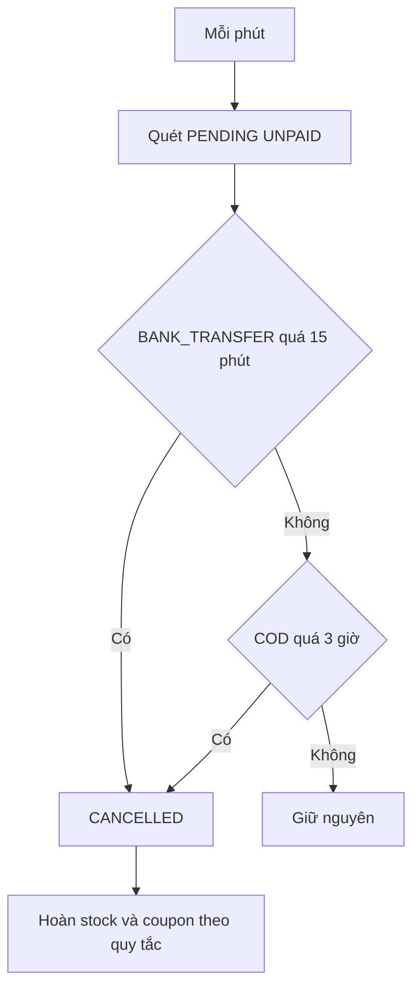

Một daemon trong tiến trình ứng dụng chạy mỗi phút. BANK_TRANSFER còn PENDING và UNPAID quá 15 phút bị hủy; COD còn PENDING và UNPAID quá 3 giờ bị hủy. Mục tiêu là không giữ tồn và coupon vô thời hạn.

Giới hạn hiện tại: scheduler chạy in-process. Khi chạy nhiều instance có rủi ro nhiều tiến trình cùng quét; lớp bảo vệ trạng thái giúp tránh double action nhưng chưa phải cơ chế điều phối scheduler phân tán.

### Thông báo và read receipt

Hệ thống phát thông báo cho USER cụ thể hoặc role khi có đơn mới, gán đơn, đổi trạng thái, refund hoặc sự kiện liên quan. Read receipt lưu việc từng người đã đọc; không dùng một cờ chung cho tất cả người nhận.

### Reserve, consume, release, waste inventory

- **Reserve:** checkout giữ số lượng để đơn khác không cùng bán phần đó.
- **Consume:** khi PREPARING, nguyên liệu/hàng đã thực sự đưa vào làm món.
- **Release:** hủy trước consume trả phần giữ về khả dụng.
- **Waste:** sau consume hoặc khi hàng return không còn dùng được, policy có thể ghi hao hụt thay vì trả bán lại.
- Các cập nhật cạnh tranh kiểm tra trạng thái/số lượng mới nhất nhằm tránh hai đơn cùng dùng một tồn.

### Loyalty award và reverse

DELIVERED của USER tạo earn và cập nhật tier/history. Refund hoàn tất gọi reverse theo đơn, không tự tạo lần đảo thứ hai. **Chưa triển khai:** dùng điểm để giảm tiền checkout.

### Coupon redemption bind và release

Claim tạo quyền dùng trong ví. Checkout hợp lệ bind redemption với order và tăng sử dụng theo quy tắc. Nếu đơn bị hủy, hệ thống release để tránh khách mất coupon vì đơn không hoàn tất, miễn là trạng thái dữ liệu cho phép.

## 11. Bảng Nếu thì

| STT | Nếu... | Thì... | Lý do nghiệp vụ |
|---:|---|---|---|
| 1 | Nếu USER hủy sau PENDING | Từ chối | Khách chỉ tự hủy trước khi cửa hàng nhận xử lý |
| 2 | Nếu USER hủy đúng PENDING của mình | Chuyển CANCELLED | Đúng quyền và đúng cửa sổ hủy |
| 3 | Nếu PayOS chưa PAID | Staff không CONFIRMED | Không làm món khi gateway chưa xác nhận tiền |
| 4 | Nếu client tự báo payment PAID | Luôn từ chối | Client không phải nguồn xác nhận thanh toán |
| 5 | Nếu webhook PayOS hợp lệ | Cập nhật PAID một lần | Gateway là nguồn xác nhận |
| 6 | Nếu BANK_TRANSFER PENDING UNPAID quá 15 phút | Scheduler hủy | Giải phóng tài nguyên chờ thanh toán |
| 7 | Nếu COD PENDING UNPAID quá 3 giờ | Scheduler hủy | Không giữ đơn treo vô hạn |
| 8 | Nếu checkout tồn không đủ | Không tạo đơn | Tránh bán vượt tồn |
| 9 | Nếu double click checkout cùng nội dung | Trả lại cùng kết quả đơn | Tránh tạo hai đơn |
| 10 | Nếu cùng idempotency key nhưng nội dung khác | Từ chối | Một mã yêu cầu không đại diện hai ý định |
| 11 | Nếu giỏ đổi sau khi mở checkout | Yêu cầu kiểm tra lại | Tổng tiền và món phải nhất quán |
| 12 | Nếu checkout thành công | Stock chuyển RESERVED | Giữ phần hàng cho đơn |
| 13 | Nếu vào PREPARING | RESERVED chuyển CONSUMED | Món bắt đầu được làm |
| 14 | Nếu hủy trước consume | Release stock | Hàng vẫn có thể bán |
| 15 | Nếu hủy sau consume | Có thể ghi waste theo policy | Không mặc định trả món đã làm về tồn bán |
| 16 | Nếu coupon không có trong ví USER | Không áp dụng | Coupon cần claim trước |
| 17 | Nếu guest nhập coupon | Từ chối verify sử dụng | Luồng coupon hiện yêu cầu USER claim |
| 18 | Nếu coupon hết hạn/hết lượt/inactive | Không áp dụng | Bảo vệ điều kiện chương trình |
| 19 | Nếu coupon không đạt minOrder | Không áp dụng | Chưa đủ giá trị đơn tối thiểu |
| 20 | Nếu category đang có product | Không xóa category | Tránh product mất phân loại |
| 21 | Nếu đơn chưa READY | Không gán shipper | Chỉ giao món đã sẵn sàng |
| 22 | Nếu shipper INACTIVE | Không xuất hiện như người hợp lệ | Không giao việc cho tài khoản ngừng hoạt động |
| 23 | Nếu shipper chưa CHECKED_IN | Không gán và không thao tác giao | Chưa bắt đầu ca |
| 24 | Nếu shipper đã checkout | Không tiếp tục thao tác cần ca | Ca đã kết thúc |
| 25 | Nếu shipper hết cửa sổ ca | Từ chối thao tác nghiệp vụ | Trách nhiệm phải nằm trong ca hợp lệ |
| 26 | Nếu shipper thao tác đơn người khác | Từ chối | Chỉ chủ thể được gán chịu trách nhiệm |
| 27 | Nếu staff cố pickup hoặc deliver | Từ chối | Pickup/deliver thuộc shipper |
| 28 | Nếu shipper cố xử lý đơn READY chưa gán | Từ chối | Chưa có bàn giao trách nhiệm |
| 29 | Nếu COD collected amount khác finalAmount | Không DELIVERED | Tránh chênh tiền và báo cáo sai |
| 30 | Nếu PayOS order chưa PAID mà giao thành công | Không DELIVERED | Tránh ghi giao khi tiền chưa hợp lệ |
| 31 | Nếu giao thất bại thiếu reason hợp lệ | Từ chối | Cần căn cứ phục hồi và đối chiếu |
| 32 | Nếu attempt đã đạt limit mặc định 2 | Không retry thường | Chặn vòng giao vô hạn |
| 33 | Nếu admin override attempt không có lý do | Từ chối | Ngoại lệ phải có audit |
| 34 | Nếu delivery failed còn lượt và shipper hợp lệ | Staff có thể retry ngay/hẹn | Cho cơ hội hoàn tất giao |
| 35 | Nếu không tiếp tục giao | Staff chuyển RETURNED_TO_STORE | Kết thúc trách nhiệm giao rõ ràng |
| 36 | Nếu paid order CANCELLED | Tạo refund PENDING | Tiền đã thu cần hoàn |
| 37 | Nếu paid order RETURNED_TO_STORE | Tạo refund PENDING | Khách không nhận hàng |
| 38 | Nếu refund chưa đúng trạng thái đơn | Từ chối | Chỉ CANCELLED/RETURNED_TO_STORE được hoàn |
| 39 | Nếu order chưa PAID | Không xử lý refund | Không có khoản đã thu để hoàn |
| 40 | Nếu refund không còn PENDING | Không bắt đầu lại | Tránh hoàn hai lần |
| 41 | Nếu refund hoàn tất và đơn đã earn điểm | Reverse điểm | Doanh thu bị hoàn không giữ thưởng |
| 42 | Nếu đơn USER DELIVERED | Award điểm một lần | Thưởng cho mua thành công |
| 43 | Nếu guest DELIVERED | Không award vào tài khoản | Guest không phải USER DB |
| 44 | Nếu USER muốn dùng điểm tại checkout | Không có lựa chọn | Chưa triển khai redeem loyalty |
| 45 | Nếu review trước DELIVERED | Từ chối | Chỉ người đã nhận hàng được đánh giá |
| 46 | Nếu cùng USER/order đã review | Không tạo review thứ hai | Một trải nghiệm có một đánh giá |
| 47 | Nếu review không consent homepage | Admin không featured | Tôn trọng đồng ý công khai |
| 48 | Nếu guest tracking thiếu 4 số cuối đúng | Không trả đơn | Bảo vệ thông tin đơn |
| 49 | Nếu guest PayOS polling thiếu proof token | Không trả payment status | Bảo vệ trạng thái thanh toán guest |
| 50 | Nếu password sai 5 lần | Khóa tạm 15 phút | Giảm thử mật khẩu liên tục |
| 51 | Nếu reset link quá 15 phút hoặc đã dùng | Từ chối | Liên kết ngắn hạn, dùng một lần |
| 52 | Nếu tài khoản không ACTIVE | Không đăng nhập nghiệp vụ | Chỉ tài khoản hoạt động được truy cập |
| 53 | Nếu STAFF ACTIVE nhưng chưa check-in | Không xử lý đơn/ticket | Quyền vận hành gắn với ca |
| 54 | Nếu hai người đổi cùng một đơn | Người sau nhận conflict và tải lại | Tránh double action |
| 55 | Nếu hai cập nhật tồn dùng số cũ | Từ chối cập nhật sau | Không ghi đè biến động mới |
| 56 | Nếu ca mới overlap ca cùng nhân viên | Không lưu | Tránh một người có hai ca trùng |
| 57 | Nếu thay đổi làm mất admin ACTIVE cuối | Từ chối | Duy trì khả năng quản trị |
| 58 | Nếu settlement chưa SUBMITTED | Admin chưa verify | Shipper phải bàn giao trước |
| 59 | Nếu submittedAmount chênh expected | Admin chọn SHORT/OVER và ghi lý do | Minh bạch chênh lệch |
| 60 | Nếu settlement đã gửi | Shipper không sửa số tiền | Giữ dấu vết bàn giao |

## 12. Hai mươi câu nói mẫu

1. **Bối cảnh:** khách nhấn đặt hai lần vì mạng chậm. **Quy tắc:** một ý định chỉ tạo một đơn. **Xử lý:** hệ thống nhận diện yêu cầu lặp cùng nội dung. **Kết quả:** trả lại đơn đã tạo. **Lý do:** tránh khách bị đặt trùng.
2. **Bối cảnh:** khách chọn PayOS. **Quy tắc:** chỉ gateway được xác nhận tiền. **Xử lý:** FastGuy chờ thông báo hợp lệ. **Kết quả:** payment mới thành PAID. **Lý do:** trình duyệt không đáng tin cho nghiệp vụ tiền.
3. **Bối cảnh:** đơn mới được tạo. **Quy tắc:** hàng phải dành cho đơn. **Xử lý:** checkout reserve stock. **Kết quả:** đơn khác không bán cùng số lượng. **Lý do:** tránh vượt tồn.
4. **Bối cảnh:** bếp bắt đầu làm. **Quy tắc:** hàng giữ chuyển thành sử dụng thật. **Xử lý:** PREPARING consume stock. **Kết quả:** ledger phản ánh đúng. **Lý do:** phân biệt giữ hàng với đã dùng.
5. **Bối cảnh:** USER đổi ý. **Quy tắc:** USER chỉ hủy PENDING. **Xử lý:** kiểm tra chủ đơn và trạng thái. **Kết quả:** hủy hoặc từ chối. **Lý do:** bảo vệ công việc cửa hàng đã bắt đầu.
6. **Bối cảnh:** staff muốn giao việc. **Quy tắc:** chỉ READY được gán. **Xử lý:** kiểm tra đơn và ca shipper. **Kết quả:** ASSIGNED đúng người. **Lý do:** không giao món chưa hoàn thành.
7. **Bối cảnh:** shipper lấy món. **Quy tắc:** chỉ đơn thuộc mình. **Xử lý:** kiểm tra gán và ca. **Kết quả:** chuyển PICKED_UP. **Lý do:** trách nhiệm rõ ràng.
8. **Bối cảnh:** shipper giao COD. **Quy tắc:** tiền thu phải bằng finalAmount. **Xử lý:** so sánh trước DELIVERED. **Kết quả:** payment PAID và lưu COD. **Lý do:** đối soát không lệch.
9. **Bối cảnh:** giao không thành công. **Quy tắc:** phải có lý do và giới hạn lượt. **Xử lý:** tăng attempt, chuyển DELIVERY_FAILED. **Kết quả:** staff nhận hàng đợi phục hồi. **Lý do:** không để đơn mất dấu.
10. **Bối cảnh:** còn khả năng giao lại. **Quy tắc:** staff chọn hướng xử lý. **Xử lý:** retry ngay hoặc hẹn. **Kết quả:** đơn quay lại PICKED_UP đúng lúc. **Lý do:** linh hoạt nhưng có kiểm soát.
11. **Bối cảnh:** không thể giao tiếp. **Quy tắc:** phải kết thúc rõ. **Xử lý:** return to store. **Kết quả:** RETURNED_TO_STORE và refund nếu paid. **Lý do:** tách giao thất bại tạm thời khỏi dừng giao.
12. **Bối cảnh:** paid order bị hủy. **Quy tắc:** tiền đã thu phải được theo dõi hoàn. **Xử lý:** tạo refund PENDING. **Kết quả:** admin có hàng đợi xử lý. **Lý do:** không hoàn tiền âm thầm.
13. **Bối cảnh:** refund hoàn tất. **Quy tắc:** thưởng phải theo doanh thu thực. **Xử lý:** reverse điểm của đơn. **Kết quả:** balance và history đồng bộ. **Lý do:** tránh giữ thưởng của giao dịch đã hoàn.
14. **Bối cảnh:** USER nhập coupon. **Quy tắc:** mã phải ở ví và đủ điều kiện. **Xử lý:** verify hạn, lượt, minOrder. **Kết quả:** tính discount chính xác. **Lý do:** bảo vệ chương trình khuyến mãi.
15. **Bối cảnh:** khách chưa đăng nhập đặt món. **Quy tắc:** guest không phải role DB. **Xử lý:** tạo đơn không gắn USER. **Kết quả:** tra cứu bằng mã đơn và bốn số cuối. **Lý do:** mua nhanh nhưng vẫn bảo vệ dữ liệu.
16. **Bối cảnh:** USER muốn review. **Quy tắc:** delivered và một review mỗi order. **Xử lý:** kiểm tra trước lưu. **Kết quả:** phản hồi gắn giao dịch thật. **Lý do:** giảm đánh giá giả/trùng.
17. **Bối cảnh:** review muốn lên homepage. **Quy tắc:** cần consent. **Xử lý:** admin chỉ featured review đủ điều kiện. **Kết quả:** nội dung công khai có sự đồng ý. **Lý do:** tôn trọng khách hàng.
18. **Bối cảnh:** kết thúc ca shipper. **Quy tắc:** COD phải đối soát theo ca. **Xử lý:** tính expected, shipper submit, admin verify. **Kết quả:** SETTLED/SHORT/OVER. **Lý do:** truy trách nhiệm tiền mặt.
19. **Bối cảnh:** hai nhân viên xử lý cùng đơn. **Quy tắc:** trạng thái cũ phải còn đúng. **Xử lý:** thao tác sau bị conflict và tải lại. **Kết quả:** chỉ một thay đổi có hiệu lực. **Lý do:** tránh double action.
20. **Bối cảnh:** đơn thanh toán treo. **Quy tắc:** tài nguyên không giữ vô hạn. **Xử lý:** scheduler quét mỗi phút và hủy quá hạn. **Kết quả:** stock/coupon được hoàn. **Lý do:** duy trì khả năng bán.

## 13. Mười lăm tình huống phản biện

1. **Hỏi:** Logout có vô hiệu hóa token ở server không? **Đáp:** Chưa. Hiện logout xóa token và dữ liệu phiên ở client; chưa có blacklist phía server.
2. **Hỏi:** Token hết hạn có tự làm mới không? **Đáp:** Chưa có refresh token; người dùng cần đăng nhập lại.
3. **Hỏi:** Scheduler có an toàn khi chạy nhiều server không? **Đáp:** Scheduler hiện chạy trong từng process. Kiểm tra trạng thái giảm double action, nhưng multi-instance vẫn là rủi ro cần cơ chế leader/distributed lock nếu mở rộng.
4. **Hỏi:** Hệ thống tự chọn shipper tối ưu chưa? **Đáp:** Chưa. Staff chọn thủ công trong danh sách shipper hợp lệ; hệ thống chỉ kiểm tra ca và trạng thái.
5. **Hỏi:** Điểm thưởng có dùng giảm tiền không? **Đáp:** Chưa. Hiện chỉ earn, history, tier và reverse khi refund.
6. **Hỏi:** Upload Cloudinary có qua backend ký không? **Đáp:** Không. Browser upload trực tiếp bằng unsigned preset; backend chỉ lưu URL. Đây là giới hạn bảo mật cần siết nếu vận hành thật.
7. **Hỏi:** Vì sao API còn dùng Map DTO? **Đáp:** Một số luồng hiện dùng Map để truyền dữ liệu nhanh. Nhược điểm là contract yếu hơn DTO kiểu rõ; hướng cải thiện là thay dần theo OpenAPI, không khẳng định đã hoàn tất.
8. **Hỏi:** FastGuy đã được triển khai production chưa? **Đáp:** Tài liệu không có bằng chứng để khẳng định. Chỉ trình bày chức năng và kiểm thử trong phạm vi dự án.
9. **Hỏi:** Client đổi trạng thái payment thành PAID được không? **Đáp:** Không. Endpoint client confirm bị từ chối; chỉ gateway PayOS hợp lệ xác nhận.
10. **Hỏi:** Guest có phải một role không? **Đáp:** Không. Role DB chỉ ADMIN, STAFF, SHIPPER, USER; guest là luồng không đăng nhập.
11. **Hỏi:** Vì sao guest xem đơn cần bốn số cuối điện thoại? **Đáp:** Để mã đơn bị lộ chưa đủ truy cập dữ liệu. Với polling PayOS guest còn cần proof token.
12. **Hỏi:** Có tự đóng đơn theo ngày hoặc giờ đóng cửa không? **Đáp:** Chưa triển khai. Scheduler hiện chỉ hủy PENDING UNPAID quá hạn theo phương thức thanh toán.
13. **Hỏi:** Nếu hai staff cùng bấm xác nhận thì sao? **Đáp:** Hệ thống kiểm tra trạng thái kỳ vọng; một thao tác thành công, thao tác sau nhận conflict và tải trạng thái mới.
14. **Hỏi:** Tại sao paid order hủy không hoàn ngay? **Đáp:** Hệ thống tạo refund PENDING để admin kiểm tra, audit và xử lý; tránh hoàn tự động thiếu kiểm soát.
15. **Hỏi:** Báo cáo có thay thế hệ thống kế toán không? **Đáp:** Không nên khẳng định. Báo cáo tổng hợp gross, refund, net và các chiều bán hàng từ dữ liệu FastGuy; phạm vi kế toán đầy đủ chưa được chứng minh.

## 14. Checklist demo nghiệp vụ

### Luồng chính COD

- [ ] USER đăng nhập; mở menu; chọn category, product, variant, modifier/combo.
- [ ] Thêm giỏ; chỉnh số lượng; chọn địa chỉ GHN; tính phí.
- [ ] Claim và verify coupon hợp lệ nếu cần.
- [ ] Checkout COD; ghi lại orderCode; chỉ tạo một đơn khi bấm lặp.
- [ ] STAFF ACTIVE check-in ca; thấy đơn PENDING trên dashboard.
- [ ] STAFF chuyển CONFIRMED, PREPARING, READY; chỉ ra consume stock ở PREPARING.
- [ ] STAFF mở danh sách shipper hợp lệ và gán thủ công.
- [ ] SHIPPER check-in; thấy đúng đơn ASSIGNED; chuyển PICKED_UP.
- [ ] SHIPPER nhập đúng finalAmount; chuyển DELIVERED.
- [ ] Mở loyalty USER để thấy earn/history/tier.
- [ ] SHIPPER mở COD settlement, xem expected và submit.
- [ ] ADMIN verify SETTLED/SHORT/OVER; mở report xem gross/net/payment.

### Nhánh PayOS

- [ ] Tạo BANK_TRANSFER; chỉ ra trạng thái chờ.
- [ ] Chứng minh client không tự confirm PAID.
- [ ] Dùng kết quả gateway hợp lệ trong môi trường demo; staff chỉ confirm sau PAID.
- [ ] Với guest, trình bày proof token cho polling; không để lộ token trong tài liệu/demo log.

### Nhánh hủy

- [ ] USER hủy một đơn PENDING; kiểm tra CANCELLED, release stock/coupon.
- [ ] Thử hủy đơn sau PENDING; chứng minh bị từ chối.
- [ ] Với paid order bị hủy, chỉ ra refund PENDING.

### Nhánh giao thất bại

- [ ] SHIPPER từ PICKED_UP báo reason và note; thấy DELIVERY_FAILED, attempt tăng.
- [ ] STAFF chọn retry ngay hoặc hẹn retry.
- [ ] Trình bày limit mặc định 2; sau đó return to store hoặc admin override có lý do.

### Nhánh refund

- [ ] Chuẩn bị paid order CANCELLED hoặc RETURNED_TO_STORE với refund PENDING.
- [ ] ADMIN xử lý refund; xem audit và thông báo.
- [ ] Kiểm tra loyalty reverse nếu đơn từng earn.

### Điểm kiểm soát khi demo

- [ ] Không dùng ADMIN làm thay thao tác STAFF/SHIPPER để che thiếu luồng.
- [ ] Không nói auto assignment, redeem point hoặc refresh token là chức năng hiện có.
- [ ] Không hiển thị secret, token, preset nhạy cảm hoặc cấu hình môi trường.
- [ ] Nếu dịch vụ ngoài không sẵn sàng, nói rõ giới hạn môi trường; không giả kết quả.

## 15. Tóm tắt một trang

FastGuy giải quyết bài toán quản lý đơn đồ ăn từ nhu cầu mua đến giao, tiền và báo cáo. Hệ thống có đúng bốn role DB: **USER, STAFF, SHIPPER, ADMIN**. Guest chỉ là khách không đăng nhập, không phải role.

USER chọn category/product, variant, modifier hoặc combo; đưa vào giỏ; chọn địa chỉ và phí GHN; có thể claim coupon rồi checkout COD hoặc BANK_TRANSFER PayOS. Checkout kiểm tra lại giỏ, giá, tồn, địa chỉ và coupon; reserve stock; bind coupon; tạo PENDING. Cùng một ý định gửi lặp không tạo đơn thứ hai.

PayOS chỉ PAID khi gateway gửi xác nhận hợp lệ. Client không được tự xác nhận. BANK_TRANSFER PENDING UNPAID quá 15 phút bị scheduler hủy; COD PENDING UNPAID quá 3 giờ cũng bị hủy. Scheduler chạy mỗi phút trong process, nên nhiều instance vẫn là giới hạn cần cải thiện.

Vòng đời chuẩn là `PENDING → CONFIRMED → PREPARING → READY → ASSIGNED → PICKED_UP → DELIVERED`. Nhánh lỗi là `PICKED_UP → DELIVERY_FAILED → PICKED_UP` để retry hoặc `DELIVERY_FAILED → RETURNED_TO_STORE`. `CANCELLED`, `DELIVERED`, `RETURNED_TO_STORE` là kết thúc. USER chỉ hủy PENDING.

STAFF cần account ACTIVE và ca CHECKED_IN. Staff xử lý từ PENDING đến READY, gán shipper thủ công và xử lý failure; staff không pickup/deliver. Chỉ READY được gán. Shipper phải ACTIVE, có ca hôm nay CHECKED_IN, chưa checkout và trong cửa sổ. Không có auto assignment.

SHIPPER chỉ thao tác đơn thuộc mình: ASSIGNED sang PICKED_UP, rồi DELIVERED hoặc DELIVERY_FAILED. Với COD, tiền thu phải đúng finalAmount; giao thành công ghi PAID và đưa tiền vào expected settlement của ca. Attempt giao mặc định tối đa 2; staff retry/hẹn/return, admin chỉ override khi có lý do.

Tồn kho có bốn ý chính: checkout **reserve**; PREPARING **consume**; hủy trước consume **release**; sau consume/return có thể **waste** theo policy. Coupon claim vào ví, checkout bind, hủy release. Các thao tác cạnh tranh kiểm tra trạng thái mới nhất để tránh xử lý hai lần.

Paid order bị CANCELLED hoặc RETURNED_TO_STORE tạo refund PENDING. Admin chỉ xử lý khi order paid, đúng trạng thái và refund đang pending; có audit. Refund hoàn tất đảo điểm đã earn. Loyalty hiện có earn, history, tier và reverse; chưa tiêu điểm tại checkout.

USER chỉ review đơn DELIVERED, một review cho mỗi USER/order. Homepage cần consent cùng các điều kiện nội dung. Ticket đi `OPEN → PROCESSING → RESOLVED`. Notification gửi theo USER hoặc role và có read receipt.

ADMIN quản lý user/status/role nhưng không được làm mất admin ACTIVE cuối; quản lý product/category/variant/modifier/combo và không xóa category còn product; quản lý coupon/banner/settings, ca không overlap, inventory adjustment/waste/ledger, order/note/review/attempt, refund, COD settlement và report gross/refund/net cùng các chiều sản phẩm, category, giờ/ngày, payment, exceptions.

Ba giới hạn cần nói trung thực: logout hiện client-side và không có refresh token; scheduler in-process có rủi ro multi-instance; chưa auto assignment và chưa loyalty redeem. Cloudinary upload trực tiếp browser bằng unsigned preset, backend lưu URL. Một số API còn Map DTO. Không khẳng định đã vận hành production khi chưa có bằng chứng.
