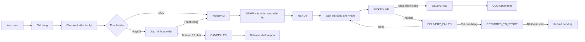
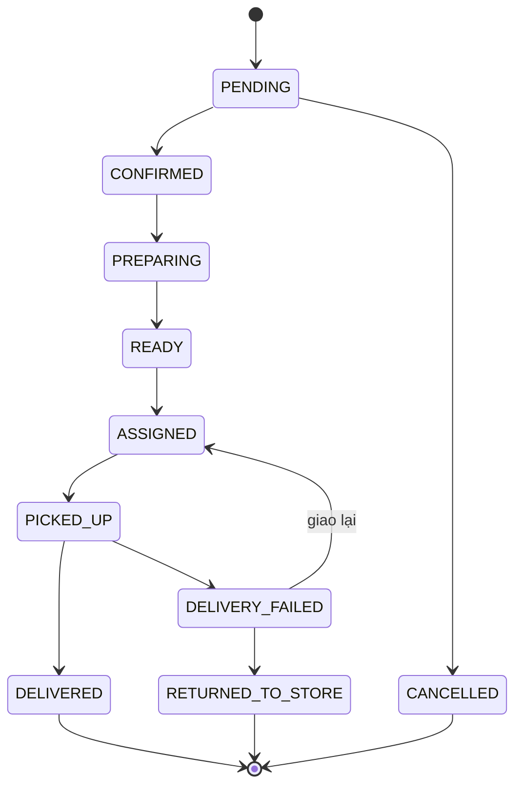
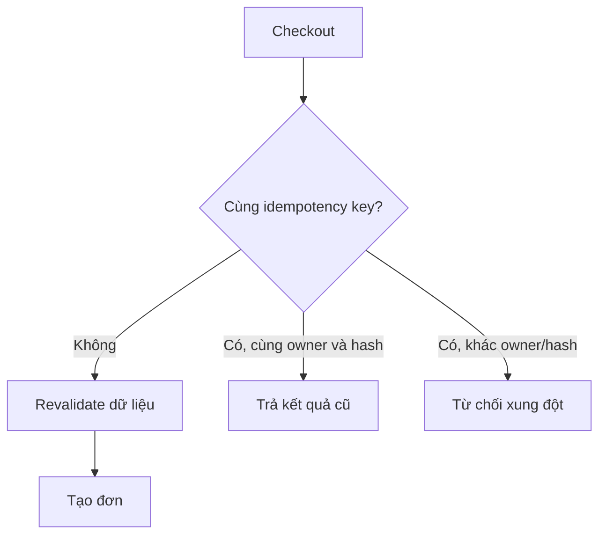
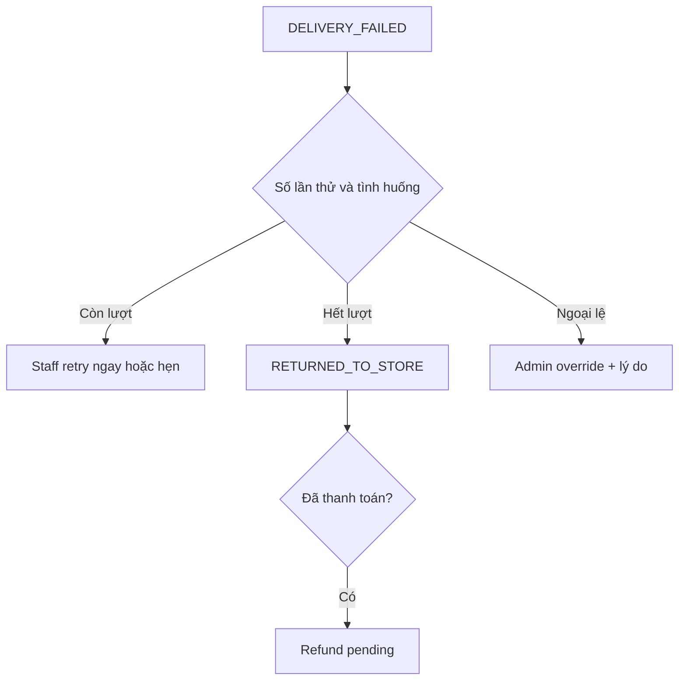
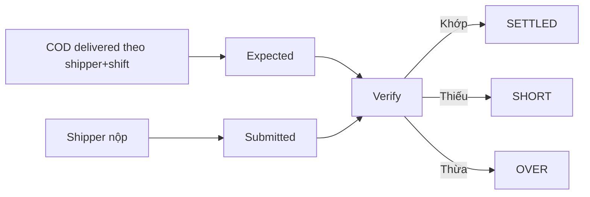
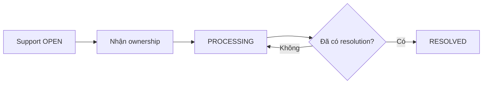

# Ôn tập vấn đáp bảo vệ dự án FastGuy

## 1. Mục tiêu và cách học ba vòng

Tài liệu này giúp sinh viên giới thiệu FastGuy rõ ràng, giải thích đúng nghiệp vụ, xử lý câu hỏi truy vấn và trung thực về giới hạn hiện tại.

1. **Đọc hiểu:** đọc theo luồng, tự giải thích vì sao có từng điều kiện.
2. **Tự nói:** che phần trả lời, nói lại bằng lời của mình; ưu tiên quy tắc và kết quả.
3. **Hội đồng truy vấn:** nhờ người khác hỏi ngược các ngoại lệ; trả lời theo công thức bối cảnh, quy tắc, xử lý, kết quả, lý do.

## 2. Mục lục

- [FastGuy trong một trang](#3-fastguy-trong-một-trang)
- [Ba bài giới thiệu](#4-ba-bài-giới-thiệu-có-thể-nói-nguyên-văn)
- [Thuật ngữ nghiệp vụ](#5-bảng-thuật-ngữ-nghiệp-vụ)
- [Luồng và trạng thái](#6-luồng-tổng-thể-và-vòng-đời-đơn)
- [Ma trận vai trò](#7-ma-trận-bốn-vai-trò)
- [Luồng theo vai trò](#8-luồng-theo-từng-vai-trò)
- [Luồng liên vai trò](#9-các-luồng-liên-vai-trò)
- [Bảng Nếu thì](#10-bảng-nếu-thì)
- [120 câu hỏi vấn đáp](#11-bộ-120-câu-hỏi-vấn-đáp)
- [Phản biện khó](#12-hai-mươi-tình-huống-phản-biện-khó)
- [Câu nói mẫu](#13-hai-mươi-câu-nói-mẫu)
- [Kịch bản demo](#14-kịch-bản-demo-15-phút)
- [Điều chưa nên khẳng định](#15-những-gì-dự-án-chưa-cóchưa-nên-khẳng-định)
- [Checklist học](#16-checklist-học)
- [Tóm tắt học thuộc](#17-tóm-tắt-hai-trang-học-thuộc)

## 3. FastGuy trong một trang

| Nội dung | Tóm tắt dễ nói |
|---|---|
| Vấn đề | Quản lý đặt món, thanh toán, chuẩn bị, giao hàng và đối soát trong một luồng có kiểm soát. |
| Đối tượng | Khách chưa đăng nhập, USER, STAFF, SHIPPER, ADMIN. Guest là trạng thái truy cập, không phải role DB. |
| Giá trị | Giảm bỏ sót đơn, kiểm soát chuyển trạng thái, chống đặt trùng, giữ đúng tồn kho, ghi nhận tiền và ngoại lệ. |
| Phạm vi | Menu, giỏ, checkout, coupon, thanh toán COD/PayOS, vận hành đơn, giao hàng, refund, loyalty, review, support, notification, báo cáo quản trị. |
| Vai trò DB | ADMIN quản trị; STAFF vận hành cửa hàng; SHIPPER giao đơn; USER mua hàng. |
| Điểm mạnh | Quyền theo vai trò và ca; trạng thái rõ; xác minh thanh toán phía server; idempotency checkout; quản lý giao thất bại và COD settlement. |
| Kiến trúc ngắn | Vue 3/Pinia; backend Servlet–Service–DAO–JPA; SQL Server; OpenAPI làm nguồn chuẩn cho API đã contract hóa. |
| Giới hạn | Không tự gán shipper; loyalty chưa đổi điểm khi checkout; logout phía client; không refresh token/blacklist; báo cáo không phải kế toán. |
| Trạng thái bằng chứng | Baseline local từng xác minh 308 backend test và 425 frontend test; không đồng nghĩa đã triển khai production. |

## 4. Ba bài giới thiệu có thể nói nguyên văn

### 4.1. Bài 30 giây

FastGuy là hệ thống hỗ trợ quy trình đặt và giao món, từ xem menu, tạo đơn, thanh toán đến chuẩn bị, giao hàng và đối soát tiền thu hộ. Hệ thống phục vụ khách, người dùng, nhân viên cửa hàng, shipper và quản trị viên; có bốn role là USER, STAFF, SHIPPER và ADMIN. Điểm nổi bật là mỗi vai trò chỉ được thao tác đúng phạm vi, nhân viên và shipper phải có ca đã check-in, checkout có cơ chế chống tạo đơn trùng, còn thanh toán PayOS chỉ được xác nhận sau khi phía cung cấp được kiểm tra. FastGuy quản lý vận hành, không được giới thiệu như hệ thống kế toán hoàn chỉnh.

### 4.2. Bài 2 phút

FastGuy giải quyết bài toán phối hợp nhiều bên trong quy trình bán và giao món. Nếu chỉ ghi nhận đơn hàng mà không kiểm soát trạng thái, cửa hàng dễ chuẩn bị nhầm, shipper nhận sai đơn, khách bị trừ tiền nhưng trạng thái không khớp, hoặc cùng một yêu cầu checkout tạo ra nhiều đơn. Vì vậy dự án tổ chức nghiệp vụ quanh vòng đời đơn và quyền của từng vai trò.

Khách có thể xem món. USER hoặc guest tạo đơn sau khi hệ thống kiểm tra lại địa chỉ, giá, giỏ, coupon và tồn kho. Checkout sử dụng idempotency key gắn với chủ sở hữu và request hash để một yêu cầu lặp hợp lệ không tạo đơn mới, nhưng nội dung khác dùng cùng khóa sẽ bị từ chối. Đơn thanh toán chuyển khoản chờ PayOS; client không được tự báo đã thanh toán. Webhook hoặc luồng kiểm tra phải xác minh với nhà cung cấp. Đơn COD được thanh toán khi giao, với số tiền shipper thu phải bằng finalAmount.

STAFF phải ACTIVE và có ca đã check-in mới được thay đổi vận hành. Nhân viên xử lý PENDING, CONFIRMED, PREPARING, READY và chỉ gán shipper khi đơn READY. Việc gán là thủ công. SHIPPER cũng phải có ca hợp lệ, chỉ thao tác đơn thuộc mình, rồi chuyển ASSIGNED sang PICKED_UP và DELIVERED hoặc DELIVERY_FAILED. Giao thất bại có mã lý do, giới hạn số lần mặc định là hai; staff quyết định giao lại, hẹn hoặc trả về cửa hàng. ADMIN có thể override nhưng phải ghi lý do.

Hệ thống còn hỗ trợ coupon, loyalty, review, support, notification, refund và báo cáo gross, refund, net cùng các góc nhìn vận hành. Tuy nhiên loyalty hiện mới earn, history, tier và reverse, chưa redeem lúc checkout. Logout chỉ phía client, Cloudinary dùng unsigned preset trực tiếp từ trình duyệt, báo cáo không thay thế kế toán. Các test 308 backend và 425 frontend là baseline local tại thời điểm kiểm tra, không phải bằng chứng production.

### 4.3. Bài 5 phút

FastGuy được xây dựng để giải quyết một vấn đề rất thực tế: một đơn món ăn không chỉ có bước khách bấm đặt. Đơn phải đi qua kiểm tra giá và tồn kho, xác nhận thanh toán, chuẩn bị, bàn giao cho shipper, giao hàng, xử lý thất bại, hoàn tiền và đối soát COD. Mỗi bước do một đối tượng khác nhau thực hiện. Nếu không có quy tắc chung, dữ liệu dễ lệch và trách nhiệm không rõ.

Hệ thống có bốn role trong cơ sở dữ liệu: USER, STAFF, SHIPPER và ADMIN. Guest không phải role; đó là khách chưa đăng nhập nhưng vẫn được phép dùng một số luồng hạn chế. USER tập trung vào mua hàng, theo dõi đơn, lịch sử và các chức năng sau mua. STAFF vận hành cửa hàng. SHIPPER nhận và giao đơn được phân công. ADMIN quản trị và xử lý các ngoại lệ cần quyền cao hơn.

Luồng chính bắt đầu khi khách xem menu, chọn món và checkout. Trước khi tạo đơn, hệ thống không tin hoàn toàn dữ liệu cũ ở giao diện mà kiểm tra lại giỏ, giá, tồn kho, coupon và địa chỉ. Với quantityAvailable bằng null, món được hiểu là không giới hạn tồn kho. Với món có giới hạn, checkout tạo trạng thái RESERVED và giảm số lượng. Cơ chế idempotency dùng một khóa, request hash và chủ sở hữu. Nếu trình duyệt gửi lại đúng yêu cầu do mạng chậm, hệ thống trả về kết quả cũ thay vì tạo thêm đơn. Nếu cùng khóa nhưng nội dung khác, yêu cầu bị từ chối.

Khách chọn COD hoặc BANK_TRANSFER qua PayOS. Với PayOS, client không được tự xác nhận đã trả tiền. Hệ thống chỉ tin kết quả đã xác minh từ webhook hoặc nhà cung cấp. Đơn chuyển khoản PENDING và UNPAID quá 15 phút được scheduler tự hủy. Đơn COD PENDING và UNPAID quá 3 giờ cũng tự hủy. Scheduler hiện chạy trong tiến trình ứng dụng, vì vậy khi bàn về triển khai nhiều instance phải thừa nhận rủi ro chạy lặp và cần cơ chế khóa phân tán hoặc scheduler tập trung.

Sau khi đơn hợp lệ, STAFF phải ở trạng thái ACTIVE và có ca đã check-in mới được mutation. Nhân viên chuyển đơn theo PENDING, CONFIRMED, PREPARING rồi READY. Khi vào PREPARING, tồn kho RESERVED chuyển thành CONSUMED. STAFF chỉ được gán shipper khi đơn READY và không tự thực hiện pickup hay deliver. Assignment là thủ công để cửa hàng chủ động theo năng lực thực tế.

Shipper hợp lệ phải ACTIVE, đúng role SHIPPER, có ca hôm nay ở CHECKED_IN, có checkInAt, chưa có checkOutAt và đang trong cửa sổ ca. Workload chỉ tính các đơn active ASSIGNED hoặc PICKED_UP kể từ checkInAt hiện tại. Sau khi được gán, shipper chỉ thao tác đơn của mình: ASSIGNED sang PICKED_UP, rồi DELIVERED hoặc DELIVERY_FAILED. Với COD, collectedAmount phải đúng bằng finalAmount trước khi hoàn tất giao.

Nếu giao thất bại, hệ thống ghi mã lý do và số lần thử. Giới hạn mặc định là hai lần. STAFF có thể cho thử lại ngay, hẹn lại hoặc trả về cửa hàng. ADMIN có thể override nhưng phải ghi lý do để giữ dấu vết trách nhiệm. COD được đối soát theo shipper và ca, gồm expected, submitted và verified; kết quả có thể là SUBMITTED, SETTLED, SHORT hoặc OVER.

Về hủy và hoàn tiền, USER chỉ tự hủy đơn PENDING. Nếu hủy trước khi hàng được consume, reservation được RELEASED và tồn kho hoàn lại. Sau consume hoặc khi trả hàng, canonical source có chính sách WASTED; tuy nhiên parity với runtime DB retained đang được xử lý, nên không được khẳng định phần này đã triển khai hoàn chỉnh. Đơn đã thanh toán nhưng CANCELLED hoặc RETURNED_TO_STORE tạo refund pending. ADMIN xử lý refund có audit, đồng thời loyalty đã cộng trước đó phải reverse.

Các chức năng bổ trợ cũng tuân theo điều kiện. Coupon gồm PERCENT, FIXED và FREE_SHIPPING, phải còn active, chưa hết hạn, đạt giá trị tối thiểu, không vượt số lượt và thuộc wallet phù hợp. Review chỉ dành cho đơn DELIVERED, mỗi user và order chỉ có một review; muốn hiện ở trang chủ cần consent. Support đi từ OPEN sang PROCESSING rồi RESOLVED, khi resolve phải có resolution và ownership rõ. Notification có thể gửi cho user hoặc role; thông báo theo role có read receipt riêng cho từng user.

Về an toàn, mật khẩu dùng PBKDF2 và có khóa brute-force; JWT có hạn 24 giờ. Hạn chế cần nói thẳng là logout hiện chỉ xóa phía client, không có refresh token hoặc blacklist. Cloudinary được upload trực tiếp từ browser bằng unsigned preset, backend chỉ lưu URL; cách này tiện nhưng cần giới hạn preset, kiểm tra loại và kích thước file, theo dõi abuse. Báo cáo cung cấp gross, refund, net, top sản phẩm, danh mục, giờ, ngày, thứ, phương thức thanh toán và exception; đây là báo cáo vận hành, không phải hệ thống kế toán.

Kiến trúc chỉ cần giới thiệu ngắn: Vue 3 và Pinia ở frontend; Servlet, Service, DAO, JPA ở backend; SQL Server lưu dữ liệu; OpenAPI chuẩn hóa hợp đồng API. Baseline local từng vượt qua 308 backend test và 425 frontend test tại thời điểm kiểm tra. Đó là bằng chứng chất lượng cục bộ, không phải tuyên bố production. Tính năng ngày vận hành với close−60/−30 hiện đang thiết kế và kiểm tra migration parity, chưa triển khai. Cách trình bày trung thực các giới hạn cho thấy nhóm hiểu rõ hệ thống hơn là phóng đại phạm vi.

## 5. Bảng thuật ngữ nghiệp vụ

| Thuật ngữ | Giải thích dễ nói |
|---|---|
| Role | Nhóm quyền lưu trong DB. |
| Guest | Khách chưa đăng nhập, không phải role. |
| USER | Người mua có tài khoản. |
| STAFF | Nhân viên vận hành cửa hàng. |
| SHIPPER | Người giao đơn được gán. |
| ADMIN | Người quản trị và xử lý ngoại lệ. |
| Order state | Mốc nghiệp vụ hiện tại của đơn. |
| Mutation | Thao tác làm thay đổi dữ liệu. |
| Shift | Ca làm việc. |
| Check-in | Xác nhận bắt đầu ca. |
| Assignment | Gán đơn READY cho shipper. |
| Workload | Số đơn active của shipper trong ca hiện tại. |
| Checkout | Kiểm tra và tạo đơn từ giỏ. |
| Idempotency key | Khóa chống tạo đơn trùng khi gửi lại. |
| Request hash | Dấu vân tay nội dung yêu cầu. |
| Owner | Chủ thể sở hữu khóa hoặc dữ liệu. |
| Reservation | Giữ tồn kho cho đơn. |
| RESERVED | Đã giữ và trừ lượng khả dụng. |
| CONSUMED | Nguyên liệu/hàng đã đưa vào chuẩn bị. |
| RELEASED | Hủy giữ chỗ và hoàn kho. |
| WASTED | Chính sách ghi nhận hao hụt sau consume; runtime parity đang xử lý. |
| quantityAvailable | Số lượng còn có thể bán; null nghĩa không giới hạn. |
| finalAmount | Tổng tiền cuối cùng phải trả. |
| COD | Thu tiền khi giao. |
| BANK_TRANSFER | Chuyển khoản qua PayOS. |
| Webhook | Thông báo server-to-server từ nhà cung cấp. |
| Payment verification | Kiểm tra thanh toán với nguồn đáng tin. |
| Refund | Hoàn tiền cho giao dịch đã trả. |
| Refund pending | Yêu cầu hoàn tiền đang chờ xử lý. |
| Coupon | Ưu đãi có điều kiện. |
| Redemption | Lượt coupon đã gắn với đơn. |
| Loyalty | Điểm và hạng khách hàng. |
| Reverse loyalty | Thu hồi điểm khi giao dịch bị đảo. |
| Delivery attempt | Một lần shipper thử giao. |
| Failure reason code | Mã lý do giao thất bại chuẩn hóa. |
| Retry | Tổ chức giao lại. |
| Return to store | Đưa đơn về cửa hàng. |
| COD settlement | Đối soát tiền shipper phải nộp và đã nộp. |
| Expected | Số tiền hệ thống kỳ vọng. |
| Submitted | Số tiền shipper khai nộp. |
| Verified | Số tiền đã được kiểm tra. |
| SHORT | Thiếu tiền khi đối soát. |
| OVER | Thừa tiền khi đối soát. |
| SETTLED | Đối soát đã khớp và chốt. |
| Consent | Đồng ý cho phép hiển thị review. |
| Read receipt | Dấu đã đọc riêng của người nhận. |
| Support ownership | Người chịu trách nhiệm ticket. |
| Gross | Tổng giá trị trước hoàn tiền. |
| Net | Gross trừ refund theo phạm vi báo cáo. |
| OpenAPI | Nguồn chuẩn mô tả API đã contract hóa. |
| Baseline local | Kết quả kiểm tra tại máy/thời điểm cụ thể. |

## 6. Luồng tổng thể và vòng đời đơn

| Trạng thái | Ý nghĩa |
|---|---|
| PENDING | Đơn mới, chờ xác nhận; USER chỉ hủy được tại đây. |
| CONFIRMED | Cửa hàng đã nhận xử lý. |
| PREPARING | Đang chuẩn bị; reservation chuyển CONSUMED. |
| READY | Đã sẵn sàng và mới đủ điều kiện gán shipper. |
| ASSIGNED | Đã gán cho shipper hợp lệ. |
| PICKED_UP | Shipper đã nhận hàng. |
| DELIVERY_FAILED | Một lần giao không thành công, có reason code. |
| RETURNED_TO_STORE | Đơn được trả về cửa hàng. |
| DELIVERED | Giao thành công; COD phải thu đúng finalAmount. |
| CANCELLED | Đơn bị hủy theo quyền hoặc timeout. |

## 7. Ma trận bốn vai trò

| Vai trò | Mục tiêu | Được làm | Không được làm | Điều kiện chính |
|---|---|---|---|---|
| USER | Mua và theo dõi đơn | Checkout, theo dõi, hủy PENDING, review DELIVERED, support | Tự xác nhận paid; hủy sau PENDING; vận hành đơn | Đăng nhập cho luồng USER; sở hữu dữ liệu |
| STAFF | Vận hành cửa hàng | PENDING→CONFIRMED→PREPARING→READY; gán READY; xử lý retry/return | Pickup/deliver; gán trước READY; override tùy ý | ACTIVE, shift CHECKED_IN hợp lệ |
| SHIPPER | Giao đơn được giao | ASSIGNED→PICKED_UP→DELIVERED/DELIVERY_FAILED | Đơn người khác; tự chọn đơn; thao tác ngoài ca | ACTIVE, role SHIPPER, ca hôm nay hợp lệ |
| ADMIN | Quản trị và kiểm soát | Quản lý, refund audit, override có lý do, báo cáo | Xóa dấu vết hoặc coi override là luồng thường | Quyền ADMIN; lý do/audit với ngoại lệ |

## 8. Luồng theo từng vai trò

### 8.1. USER và guest

- **Mục tiêu:** đặt đúng món, trả đúng tiền, theo dõi an toàn.
- **Từng bước:** xem menu → giỏ → địa chỉ/coupon → checkout → thanh toán/theo dõi → hậu mãi.
- **Logic:** revalidate toàn bộ; guest tra bằng orderCode và bốn số cuối điện thoại; guest PayOS polling cần proof token.
- **Ngoại lệ:** giá/tồn kho/coupon đổi; PayOS chậm; yêu cầu lặp; hủy sau PENDING bị chặn.
- **Bàn giao:** đơn hợp lệ chuyển STAFF; thanh toán chuyển nhà cung cấp rồi webhook/server verify.
- **Năm câu nói mẫu:** “Guest không phải role”; “Client không tự báo paid”; “USER chỉ hủy PENDING”; “Checkout kiểm tra lại dữ liệu”; “Gửi lặp đúng nội dung không tạo đơn mới”.

### 8.2. STAFF

- **Mục tiêu:** biến đơn hợp lệ thành món sẵn sàng giao.
- **Từng bước:** check-in → nhận PENDING → CONFIRMED → PREPARING → READY → gán shipper → xử lý ngoại lệ giao.
- **Logic:** ACTIVE và checked-in shift; chỉ READY được assign; không pickup/deliver.
- **Ngoại lệ:** stale action, hết kho, shipper hết ca, giao thất bại.
- **Bàn giao:** READY sang shipper; failure sang staff quyết định retry/hẹn/return.
- **Năm câu nói mẫu:** “Ca là điều kiện mutation”; “PREPARING đánh dấu consume”; “READY mới được gán”; “Gán thủ công”; “Staff không giả vai shipper”.

### 8.3. SHIPPER

- **Mục tiêu:** giao đúng đơn và ghi nhận đúng tiền/kết quả.
- **Từng bước:** check-in → nhận assignment → pickup → giao → nhập tiền COD hoặc reason failure → đối soát.
- **Logic:** chỉ đơn thuộc mình; ca hôm nay hợp lệ; COD collectedAmount bằng finalAmount.
- **Ngoại lệ:** ngoài cửa sổ ca, đơn bị đổi, khách vắng, thiếu/thừa settlement.
- **Bàn giao:** delivered sang hậu mãi/settlement; failed về staff.
- **Năm câu nói mẫu:** “Không tự nhận đơn”; “Chỉ thao tác đơn thuộc mình”; “Pickup trước deliver”; “COD phải khớp finalAmount”; “Failure phải có mã lý do”.

### 8.4. ADMIN

- **Mục tiêu:** quản trị, kiểm soát ngoại lệ và dấu vết.
- **Từng bước:** giám sát → xử lý quyền/dữ liệu → xem exception → refund/override có lý do → xem báo cáo.
- **Logic:** quyền cao không thay thế audit; báo cáo phục vụ vận hành.
- **Ngoại lệ:** provider lỗi, refund thủ công, delivery override, parity DB chưa hoàn tất.
- **Bàn giao:** quyết định ngoại lệ về luồng chuẩn; không che giấu giới hạn.
- **Năm câu nói mẫu:** “Override phải có lý do”; “Refund có audit”; “Net không phải sổ kế toán”; “Không khẳng định production”; “Phần parity đang xử lý được ghi rõ”.

## 9. Các luồng liên vai trò

| Luồng | Bắt đầu | Điều kiện | Xử lý | Kết quả | Lý do |
|---|---|---|---|---|---|
| Checkout COD | Khách xác nhận giỏ | Dữ liệu revalidate hợp lệ | Tạo đơn, reserve kho, PENDING/UNPAID | Staff nhận xử lý; timeout 3 giờ nếu còn PENDING/UNPAID | Tránh giữ tài nguyên vô hạn |
| Checkout PayOS | Khách chọn chuyển khoản | Đơn và phiên thanh toán hợp lệ | Điều hướng PayOS; webhook/provider verify | Paid hoặc tự hủy sau 15 phút | Không tin client |
| Hủy | USER hoặc scheduler yêu cầu | USER chỉ PENDING; timeout đúng loại | CANCELLED, release quyền lợi/tồn kho phù hợp | Đơn kết thúc; paid thì refund pending | Giữ dữ liệu nhất quán |
| Giao thất bại | Shipper không giao được | Đơn thuộc shipper, có ca, reason code | Tăng attempt; staff retry/hẹn/return | ASSIGNED lại hoặc RETURNED_TO_STORE | Tách ghi nhận và quyết định |
| Refund | Đơn paid bị cancel/return | Trạng thái và payment phù hợp | Tạo pending; admin xử lý có audit | Hoàn tiền; reverse loyalty | Tiền không tự biến mất |
| COD settlement | Có COD delivered trong ca | Đúng shipper+shift | So expected/submitted/verified | SETTLED, SHORT hoặc OVER | Kiểm soát tiền mặt |
| Support | User mở yêu cầu | Có nội dung/chủ thể | OPEN→ownership→PROCESSING→RESOLVED | Resolution được lưu | Rõ trách nhiệm và kết quả |

## 10. Bảng “Nếu... thì...”

| # | Nếu... | Thì... | Lý do |
|---:|---|---|---|
| 1 | guest truy cập | không gán role DB | guest là trạng thái truy cập |
| 2 | USER hủy đơn PENDING | cho phép CANCELLED | chưa vào vận hành sâu |
| 3 | USER hủy CONFIRMED | từ chối | vượt quyền tự hủy |
| 4 | staff không ACTIVE | chặn mutation | tránh tài khoản ngừng hoạt động |
| 5 | staff chưa check-in | chặn mutation | thao tác phải gắn ca |
| 6 | staff xử lý PENDING | có thể CONFIRMED | đúng bước kế tiếp |
| 7 | đơn CONFIRMED | chưa được assign | chưa sẵn sàng giao |
| 8 | đơn PREPARING | inventory thành CONSUMED | đã đưa vào chuẩn bị |
| 9 | đơn READY | staff có thể gán shipper | đủ điều kiện bàn giao |
| 10 | staff muốn pickup | chặn | pickup thuộc shipper |
| 11 | assignment được yêu cầu | staff chọn thủ công | chưa có auto assignment |
| 12 | shipper không ACTIVE | không hợp lệ | trạng thái tài khoản bắt buộc |
| 13 | role không phải SHIPPER | không được gán | sai chức năng |
| 14 | ca không phải hôm nay | không được gán | ca cũ không còn hiệu lực |
| 15 | shift chưa CHECKED_IN | không được gán | chưa bắt đầu làm |
| 16 | checkInAt trống | không được gán | thiếu bằng chứng bắt đầu ca |
| 17 | checkOutAt có giá trị | không được gán | ca đã kết thúc |
| 18 | ngoài cửa sổ ca | không được gán | đảm bảo khả năng phục vụ |
| 19 | shipper thao tác đơn người khác | từ chối | bảo vệ ownership |
| 20 | ASSIGNED được pickup | chuyển PICKED_UP | đúng trình tự |
| 21 | ASSIGNED được deliver thẳng | từ chối | phải pickup trước |
| 22 | COD thu thiếu finalAmount | không hoàn tất DELIVERED | tránh lệch tiền |
| 23 | giao thất bại | yêu cầu reason code | chuẩn hóa nguyên nhân |
| 24 | attempt còn dưới giới hạn | staff có thể retry/hẹn | còn cơ hội giao |
| 25 | đạt giới hạn mặc định 2 | cân nhắc return | tránh lặp vô hạn |
| 26 | admin override attempt | bắt buộc lý do | giữ audit |
| 27 | BANK_TRANSFER PENDING+UNPAID quá 15 phút | scheduler hủy | hết cửa sổ PayOS |
| 28 | COD PENDING+UNPAID quá 3 giờ | scheduler hủy | không giữ đơn vô hạn |
| 29 | BANK_TRANSFER đã paid | không hủy theo rule unpaid | điều kiện không còn đúng |
| 30 | trạng thái không PENDING | timeout trên không áp dụng | tránh hủy đơn đang xử lý |
| 31 | client báo paid | không tin trực tiếp | client có thể sai/giả |
| 32 | webhook đến | verify provider | nguồn server cần xác thực |
| 33 | PayOS unavailable | giữ trạng thái an toàn, báo thử lại | không đoán kết quả tiền |
| 34 | checkout gửi lặp cùng owner/hash | trả kết quả cũ | idempotency |
| 35 | cùng key nhưng khác hash | từ chối | khóa bị tái dùng sai |
| 36 | cùng key nhưng khác owner | từ chối | chống chiếm kết quả |
| 37 | giá đổi trước checkout | dùng giá đã revalidate hoặc báo lại | không tin giỏ cũ |
| 38 | tồn kho không đủ | không tạo đơn | tránh bán vượt |
| 39 | quantityAvailable null | coi không giới hạn | quy ước nghiệp vụ |
| 40 | checkout thành công | reserve và giảm kho hữu hạn | giữ hàng cho đơn |
| 41 | hủy trước consume | RELEASED và hoàn kho | hàng chưa dùng |
| 42 | hủy sau consume | không hoàn kho như hàng nguyên | tránh tồn kho ảo |
| 43 | hỏi WASTED retained runtime | nói parity đang xử lý | chưa đủ bằng chứng triển khai |
| 44 | coupon inactive | từ chối | ưu đãi không hiệu lực |
| 45 | coupon hết hạn | từ chối | vượt thời gian áp dụng |
| 46 | chưa đạt minimum | từ chối | không đủ điều kiện giá trị |
| 47 | vượt max uses | từ chối | bảo vệ giới hạn chương trình |
| 48 | coupon không thuộc wallet | từ chối | bảo vệ quyền sử dụng |
| 49 | checkout thất bại | không giữ redemption sai | tránh mất lượt coupon |
| 50 | đơn bị hủy hợp lệ | release redemption theo rule | có thể dùng lại đúng chính sách |
| 51 | loyalty đã earn rồi refund | reverse | điểm phải theo giao dịch thật |
| 52 | USER muốn dùng điểm checkout | nói chưa hỗ trợ redeem | đúng hiện trạng |
| 53 | review đơn chưa DELIVERED | từ chối | chưa có trải nghiệm hoàn tất |
| 54 | cùng user/order review lần hai | từ chối | unique review |
| 55 | review muốn lên homepage | cần consent | tôn trọng người viết |
| 56 | support đang OPEN | nhận ownership rồi PROCESSING | rõ người phụ trách |
| 57 | resolve không có resolution | từ chối | kết quả phải giải thích được |
| 58 | notification gửi role | tạo read receipt riêng user | mỗi người đọc độc lập |
| 59 | guest tra đơn | cần orderCode và 4 số cuối phone | cân bằng tiện lợi và riêng tư |
| 60 | guest poll PayOS | cần proof token | chống dò trạng thái thanh toán |
| 61 | mật khẩu sai liên tục | brute-force lock | giảm dò mật khẩu |
| 62 | JWT quá 24 giờ | hết hiệu lực | giới hạn phiên |
| 63 | user logout | client xóa token | hiện chưa blacklist server |
| 64 | token cũ chưa hết hạn bị lộ | logout không thu hồi được | hạn chế hiện tại |
| 65 | upload Cloudinary | browser dùng unsigned preset | thiết kế hiện tại |
| 66 | file upload bất thường | preset/provider phải hạn chế | giảm abuse |
| 67 | backend nhận URL ảnh | lưu URL, không giữ secret client | phân vai hiện tại |
| 68 | gross cao nhưng refund cao | xem net và exception | gross không phản ánh cuối cùng |
| 69 | cần sổ kế toán | không dùng report FastGuy thay thế | báo cáo chỉ vận hành |
| 70 | hỏi test production | nói 308/425 là baseline local | không phóng đại bằng chứng |

## 11. Bộ 120 câu hỏi vấn đáp

### Nhóm 1. Tổng quan và phạm vi

### Câu 1. FastGuy giải quyết bài toán gì?
**Trả lời nói miệng:** FastGuy phối hợp đặt món, thanh toán, chuẩn bị, giao hàng và hậu mãi trong một vòng đời đơn có kiểm soát.
**Điều kiện cần nhớ:**
- Không gọi là hệ thống kế toán.
**Hội đồng có thể hỏi tiếp:** Giá trị lớn nhất là gì?
**Trả lời truy vấn:** Giảm sai lệch trạng thái, quyền và tiền.
**Sai lầm cần tránh:** Chỉ mô tả đây là website bán hàng.

### Câu 2. Đối tượng sử dụng gồm ai?
**Trả lời nói miệng:** Có guest, USER, STAFF, SHIPPER và ADMIN; nhưng DB chỉ có bốn role, guest không phải role.
**Điều kiện cần nhớ:**
- Bốn role DB.
**Hội đồng có thể hỏi tiếp:** Vì sao guest không là role?
**Trả lời truy vấn:** Vì guest chưa có danh tính tài khoản để gán quyền lâu dài.
**Sai lầm cần tránh:** Nói có năm role.

### Câu 3. Phạm vi chính của dự án là gì?
**Trả lời nói miệng:** Phạm vi gồm menu, checkout, payment, vận hành đơn, giao hàng, refund và các chức năng hậu mãi, báo cáo.
**Điều kiện cần nhớ:**
- Tập trung vận hành giao món.
**Hội đồng có thể hỏi tiếp:** Có kế toán không?
**Trả lời truy vấn:** Không; chỉ có báo cáo gross, refund, net và góc nhìn vận hành.
**Sai lầm cần tránh:** Mở rộng thành ERP.

### Câu 4. Giá trị khác biệt của FastGuy là gì?
**Trả lời nói miệng:** Điểm khác biệt nằm ở điều kiện nghiệp vụ xuyên vai trò: ca làm, state transition, idempotency, payment verification và settlement.
**Điều kiện cần nhớ:**
- Quy tắc hơn giao diện.
**Hội đồng có thể hỏi tiếp:** Ví dụ cụ thể?
**Trả lời truy vấn:** Staff chưa check-in không được đổi trạng thái đơn.
**Sai lầm cần tránh:** Chỉ nói giao diện đẹp.

### Câu 5. Kiến trúc được giới thiệu thế nào?
**Trả lời nói miệng:** Frontend dùng Vue 3 và Pinia; backend theo Servlet–Service–DAO–JPA; dữ liệu ở SQL Server; OpenAPI chuẩn hóa API.
**Điều kiện cần nhớ:**
- Chỉ giới thiệu ngắn.
**Hội đồng có thể hỏi tiếp:** Service có vai trò gì?
**Trả lời truy vấn:** Giữ luật nghiệp vụ giữa API và truy cập dữ liệu.
**Sai lầm cần tránh:** Sa đà tên class.

### Câu 6. Vì sao lấy vòng đời đơn làm trung tâm?
**Trả lời nói miệng:** Vì mọi bên đều bàn giao quanh đơn; state cho biết ai được làm gì và điều kiện kế tiếp.
**Điều kiện cần nhớ:**
- State là kiểm soát, không chỉ nhãn.
**Hội đồng có thể hỏi tiếp:** Nếu bỏ state?
**Trả lời truy vấn:** Dễ thao tác sai thứ tự và khó truy trách nhiệm.
**Sai lầm cần tránh:** Coi state chỉ để hiển thị.

### Câu 7. Dự án có được gọi là production không?
**Trả lời nói miệng:** Không nên khẳng định. Nguồn được khảo sát theo trạng thái production-like, còn bằng chứng test là baseline local.
**Điều kiện cần nhớ:**
- Không bịa uptime/người dùng.
**Hội đồng có thể hỏi tiếp:** Test chứng minh gì?
**Trả lời truy vấn:** Chứng minh baseline cục bộ tại thời điểm chạy.
**Sai lầm cần tránh:** Đồng nhất test pass với production deployment.

### Câu 8. Baseline kiểm thử hiện biết là gì?
**Trả lời nói miệng:** Tại thời điểm xác minh ở worktree baseline, có 308 backend test và 425 frontend test pass.
**Điều kiện cần nhớ:**
- Kết quả theo thời điểm.
**Hội đồng có thể hỏi tiếp:** Có phải production test?
**Trả lời truy vấn:** Không, đó là baseline local.
**Sai lầm cần tránh:** Nói số này luôn đúng.

### Câu 9. FastGuy ưu tiên nguyên tắc thiết kế nào?
**Trả lời nói miệng:** Ưu tiên không tin dữ liệu cũ, kiểm tra lại tại ranh giới, quyền tối thiểu và lưu dấu vết ngoại lệ.
**Điều kiện cần nhớ:**
- Revalidate, ownership, audit.
**Hội đồng có thể hỏi tiếp:** Thể hiện ở checkout?
**Trả lời truy vấn:** Kiểm tra lại stock, price, cart, coupon, address.
**Sai lầm cần tránh:** Nói frontend quyết định cuối cùng.

### Câu 10. Giới hạn quan trọng nhất cần nói thẳng?
**Trả lời nói miệng:** Chưa auto assignment, loyalty chưa redeem, logout client-side, không refresh/blacklist và một số parity DB đang xử lý.
**Điều kiện cần nhớ:**
- Phân biệt hiện có và đang xử lý.
**Hội đồng có thể hỏi tiếp:** Tính năng close−60/−30 thì sao?
**Trả lời truy vấn:** Đang thiết kế/chưa triển khai.
**Sai lầm cần tránh:** Biến đề xuất thành hiện trạng.

### Nhóm 2. Vai trò và phân quyền

### Câu 11. ADMIN chịu trách nhiệm gì?
**Trả lời nói miệng:** ADMIN quản trị, giám sát, xử lý refund và override ngoại lệ có lý do, đồng thời xem báo cáo.
**Điều kiện cần nhớ:**
- Quyền cao vẫn cần audit.
**Hội đồng có thể hỏi tiếp:** Admin có được bỏ lý do?
**Trả lời truy vấn:** Không với override cần kiểm soát.
**Sai lầm cần tránh:** Nói admin làm gì cũng không cần dấu vết.

### Câu 12. STAFF chịu trách nhiệm gì?
**Trả lời nói miệng:** STAFF xác nhận, chuẩn bị, đưa đơn tới READY, gán shipper và xử lý nhánh giao thất bại.
**Điều kiện cần nhớ:**
- ACTIVE và checked-in.
**Hội đồng có thể hỏi tiếp:** Staff có giao hàng không?
**Trả lời truy vấn:** Không; staff không pickup/deliver.
**Sai lầm cần tránh:** Trộn staff với shipper.

### Câu 13. SHIPPER chịu trách nhiệm gì?
**Trả lời nói miệng:** SHIPPER nhận đơn đã gán, pickup, giao, ghi nhận thất bại và tham gia đối soát COD.
**Điều kiện cần nhớ:**
- Chỉ đơn thuộc mình.
**Hội đồng có thể hỏi tiếp:** Có tự chọn đơn không?
**Trả lời truy vấn:** Không, assignment thủ công bởi staff.
**Sai lầm cần tránh:** Nói shipper lấy mọi đơn READY.

### Câu 14. USER có quyền gì với đơn?
**Trả lời nói miệng:** USER tạo, theo dõi và chỉ tự hủy khi đơn còn PENDING; hậu mãi phụ thuộc đơn và ownership.
**Điều kiện cần nhớ:**
- Hủy chỉ PENDING.
**Hội đồng có thể hỏi tiếp:** CONFIRMED thì sao?
**Trả lời truy vấn:** USER không tự hủy.
**Sai lầm cần tránh:** Nói user hủy bất kỳ lúc nào.

### Câu 15. Vì sao quyền phải gắn trạng thái?
**Trả lời nói miệng:** Cùng một người nhưng hành động chỉ hợp lệ ở đúng mốc, giúp tránh bỏ bước và xung đột trách nhiệm.
**Điều kiện cần nhớ:**
- Role cộng state.
**Hội đồng có thể hỏi tiếp:** Ví dụ?
**Trả lời truy vấn:** Staff chỉ assign khi READY.
**Sai lầm cần tránh:** Kiểm tra role nhưng bỏ state.

### Câu 16. Vì sao staff cần ca?
**Trả lời nói miệng:** Ca chứng minh nhân viên đang thực sự làm việc và gắn thao tác với khoảng thời gian chịu trách nhiệm.
**Điều kiện cần nhớ:**
- ACTIVE, CHECKED_IN.
**Hội đồng có thể hỏi tiếp:** Chỉ ACTIVE đủ không?
**Trả lời truy vấn:** Không, còn cần ca đã check-in.
**Sai lầm cần tránh:** Đồng nhất tài khoản active với đang làm việc.

### Câu 17. Vì sao shipper chỉ thao tác đơn thuộc mình?
**Trả lời nói miệng:** Ownership ngăn shipper sửa kết quả giao của người khác và giữ trách nhiệm rõ ràng.
**Điều kiện cần nhớ:**
- Kiểm tra ownership mỗi mutation.
**Hội đồng có thể hỏi tiếp:** Biết orderCode có đủ không?
**Trả lời truy vấn:** Không.
**Sai lầm cần tránh:** Dùng khả năng xem thay cho quyền sửa.

### Câu 18. Guest được bảo vệ thế nào?
**Trả lời nói miệng:** Guest tra đơn bằng orderCode và bốn số cuối điện thoại; PayOS polling còn cần proof token.
**Điều kiện cần nhớ:**
- Không tiết lộ toàn bộ bằng mã đơn.
**Hội đồng có thể hỏi tiếp:** Vì sao thêm proof token?
**Trả lời truy vấn:** Giảm nguy cơ dò trạng thái thanh toán.
**Sai lầm cần tránh:** Cho tra chỉ bằng orderCode.

### Câu 19. Phân quyền frontend có đủ không?
**Trả lời nói miệng:** Không. Frontend chỉ hỗ trợ trải nghiệm; backend phải kiểm tra role, state, ca và ownership.
**Điều kiện cần nhớ:**
- Backend là điểm cưỡng chế.
**Hội đồng có thể hỏi tiếp:** Vì sao?
**Trả lời truy vấn:** Client có thể bị sửa hoặc gọi API trực tiếp.
**Sai lầm cần tránh:** Tin nút bị ẩn.

### Câu 20. Admin override nên dùng khi nào?
**Trả lời nói miệng:** Chỉ dùng cho ngoại lệ có căn cứ, ghi rõ lý do; không thay luồng nghiệp vụ thường.
**Điều kiện cần nhớ:**
- Có audit.
**Hội đồng có thể hỏi tiếp:** Vì sao hạn chế?
**Trả lời truy vấn:** Tránh quyền cao che mất sai lệch.
**Sai lầm cần tránh:** Dùng override để sửa mọi lỗi quy trình.

### Nhóm 3. Menu, sản phẩm và giỏ

### Câu 21. Menu có vai trò gì?
**Trả lời nói miệng:** Menu giúp khách khám phá món và tạo giỏ, nhưng dữ liệu hiển thị không phải quyết định cuối của checkout.
**Điều kiện cần nhớ:**
- Checkout revalidate.
**Hội đồng có thể hỏi tiếp:** Giá cũ xử lý sao?
**Trả lời truy vấn:** Kiểm tra lại trước tạo đơn.
**Sai lầm cần tránh:** Tin giá lưu ở browser.

### Câu 22. Vì sao giỏ chưa phải đơn?
**Trả lời nói miệng:** Giỏ là ý định mua; chỉ sau kiểm tra địa chỉ, giá, kho, coupon và idempotency mới thành đơn.
**Điều kiện cần nhớ:**
- Không reserve chỉ vì thêm giỏ.
**Hội đồng có thể hỏi tiếp:** Khi nào giữ kho?
**Trả lời truy vấn:** Khi checkout thành công.
**Sai lầm cần tránh:** Đồng nhất cart với order.

### Câu 23. Giá món được tin từ đâu?
**Trả lời nói miệng:** Giá phải được backend lấy và kiểm tra theo nguồn hiện tại, không nhận tổng tiền do client tự tính làm sự thật.
**Điều kiện cần nhớ:**
- Server tính finalAmount.
**Hội đồng có thể hỏi tiếp:** Client tính để làm gì?
**Trả lời truy vấn:** Chỉ hiển thị dự kiến.
**Sai lầm cần tránh:** Cho client gửi giá quyết định.

### Câu 24. Món hết hàng xử lý thế nào?
**Trả lời nói miệng:** Checkout phải từ chối hoặc yêu cầu điều chỉnh giỏ nếu số lượng hữu hạn không đủ.
**Điều kiện cần nhớ:**
- Revalidate stock.
**Hội đồng có thể hỏi tiếp:** Menu vừa hiển thị còn hàng thì sao?
**Trả lời truy vấn:** Dữ liệu có thể đổi nên vẫn kiểm tra lại.
**Sai lầm cần tránh:** Cam kết theo ảnh chụp cũ.

### Câu 25. quantityAvailable bằng null nghĩa gì?
**Trả lời nói miệng:** Đó là quy ước món không giới hạn số lượng tồn kho, khác với bằng không.
**Điều kiện cần nhớ:**
- null không phải zero.
**Hội đồng có thể hỏi tiếp:** Có trừ kho không?
**Trả lời truy vấn:** Không áp dụng giới hạn số lượng như hàng hữu hạn.
**Sai lầm cần tránh:** Coi null là hết hàng.

### Câu 26. Giỏ thay đổi giữa hai thiết bị thì sao?
**Trả lời nói miệng:** Kết quả checkout dựa trên dữ liệu được gửi và kiểm tra tại thời điểm xử lý, không giả định mọi màn hình luôn đồng bộ.
**Điều kiện cần nhớ:**
- Revalidate ở trust boundary.
**Hội đồng có thể hỏi tiếp:** Có thể báo xung đột không?
**Trả lời truy vấn:** Có nếu nội dung không còn hợp lệ.
**Sai lầm cần tránh:** Âm thầm tạo đơn sai.

### Câu 27. Vì sao không giữ kho từ lúc thêm giỏ?
**Trả lời nói miệng:** Giỏ có thể bị bỏ lâu; giữ kho lúc đó làm giảm hàng khả dụng mà chưa có cam kết mua.
**Điều kiện cần nhớ:**
- Reserve tại checkout.
**Hội đồng có thể hỏi tiếp:** Rủi ro cạnh tranh?
**Trả lời truy vấn:** Được giải quyết bằng kiểm tra và reserve khi tạo đơn.
**Sai lầm cần tránh:** Khóa kho vô hạn theo cart.

### Câu 28. Sản phẩm ẩn hoặc ngừng bán thì sao?
**Trả lời nói miệng:** Dù còn trong giỏ cũ, checkout phải kiểm tra khả năng bán hiện tại và từ chối nếu không hợp lệ.
**Điều kiện cần nhớ:**
- Trạng thái hiện tại quyết định.
**Hội đồng có thể hỏi tiếp:** Có tự thay món không?
**Trả lời truy vấn:** Không nên tự thay nếu khách chưa đồng ý.
**Sai lầm cần tránh:** Tạo đơn từ cache cũ.

### Câu 29. Tổng tiền gồm những gì?
**Trả lời nói miệng:** Tổng cuối phản ánh giá món, số lượng, ưu đãi và phí liên quan sau khi hệ thống tính lại.
**Điều kiện cần nhớ:**
- finalAmount là chuẩn thu tiền.
**Hội đồng có thể hỏi tiếp:** COD đối chiếu số nào?
**Trả lời truy vấn:** finalAmount.
**Sai lầm cần tránh:** Thu theo subtotal cũ.

### Câu 30. Menu liên quan báo cáo ra sao?
**Trả lời nói miệng:** Dữ liệu đơn giúp tổng hợp top sản phẩm và danh mục, nhưng đó là góc nhìn vận hành.
**Điều kiện cần nhớ:**
- Không phải sổ kế toán.
**Hội đồng có thể hỏi tiếp:** Có phân tích thời gian không?
**Trả lời truy vấn:** Có theo giờ, ngày và thứ.
**Sai lầm cần tránh:** Suy diễn lợi nhuận kế toán.

### Nhóm 4. Checkout, địa chỉ, GHN, coupon và idempotency

### Câu 31. Checkout kiểm tra lại gì?
**Trả lời nói miệng:** Hệ thống kiểm tra stock, price, cart, coupon và address trước khi tạo đơn.
**Điều kiện cần nhớ:**
- Không tin trạng thái frontend.
**Hội đồng có thể hỏi tiếp:** Vì sao kiểm tra nhiều lần?
**Trả lời truy vấn:** Dữ liệu có thể đổi từ lúc người dùng xem.
**Sai lầm cần tránh:** Chỉ validate giao diện.

### Câu 32. Địa chỉ có vai trò gì?
**Trả lời nói miệng:** Địa chỉ xác định nơi giao và là đầu vào cho khả năng phục vụ, phí hoặc thông tin vận chuyển.
**Điều kiện cần nhớ:**
- Kiểm tra lại ownership/hợp lệ.
**Hội đồng có thể hỏi tiếp:** Có tin addressId bất kỳ?
**Trả lời truy vấn:** Không, phải thuộc đúng chủ thể.
**Sai lầm cần tránh:** Cho dùng địa chỉ người khác.

### Câu 33. GHN lỗi thì xử lý thế nào?
**Trả lời nói miệng:** Không đoán phí hoặc vùng giao. Hệ thống báo chưa xác minh được, giữ giỏ và cho thử lại hoặc dùng fallback đã định.
**Điều kiện cần nhớ:**
- Không tạo số giả.
**Hội đồng có thể hỏi tiếp:** Có mất giỏ không?
**Trả lời truy vấn:** Không nên.
**Sai lầm cần tránh:** Mặc định phí bằng không.

### Câu 34. Coupon có những loại nào?
**Trả lời nói miệng:** Có PERCENT, FIXED và FREE_SHIPPING.
**Điều kiện cần nhớ:**
- Mỗi loại ảnh hưởng phần tiền khác nhau.
**Hội đồng có thể hỏi tiếp:** Có điều kiện chung gì?
**Trả lời truy vấn:** Active, expiry, min, max uses và wallet.
**Sai lầm cần tránh:** Nói coupon nào cũng giảm tổng theo phần trăm.

### Câu 35. Coupon được kiểm tra điều kiện nào?
**Trả lời nói miệng:** Coupon phải active, còn hạn, đạt mức tối thiểu, chưa vượt lượt và người dùng có quyền trong wallet.
**Điều kiện cần nhớ:**
- Kiểm tra tại checkout.
**Hội đồng có thể hỏi tiếp:** Client đã báo hợp lệ có đủ không?
**Trả lời truy vấn:** Không.
**Sai lầm cần tránh:** Chỉ kiểm tra mã tồn tại.

### Câu 36. Redemption binding là gì?
**Trả lời nói miệng:** Là gắn lượt dùng coupon với đơn cụ thể để không dùng cùng quyền lợi cho nhiều đơn.
**Điều kiện cần nhớ:**
- Có release theo trường hợp hợp lệ.
**Hội đồng có thể hỏi tiếp:** Checkout lỗi thì sao?
**Trả lời truy vấn:** Không được làm mất lượt sai.
**Sai lầm cần tránh:** Trừ lượt trước rồi bỏ quên.

### Câu 37. Idempotency giải quyết gì?
**Trả lời nói miệng:** Nó ngăn một thao tác checkout bị gửi lại do mạng hoặc double-click tạo nhiều đơn.
**Điều kiện cần nhớ:**
- Key, hash, owner.
**Hội đồng có thể hỏi tiếp:** Có phải chống mọi đơn giống nhau?
**Trả lời truy vấn:** Không, chỉ kiểm soát yêu cầu theo khóa.
**Sai lầm cần tránh:** Dùng nội dung giống nhau làm tiêu chí duy nhất.

### Câu 38. Request hash dùng để làm gì?
**Trả lời nói miệng:** Hash xác định nội dung đi cùng idempotency key; cùng khóa nhưng nội dung khác là xung đột.
**Điều kiện cần nhớ:**
- Không tái dùng key cho yêu cầu khác.
**Hội đồng có thể hỏi tiếp:** Cùng hash thì sao?
**Trả lời truy vấn:** Còn phải đúng owner.
**Sai lầm cần tránh:** Chỉ so key.

### Câu 39. Owner của idempotency quan trọng thế nào?
**Trả lời nói miệng:** Owner ngăn người khác dùng khóa biết được để nhận kết quả checkout không thuộc mình.
**Điều kiện cần nhớ:**
- Khóa gắn chủ thể.
**Hội đồng có thể hỏi tiếp:** Guest có owner không?
**Trả lời truy vấn:** Phải có chủ thể phiên/định danh phù hợp trong thiết kế.
**Sai lầm cần tránh:** Dùng key toàn cục không ràng buộc.

### Câu 40. Double checkout được xử lý ra sao?
**Trả lời nói miệng:** Nếu cùng owner, key và hash, hệ thống trả kết quả cũ; nếu nội dung hoặc owner khác thì từ chối.
**Điều kiện cần nhớ:**
- Không tạo đơn thứ hai.
**Hội đồng có thể hỏi tiếp:** Vì sao không cứ tạo mới?
**Trả lời truy vấn:** Tránh trừ kho và thanh toán lặp.
**Sai lầm cần tránh:** Chỉ khóa nút frontend.

### Nhóm 5. Vòng đời đơn

### Câu 41. Các state chuẩn là gì?
**Trả lời nói miệng:** PENDING, CONFIRMED, PREPARING, READY, ASSIGNED, PICKED_UP, DELIVERY_FAILED, RETURNED_TO_STORE, DELIVERED và CANCELLED.
**Điều kiện cần nhớ:**
- Đúng mười trạng thái.
**Hội đồng có thể hỏi tiếp:** State nào do staff xử lý?
**Trả lời truy vấn:** Chuỗi PENDING đến READY và assignment.
**Sai lầm cần tránh:** Tự thêm trạng thái không có.

### Câu 42. PENDING nghĩa gì?
**Trả lời nói miệng:** Đơn vừa tạo và đang chờ xác nhận; đây là state duy nhất USER tự hủy được.
**Điều kiện cần nhớ:**
- Timeout cũng xét PENDING+UNPAID.
**Hội đồng có thể hỏi tiếp:** Paid PENDING có bị timeout không?
**Trả lời truy vấn:** Không theo rule yêu cầu UNPAID.
**Sai lầm cần tránh:** Bỏ điều kiện payment.

### Câu 43. CONFIRMED nghĩa gì?
**Trả lời nói miệng:** Cửa hàng đã chấp nhận xử lý đơn nhưng chưa bắt đầu chuẩn bị.
**Điều kiện cần nhớ:**
- Chưa assign shipper.
**Hội đồng có thể hỏi tiếp:** Bước tiếp theo?
**Trả lời truy vấn:** PREPARING.
**Sai lầm cần tránh:** Coi là đã sẵn sàng giao.

### Câu 44. PREPARING nghĩa gì?
**Trả lời nói miệng:** Cửa hàng đang chuẩn bị; reservation được chuyển thành CONSUMED.
**Điều kiện cần nhớ:**
- Ảnh hưởng chính sách kho khi hủy.
**Hội đồng có thể hỏi tiếp:** Có hoàn kho nguyên trạng không?
**Trả lời truy vấn:** Không nên như trước consume.
**Sai lầm cần tránh:** Bỏ qua consume.

### Câu 45. READY nghĩa gì?
**Trả lời nói miệng:** Món đã sẵn sàng bàn giao và chỉ từ state này staff mới gán shipper.
**Điều kiện cần nhớ:**
- Assignment thủ công.
**Hội đồng có thể hỏi tiếp:** Có auto assign không?
**Trả lời truy vấn:** Không.
**Sai lầm cần tránh:** Gán từ PREPARING.

### Câu 46. ASSIGNED nghĩa gì?
**Trả lời nói miệng:** Đơn đã thuộc trách nhiệm một shipper hợp lệ nhưng shipper chưa nhận hàng.
**Điều kiện cần nhớ:**
- Ownership bắt đầu rõ.
**Hội đồng có thể hỏi tiếp:** Bước kế?
**Trả lời truy vấn:** PICKED_UP.
**Sai lầm cần tránh:** Coi là đã lấy hàng.

### Câu 47. PICKED_UP nghĩa gì?
**Trả lời nói miệng:** Shipper đã nhận hàng từ cửa hàng và đang chịu trách nhiệm giao.
**Điều kiện cần nhớ:**
- Có thể DELIVERED hoặc DELIVERY_FAILED.
**Hội đồng có thể hỏi tiếp:** COD kiểm tra lúc nào?
**Trả lời truy vấn:** Khi hoàn tất giao, tiền thu phải khớp finalAmount.
**Sai lầm cần tránh:** Deliver từ ASSIGNED.

### Câu 48. DELIVERY_FAILED nghĩa gì?
**Trả lời nói miệng:** Một lần giao thất bại đã được ghi nhận cùng mã lý do, chưa nhất thiết kết thúc đơn.
**Điều kiện cần nhớ:**
- Attempt mặc định tối đa 2.
**Hội đồng có thể hỏi tiếp:** Ai quyết định tiếp?
**Trả lời truy vấn:** Staff retry, hẹn hoặc return; admin override có lý do.
**Sai lầm cần tránh:** Đồng nhất với CANCELLED.

### Câu 49. RETURNED_TO_STORE nghĩa gì?
**Trả lời nói miệng:** Đơn không tiếp tục giao và được trả về cửa hàng; nếu đã thanh toán thì tạo refund pending.
**Điều kiện cần nhớ:**
- Có thể liên quan WASTED policy.
**Hội đồng có thể hỏi tiếp:** WASTED đã pass runtime chưa?
**Trả lời truy vấn:** Chưa khẳng định; parity đang xử lý.
**Sai lầm cần tránh:** Nói hoàn kho toàn bộ.

### Câu 50. DELIVERED và CANCELLED khác gì?
**Trả lời nói miệng:** DELIVERED là hoàn tất giao; CANCELLED là kết thúc do hủy. Hệ quả tiền, kho, loyalty khác nhau.
**Điều kiện cần nhớ:**
- Không đổi state tùy ý.
**Hội đồng có thể hỏi tiếp:** Review state nào?
**Trả lời truy vấn:** Chỉ DELIVERED.
**Sai lầm cần tránh:** Coi mọi state cuối giống nhau.

### Nhóm 6. Thanh toán PayOS và COD

### Câu 51. Hai phương thức thanh toán là gì?
**Trả lời nói miệng:** COD và BANK_TRANSFER qua PayOS.
**Điều kiện cần nhớ:**
- Luật timeout khác nhau.
**Hội đồng có thể hỏi tiếp:** Client xác nhận paid được không?
**Trả lời truy vấn:** Không.
**Sai lầm cần tránh:** Gọi PayOS là COD.

### Câu 52. PayOS được xác nhận thế nào?
**Trả lời nói miệng:** Backend nhận tín hiệu rồi xác minh webhook hoặc provider; giao diện không phải nguồn quyết định.
**Điều kiện cần nhớ:**
- Verify phía server.
**Hội đồng có thể hỏi tiếp:** Redirect thành công đủ không?
**Trả lời truy vấn:** Không.
**Sai lầm cần tránh:** Tin query parameter client.

### Câu 53. Timeout PayOS là bao lâu?
**Trả lời nói miệng:** BANK_TRANSFER còn PENDING và UNPAID quá 15 phút được scheduler tự hủy.
**Điều kiện cần nhớ:**
- Đủ cả state và payment condition.
**Hội đồng có thể hỏi tiếp:** Đã paid thì sao?
**Trả lời truy vấn:** Không thuộc rule tự hủy này.
**Sai lầm cần tránh:** Nói mọi đơn 15 phút đều hủy.

### Câu 54. Timeout COD là bao lâu?
**Trả lời nói miệng:** COD còn PENDING và UNPAID quá 3 giờ được tự hủy.
**Điều kiện cần nhớ:**
- Khác PayOS 15 phút.
**Hội đồng có thể hỏi tiếp:** Vì sao lâu hơn?
**Trả lời truy vấn:** COD không chờ phiên thanh toán online ngắn.
**Sai lầm cần tránh:** Đảo hai mốc.

### Câu 55. COD được công nhận thu tiền khi nào?
**Trả lời nói miệng:** Khi giao thành công và collectedAmount bằng đúng finalAmount.
**Điều kiện cần nhớ:**
- Không chấp nhận thiếu/thừa ở bước deliver.
**Hội đồng có thể hỏi tiếp:** Tiền được quản lý tiếp thế nào?
**Trả lời truy vấn:** Qua settlement theo shipper và shift.
**Sai lầm cần tránh:** Coi DELIVERED tự động nghĩa tiền khớp.

### Câu 56. Vì sao client không tự confirm paid?
**Trả lời nói miệng:** Client nằm ngoài vùng tin cậy, có thể lỗi hoặc bị sửa; tiền phải dựa vào provider được xác minh.
**Điều kiện cần nhớ:**
- Server-side verification.
**Hội đồng có thể hỏi tiếp:** Webhook giả thì sao?
**Trả lời truy vấn:** Phải kiểm tra chữ ký/dữ liệu provider theo tích hợp.
**Sai lầm cần tránh:** Tin JSON bất kỳ.

### Câu 57. PayOS unavailable thì sao?
**Trả lời nói miệng:** Không đoán paid; giữ trạng thái an toàn, thông báo rõ và cho kiểm tra/thử lại theo luồng.
**Điều kiện cần nhớ:**
- Không tạo kết quả tiền giả.
**Hội đồng có thể hỏi tiếp:** Có chuyển COD tự động không?
**Trả lời truy vấn:** Không nếu khách chưa đồng ý.
**Sai lầm cần tránh:** Tự đổi payment method.

### Câu 58. Đơn paid rồi CANCELLED thì sao?
**Trả lời nói miệng:** Hệ thống tạo refund pending để admin xử lý có audit, đồng thời reverse loyalty liên quan.
**Điều kiện cần nhớ:**
- Không đánh dấu hoàn tiền giả.
**Hội đồng có thể hỏi tiếp:** Refund tự động hoàn tất không?
**Trả lời truy vấn:** Hiện có bước admin xử lý/audit.
**Sai lầm cần tránh:** Coi cancel là tiền đã về khách.

### Câu 59. RETURNED_TO_STORE đã paid thì sao?
**Trả lời nói miệng:** Tương tự trường hợp paid bị đảo, hệ thống tạo refund pending và xử lý hậu quả loyalty.
**Điều kiện cần nhớ:**
- Refund có dấu vết.
**Hội đồng có thể hỏi tiếp:** Kho xử lý sao?
**Trả lời truy vấn:** Sau consume có WASTED policy canonical; runtime parity đang xử lý.
**Sai lầm cần tránh:** Khẳng định retained runtime đã pass.

### Câu 60. Scheduler thanh toán có hạn chế gì?
**Trả lời nói miệng:** Scheduler hiện chạy in-process; nhiều instance có nguy cơ cùng quét và cần khóa hoặc scheduler tập trung khi mở rộng.
**Điều kiện cần nhớ:**
- Đây là hạn chế triển khai.
**Hội đồng có thể hỏi tiếp:** Hiện đã có distributed lock chưa?
**Trả lời truy vấn:** Không nên khẳng định nếu chưa có bằng chứng.
**Sai lầm cần tránh:** Nói multi-instance an toàn tuyệt đối.

### Nhóm 7. Tồn kho và reservation

### Câu 61. Tại sao cần reservation?
**Trả lời nói miệng:** Reservation giữ số lượng cho đơn vừa checkout, giảm nguy cơ bán cùng một tồn kho cho nhiều khách.
**Điều kiện cần nhớ:**
- RESERVED và giảm kho.
**Hội đồng có thể hỏi tiếp:** Có áp dụng hàng unlimited?
**Trả lời truy vấn:** quantityAvailable null không bị giới hạn như hàng hữu hạn.
**Sai lầm cần tránh:** Chỉ ghi order mà không giữ kho.

### Câu 62. RESERVED xảy ra khi nào?
**Trả lời nói miệng:** Khi checkout hợp lệ tạo đơn và giữ hàng hữu hạn.
**Điều kiện cần nhớ:**
- Không phải lúc thêm giỏ.
**Hội đồng có thể hỏi tiếp:** Tác động số lượng?
**Trả lời truy vấn:** Giảm quantity khả dụng.
**Sai lầm cần tránh:** Reserve quá sớm.

### Câu 63. CONSUMED xảy ra khi nào?
**Trả lời nói miệng:** Khi đơn chuyển PREPARING, hàng đã bước vào quá trình chuẩn bị.
**Điều kiện cần nhớ:**
- Hậu quả hủy khác trước consume.
**Hội đồng có thể hỏi tiếp:** Vì sao?
**Trả lời truy vấn:** Hàng có thể không còn bán lại nguyên trạng.
**Sai lầm cần tránh:** Hoàn kho máy móc.

### Câu 64. RELEASED xảy ra khi nào?
**Trả lời nói miệng:** Khi đơn bị hủy trước consume, reservation được giải phóng và lượng hữu hạn được hoàn lại.
**Điều kiện cần nhớ:**
- Trước PREPARING/consume.
**Hội đồng có thể hỏi tiếp:** Sau consume?
**Trả lời truy vấn:** Theo policy hao hụt, không release như hàng nguyên.
**Sai lầm cần tránh:** Không phân biệt thời điểm.

### Câu 65. WASTED là gì?
**Trả lời nói miệng:** Đây là chính sách canonical cho hàng đã consume hoặc return không thể trở lại tồn bán bình thường.
**Điều kiện cần nhớ:**
- Runtime DB parity đang xử lý.
**Hội đồng có thể hỏi tiếp:** Đã triển khai retained runtime chưa?
**Trả lời truy vấn:** Chưa được khẳng định.
**Sai lầm cần tránh:** Nói đã pass production.

### Câu 66. Vì sao null khác zero?
**Trả lời nói miệng:** Null được quy ước là không giới hạn; zero là hàng hữu hạn đã hết.
**Điều kiện cần nhớ:**
- Ý nghĩa nghiệp vụ rõ.
**Hội đồng có thể hỏi tiếp:** Có nguy cơ nhầm không?
**Trả lời truy vấn:** Có, nên mapping và kiểm thử phải giữ đúng quy ước.
**Sai lầm cần tránh:** Dùng mặc định null thành 0.

### Câu 67. Checkout thất bại giữa chừng thì sao?
**Trả lời nói miệng:** Không được để lại đơn, reservation hoặc redemption nửa vời; xử lý phải giữ tính nhất quán.
**Điều kiện cần nhớ:**
- Tránh dữ liệu mồ côi.
**Hội đồng có thể hỏi tiếp:** Dùng gì để đảm bảo?
**Trả lời truy vấn:** Ranh giới giao dịch và xử lý lỗi phù hợp.
**Sai lầm cần tránh:** Bắt lỗi rồi bỏ dữ liệu dở dang.

### Câu 68. Hủy PayOS timeout ảnh hưởng kho thế nào?
**Trả lời nói miệng:** Nếu đơn chưa consume, reservation được release và kho hoàn lại theo rule.
**Điều kiện cần nhớ:**
- Xét trạng thái inventory.
**Hội đồng có thể hỏi tiếp:** Coupon thì sao?
**Trả lời truy vấn:** Redemption được release theo chính sách hủy hợp lệ.
**Sai lầm cần tránh:** Chỉ đổi order state.

### Câu 69. Vì sao inventory gắn order lifecycle?
**Trả lời nói miệng:** Vì khả năng hoàn kho phụ thuộc đơn mới giữ hàng, đã chuẩn bị hay đã trả về.
**Điều kiện cần nhớ:**
- RESERVED, CONSUMED, RELEASED/WASTED.
**Hội đồng có thể hỏi tiếp:** State nào là mốc consume?
**Trả lời truy vấn:** PREPARING.
**Sai lầm cần tránh:** Quản lý kho tách rời state.

### Câu 70. Có nên khẳng định parity DB hoàn tất không?
**Trả lời nói miệng:** Không. Canonical source có WASTED policy nhưng runtime retained DB parity đang được xử lý.
**Điều kiện cần nhớ:**
- Nói đúng mức bằng chứng.
**Hội đồng có thể hỏi tiếp:** Khi nào được khẳng định?
**Trả lời truy vấn:** Khi migration parity và integration test runtime chứng minh.
**Sai lầm cần tránh:** Dùng source policy thay bằng chứng DB.

### Nhóm 8. Ca làm, assignment và shipper

### Câu 71. Shipper hợp lệ cần gì?
**Trả lời nói miệng:** ACTIVE, role SHIPPER, ca hôm nay CHECKED_IN, có checkInAt, checkOutAt null và đang trong cửa sổ ca.
**Điều kiện cần nhớ:**
- Đủ mọi điều kiện.
**Hội đồng có thể hỏi tiếp:** Thiếu một điều kiện?
**Trả lời truy vấn:** Không hợp lệ để gán/thao tác.
**Sai lầm cần tránh:** Chỉ kiểm tra role.

### Câu 72. Assignment là tự động hay thủ công?
**Trả lời nói miệng:** Thủ công; staff chọn shipper hợp lệ khi đơn READY.
**Điều kiện cần nhớ:**
- Không auto assignment.
**Hội đồng có thể hỏi tiếp:** Vì sao?
**Trả lời truy vấn:** Giữ quyền điều phối cho cửa hàng theo thực tế.
**Sai lầm cần tránh:** Phóng đại thuật toán tối ưu.

### Câu 73. Workload được tính thế nào?
**Trả lời nói miệng:** Tính các đơn active ASSIGNED và PICKED_UP kể từ checkInAt của ca hiện tại.
**Điều kiện cần nhớ:**
- Không cộng lịch sử ca cũ.
**Hội đồng có thể hỏi tiếp:** DELIVERED có tính không?
**Trả lời truy vấn:** Không còn active workload.
**Sai lầm cần tránh:** Đếm mọi đơn trong ngày.

### Câu 74. Vì sao chỉ READY mới assign?
**Trả lời nói miệng:** Để shipper không chờ đơn chưa chuẩn bị xong và ranh giới bàn giao rõ.
**Điều kiện cần nhớ:**
- Staff hoàn tất READY trước.
**Hội đồng có thể hỏi tiếp:** PREPARING assign được không?
**Trả lời truy vấn:** Không.
**Sai lầm cần tránh:** Tối ưu thời gian bằng cách phá rule.

### Câu 75. CheckOutAt null có ý nghĩa gì?
**Trả lời nói miệng:** Ca chưa được check-out; kết hợp thời gian và status mới chứng minh shipper đang làm.
**Điều kiện cần nhớ:**
- Null riêng lẻ chưa đủ.
**Hội đồng có thể hỏi tiếp:** Ngoài cửa sổ ca thì sao?
**Trả lời truy vấn:** Vẫn không hợp lệ.
**Sai lầm cần tránh:** Chỉ nhìn checkOutAt.

### Câu 76. Shipper có thể pickup đơn chưa gán không?
**Trả lời nói miệng:** Không; đơn phải ASSIGNED cho đúng shipper và người đó đang có ca hợp lệ.
**Điều kiện cần nhớ:**
- State cộng ownership cộng shift.
**Hội đồng có thể hỏi tiếp:** Biết mã đơn có đủ không?
**Trả lời truy vấn:** Không.
**Sai lầm cần tránh:** Kiểm tra state nhưng bỏ owner.

### Câu 77. Staff có thể deliver thay shipper không?
**Trả lời nói miệng:** Không theo phân công hiện tại; staff vận hành tới READY và assignment, shipper pickup/deliver.
**Điều kiện cần nhớ:**
- Separation of duties.
**Hội đồng có thể hỏi tiếp:** Admin thì sao?
**Trả lời truy vấn:** Không nên dùng quyền cao thay luồng chuẩn.
**Sai lầm cần tránh:** Cho staff làm mọi bước.

### Câu 78. Stale action là gì?
**Trả lời nói miệng:** Là thao tác dựa trên màn hình cũ khi state đã bị người khác đổi; backend phải kiểm tra state hiện tại và từ chối.
**Điều kiện cần nhớ:**
- Không tin UI snapshot.
**Hội đồng có thể hỏi tiếp:** Người dùng làm gì?
**Trả lời truy vấn:** Tải lại dữ liệu rồi thao tác theo state mới.
**Sai lầm cần tránh:** Ghi đè state mới.

### Câu 79. Ca kết thúc giữa lúc đang giao thì sao?
**Trả lời nói miệng:** Đây là ngoại lệ vận hành cần chính sách bàn giao rõ; không nên âm thầm cho mutation ngoài điều kiện ca.
**Điều kiện cần nhớ:**
- Bảo toàn ownership và audit.
**Hội đồng có thể hỏi tiếp:** Có tự chuyển shipper không?
**Trả lời truy vấn:** Không có auto assignment để khẳng định.
**Sai lầm cần tránh:** Bịa luồng tự động.

### Câu 80. Vì sao workload bắt đầu từ checkInAt?
**Trả lời nói miệng:** Để phản ánh tải của ca hiện tại, không mang đơn lịch sử vào quyết định điều phối mới.
**Điều kiện cần nhớ:**
- Chỉ tính trạng thái đang hoạt động.
**Hội đồng có thể hỏi tiếp:** Active states nào?
**Trả lời truy vấn:** ASSIGNED và PICKED_UP.
**Sai lầm cần tránh:** Đếm CANCELLED/DELIVERED.

### Nhóm 9. Giao thất bại và COD settlement

### Câu 81. Giao thất bại cần dữ liệu gì?
**Trả lời nói miệng:** Cần reason code chuẩn và ghi nhận attempt để hệ thống quyết định bước tiếp.
**Điều kiện cần nhớ:**
- Không chỉ ghi văn bản tự do.
**Hội đồng có thể hỏi tiếp:** Ai ghi?
**Trả lời truy vấn:** Shipper của đơn trong ca hợp lệ.
**Sai lầm cần tránh:** Cho người ngoài ownership báo thất bại.

### Câu 82. Giới hạn attempt mặc định là bao nhiêu?
**Trả lời nói miệng:** Mặc định hai lần, sau đó ưu tiên xử lý return thay vì lặp vô hạn.
**Điều kiện cần nhớ:**
- Admin override có lý do.
**Hội đồng có thể hỏi tiếp:** Có cố định tuyệt đối không?
**Trả lời truy vấn:** Có override quản trị nhưng phải audit.
**Sai lầm cần tránh:** Nói vô hạn.

### Câu 83. Staff xử lý failure thế nào?
**Trả lời nói miệng:** Staff có thể retry ngay, hẹn giao lại hoặc đưa đơn về cửa hàng tùy attempt và tình huống.
**Điều kiện cần nhớ:**
- Tách ghi nhận khỏi quyết định.
**Hội đồng có thể hỏi tiếp:** Shipper tự quyết return không?
**Trả lời truy vấn:** Luồng quyết định thuộc staff.
**Sai lầm cần tránh:** Cho shipper tự đổi mọi state.

### Câu 84. Vì sao dùng reason code?
**Trả lời nói miệng:** Reason code giúp báo cáo, xử lý nhất quán và tránh mô tả mơ hồ.
**Điều kiện cần nhớ:**
- Có thể kèm chi tiết phù hợp.
**Hội đồng có thể hỏi tiếp:** Text tự do đủ không?
**Trả lời truy vấn:** Không tốt cho tổng hợp và rule.
**Sai lầm cần tránh:** Lưu mọi lý do thành một chuỗi tùy ý.

### Câu 85. Admin override failure có yêu cầu gì?
**Trả lời nói miệng:** Phải có lý do để giải thích vì sao vượt giới hạn hoặc thay luồng chuẩn.
**Điều kiện cần nhớ:**
- Audit bắt buộc.
**Hội đồng có thể hỏi tiếp:** Có xóa attempt không?
**Trả lời truy vấn:** Không nên xóa dấu vết lịch sử.
**Sai lầm cần tránh:** Reset để che thất bại.

### Câu 86. COD settlement là gì?
**Trả lời nói miệng:** Là đối chiếu tiền COD shipper phải nộp, khai đã nộp và số được xác minh theo shipper cùng ca.
**Điều kiện cần nhớ:**
- expected/submitted/verified.
**Hội đồng có thể hỏi tiếp:** Vì sao theo shift?
**Trả lời truy vấn:** Gắn trách nhiệm vào phiên làm việc.
**Sai lầm cần tránh:** Chỉ xem tổng toàn hệ thống.

### Câu 87. SUBMITTED nghĩa gì?
**Trả lời nói miệng:** Shipper đã gửi số liệu hoặc khoản nộp để chờ xác minh, chưa đồng nghĩa đã khớp.
**Điều kiện cần nhớ:**
- Chưa SETTLED.
**Hội đồng có thể hỏi tiếp:** Ai xác minh?
**Trả lời truy vấn:** Quy trình có thẩm quyền kiểm tra verified.
**Sai lầm cần tránh:** Coi submitted là hoàn tất.

### Câu 88. SHORT và OVER nghĩa gì?
**Trả lời nói miệng:** SHORT là verified thiếu so với expected; OVER là thừa.
**Điều kiện cần nhớ:**
- Đều là exception cần xử lý.
**Hội đồng có thể hỏi tiếp:** Có tự sửa expected không?
**Trả lời truy vấn:** Không; phải điều tra chênh lệch.
**Sai lầm cần tránh:** Ép số cho khớp.

### Câu 89. SETTLED nghĩa gì?
**Trả lời nói miệng:** Số tiền được xác minh đã khớp nghĩa vụ COD và kỳ đối soát được chốt.
**Điều kiện cần nhớ:**
- Sau verify.
**Hội đồng có thể hỏi tiếp:** Delivered có tự SETTLED không?
**Trả lời truy vấn:** Không, còn bước đối soát.
**Sai lầm cần tránh:** Đồng nhất giao thành công với nộp tiền.

### Câu 90. Failure ảnh hưởng payment thế nào?
**Trả lời nói miệng:** COD chưa thu thì không ghi nhận paid; đơn online đã paid và bị return sẽ tạo refund pending.
**Điều kiện cần nhớ:**
- Xét payment method/status.
**Hội đồng có thể hỏi tiếp:** Loyalty thì sao?
**Trả lời truy vấn:** Reverse nếu giao dịch bị đảo.
**Sai lầm cần tránh:** Dùng một xử lý cho COD và PayOS.

### Nhóm 10. Refund, loyalty, review, support và notification

### Câu 91. Refund được tạo khi nào?
**Trả lời nói miệng:** Khi đơn đã paid chuyển CANCELLED hoặc RETURNED_TO_STORE, hệ thống tạo refund pending.
**Điều kiện cần nhớ:**
- Pending chưa phải hoàn tất.
**Hội đồng có thể hỏi tiếp:** Ai xử lý?
**Trả lời truy vấn:** Admin xử lý có audit.
**Sai lầm cần tránh:** Nói state đổi là tiền tự về.

### Câu 92. Vì sao refund cần audit?
**Trả lời nói miệng:** Refund liên quan tiền thật nên cần biết ai xử lý, căn cứ và kết quả.
**Điều kiện cần nhớ:**
- Không xóa dấu vết.
**Hội đồng có thể hỏi tiếp:** Provider lỗi thì sao?
**Trả lời truy vấn:** Giữ pending/error rõ, không giả thành công.
**Sai lầm cần tránh:** Sửa DB thủ công không ghi nhận.

### Câu 93. Loyalty hiện có gì?
**Trả lời nói miệng:** Có earn, history, tier và reverse.
**Điều kiện cần nhớ:**
- Chưa redeem checkout.
**Hội đồng có thể hỏi tiếp:** Điểm dùng giảm giá được chưa?
**Trả lời truy vấn:** Chưa.
**Sai lầm cần tránh:** Demo đổi điểm không tồn tại.

### Câu 94. Reverse loyalty dùng khi nào?
**Trả lời nói miệng:** Khi giao dịch từng tạo điểm nhưng sau đó bị hoàn hoặc đảo, điểm phải được thu hồi phù hợp.
**Điều kiện cần nhớ:**
- Tránh điểm ảo.
**Hội đồng có thể hỏi tiếp:** Có xóa history không?
**Trả lời truy vấn:** Không; nên giữ lịch sử reverse.
**Sai lầm cần tránh:** Xóa dấu vết earn.

### Câu 95. Điều kiện review là gì?
**Trả lời nói miệng:** Đơn phải DELIVERED và mỗi cặp user/order chỉ có một review.
**Điều kiện cần nhớ:**
- Unique user/order.
**Hội đồng có thể hỏi tiếp:** Guest review được không?
**Trả lời truy vấn:** Không nên khẳng định ngoài contract hiện có.
**Sai lầm cần tránh:** Cho review trước giao.

### Câu 96. Vì sao homepage review cần consent?
**Trả lời nói miệng:** Người dùng đánh giá đơn không đồng nghĩa đồng ý quảng bá công khai ở trang chủ.
**Điều kiện cần nhớ:**
- Consent riêng.
**Hội đồng có thể hỏi tiếp:** Không consent thì sao?
**Trả lời truy vấn:** Không dùng review đó cho homepage.
**Sai lầm cần tránh:** Mặc định công khai.

### Câu 97. Vòng đời support là gì?
**Trả lời nói miệng:** OPEN chuyển PROCESSING rồi RESOLVED.
**Điều kiện cần nhớ:**
- Resolve cần resolution.
**Hội đồng có thể hỏi tiếp:** Ownership dùng làm gì?
**Trả lời truy vấn:** Xác định người chịu trách nhiệm xử lý.
**Sai lầm cần tránh:** Resolve không nội dung.

### Câu 98. Tại sao support cần ownership?
**Trả lời nói miệng:** Ownership tránh nhiều người tưởng người khác đang xử lý và giúp truy trách nhiệm.
**Điều kiện cần nhớ:**
- Nhận việc trước xử lý.
**Hội đồng có thể hỏi tiếp:** Có thể đổi owner không?
**Trả lời truy vấn:** Chỉ theo luồng có kiểm soát và dấu vết.
**Sai lầm cần tránh:** Ticket vô chủ.

### Câu 99. Notification user và role khác gì?
**Trả lời nói miệng:** User notification nhắm một người; role notification nhắm nhóm nhưng mỗi user có trạng thái đọc riêng.
**Điều kiện cần nhớ:**
- Read receipt per user.
**Hội đồng có thể hỏi tiếp:** Một người đọc ảnh hưởng người khác?
**Trả lời truy vấn:** Không.
**Sai lầm cần tránh:** Một cờ read chung cho role.

### Câu 100. Các chức năng hậu mãi liên kết thế nào?
**Trả lời nói miệng:** Order state và payment quyết định review, refund, loyalty reverse, notification và support context.
**Điều kiện cần nhớ:**
- Dùng cùng nguồn trạng thái.
**Hội đồng có thể hỏi tiếp:** Review có tạo refund không?
**Trả lời truy vấn:** Không; đó là hai nghiệp vụ khác nhau.
**Sai lầm cần tránh:** Gộp mọi hậu mãi thành một trạng thái.

### Nhóm 11. Bảo mật, dữ liệu và API ở mức nghiệp vụ

### Câu 101. Mật khẩu được bảo vệ thế nào?
**Trả lời nói miệng:** Mật khẩu được xử lý bằng PBKDF2, kèm cơ chế khóa brute-force khi thử sai nhiều.
**Điều kiện cần nhớ:**
- Không lưu mật khẩu thô.
**Hội đồng có thể hỏi tiếp:** Có in mật khẩu log không?
**Trả lời truy vấn:** Không.
**Sai lầm cần tránh:** Nói mã hóa có thể giải ngược thay cho hashing.

### Câu 102. JWT có thời hạn bao lâu?
**Trả lời nói miệng:** JWT hiện có thời hạn 24 giờ.
**Điều kiện cần nhớ:**
- Không refresh token.
**Hội đồng có thể hỏi tiếp:** Hết hạn thì sao?
**Trả lời truy vấn:** Người dùng phải xác thực lại.
**Sai lầm cần tránh:** Nói phiên vô hạn.

### Câu 103. Logout hiện hoạt động thế nào?
**Trả lời nói miệng:** Logout xóa thông tin xác thực phía client; server chưa có blacklist token.
**Điều kiện cần nhớ:**
- Token cũ có thể còn hiệu lực đến hạn.
**Hội đồng có thể hỏi tiếp:** Đây có phải hạn chế không?
**Trả lời truy vấn:** Có.
**Sai lầm cần tránh:** Nói server đã revoke token.

### Câu 104. Vì sao không có refresh token là hạn chế?
**Trả lời nói miệng:** Hệ thống phải cân bằng phiên 24 giờ, nhưng không có cơ chế gia hạn an toàn tách biệt hoặc rotation.
**Điều kiện cần nhớ:**
- Hiện chưa triển khai.
**Hội đồng có thể hỏi tiếp:** Cải tiến thế nào?
**Trả lời truy vấn:** Refresh rotation, revoke store và chính sách phiên.
**Sai lầm cần tránh:** Nói đã có roadmap thành hiện trạng.

### Câu 105. Cloudinary upload hoạt động ra sao?
**Trả lời nói miệng:** Browser upload trực tiếp bằng unsigned preset; backend nhận và lưu URL.
**Điều kiện cần nhớ:**
- Không đưa secret vào client.
**Hội đồng có thể hỏi tiếp:** Rủi ro?
**Trả lời truy vấn:** Preset có thể bị abuse nếu không giới hạn loại, kích thước và quota.
**Sai lầm cần tránh:** Gọi unsigned là hoàn toàn an toàn.

### Câu 106. API contract có vai trò gì?
**Trả lời nói miệng:** OpenAPI là nguồn chuẩn cho endpoint đã contract hóa, giúp backend và frontend thống nhất request/response.
**Điều kiện cần nhớ:**
- Không đoán field.
**Hội đồng có thể hỏi tiếp:** Endpoint legacy thì sao?
**Trả lời truy vấn:** Cần bổ sung contract nhỏ nhất trước khi đổi.
**Sai lầm cần tránh:** Sửa client theo ảnh DevTools.

### Câu 107. DTO dùng Map có hạn chế gì?
**Trả lời nói miệng:** Map linh hoạt nhưng giảm rõ ràng kiểu dữ liệu và dễ lệch field giữa các bên.
**Điều kiện cần nhớ:**
- Contract và validation bù rủi ro.
**Hội đồng có thể hỏi tiếp:** Cải tiến?
**Trả lời truy vấn:** DTO typed cho contract ổn định.
**Sai lầm cần tránh:** Nói Map luôn sai hoặc hoàn toàn an toàn.

### Câu 108. Dữ liệu nào không được lộ khi demo?
**Trả lời nói miệng:** Token, secret, credential, preset nhạy cảm, webhook signature và dữ liệu cá nhân đầy đủ.
**Điều kiện cần nhớ:**
- Dùng dữ liệu mẫu.
**Hội đồng có thể hỏi tiếp:** Console có mở không?
**Trả lời truy vấn:** Chỉ mở khi đã chắc không lộ dữ liệu nhạy cảm.
**Sai lầm cần tránh:** Chiếu file cấu hình.

### Câu 109. Vì sao backend phải revalidate?
**Trả lời nói miệng:** Request đến từ vùng không tin cậy và dữ liệu có thể đã thay đổi; backend quyết định cuối cùng.
**Điều kiện cần nhớ:**
- Trust boundary.
**Hội đồng có thể hỏi tiếp:** Frontend validation còn cần không?
**Trả lời truy vấn:** Có cho trải nghiệm, nhưng không thay backend.
**Sai lầm cần tránh:** Chỉ chọn một phía.

### Câu 110. Báo cáo dữ liệu gồm gì?
**Trả lời nói miệng:** Gross, refund, net, top sản phẩm/danh mục, giờ/ngày/thứ, payment và exception.
**Điều kiện cần nhớ:**
- Vận hành, không kế toán.
**Hội đồng có thể hỏi tiếp:** Có dùng khai thuế không?
**Trả lời truy vấn:** Không nên dùng thay hệ thống kế toán.
**Sai lầm cần tránh:** Khẳng định số liệu tài chính pháp lý.

### Nhóm 12. Hạn chế, phản biện, demo và cải tiến

### Câu 111. Tính năng ngày vận hành close−60/−30 đã có chưa?
**Trả lời nói miệng:** Chưa. Phần này đang thiết kế và kiểm tra migration parity, chưa triển khai.
**Điều kiện cần nhớ:**
- Gắn nhãn ĐANG XỬ LÝ.
**Hội đồng có thể hỏi tiếp:** Có demo được không?
**Trả lời truy vấn:** Không demo như tính năng hiện có.
**Sai lầm cần tránh:** Nói source đã hoàn tất.

### Câu 112. Vì sao chưa auto assignment?
**Trả lời nói miệng:** Hiện cửa hàng điều phối thủ công để kiểm soát shipper hợp lệ và tình hình thực tế; tối ưu tự động là đề xuất sau.
**Điều kiện cần nhớ:**
- Không bịa thuật toán.
**Hội đồng có thể hỏi tiếp:** Workload có tác dụng gì?
**Trả lời truy vấn:** Hỗ trợ staff đánh giá tải, không tự gán.
**Sai lầm cần tránh:** Gọi workload là auto scheduler.

### Câu 113. Hạn chế logout xử lý thế nào trong tương lai?
**Trả lời nói miệng:** Có thể bổ sung revoke/blacklist, refresh token rotation và quản lý phiên; hiện chưa có.
**Điều kiện cần nhớ:**
- Phân biệt đề xuất.
**Hội đồng có thể hỏi tiếp:** Hiện giảm rủi ro bằng gì?
**Trả lời truy vấn:** JWT có hạn 24 giờ và client xóa token.
**Sai lầm cần tránh:** Nói đề xuất đã chạy.

### Câu 114. Scheduler nhiều instance có rủi ro gì?
**Trả lời nói miệng:** Nhiều tiến trình có thể cùng quét một đơn, gây xử lý lặp nếu không có claim/lock idempotent.
**Điều kiện cần nhớ:**
- Scheduler hiện in-process.
**Hội đồng có thể hỏi tiếp:** Cải tiến?
**Trả lời truy vấn:** Distributed lock, DB claim hoặc scheduler tập trung.
**Sai lầm cần tránh:** Phủ nhận race condition.

### Câu 115. Demo khi PayOS lỗi thế nào?
**Trả lời nói miệng:** Nói rõ external service unavailable, giữ đơn an toàn, chuyển sang dữ liệu/kịch bản dự phòng; không giả callback paid.
**Điều kiện cần nhớ:**
- Không lộ secret.
**Hội đồng có thể hỏi tiếp:** Có đổi COD không?
**Trả lời truy vấn:** Chỉ khi người dùng chủ động chọn luồng mới hợp lệ.
**Sai lầm cần tránh:** Sửa DB để demo.

### Câu 116. Demo khi GHN lỗi thế nào?
**Trả lời nói miệng:** Giữ giỏ, trình bày thông báo không xác minh được phí/vùng và dùng ảnh hoặc dữ liệu dự phòng đã chuẩn bị.
**Điều kiện cần nhớ:**
- Không bịa phí.
**Hội đồng có thể hỏi tiếp:** Có tiếp tục checkout không?
**Trả lời truy vấn:** Chỉ khi fallback nghiệp vụ hợp lệ đã được thiết kế.
**Sai lầm cần tránh:** Cho phí bằng 0.

### Câu 117. Vì sao test nhiều vẫn chưa gọi production-ready?
**Trả lời nói miệng:** Test local không chứng minh hạ tầng, giám sát, bảo mật vận hành, backup, tải thật và external service production.
**Điều kiện cần nhớ:**
- 308/425 là baseline local.
**Hội đồng có thể hỏi tiếp:** Cần thêm gì?
**Trả lời truy vấn:** Staging, integration, load, security và vận hành triển khai.
**Sai lầm cần tránh:** Dùng số test thay mọi bằng chứng.

### Câu 118. Cải tiến ưu tiên nào hợp lý?
**Trả lời nói miệng:** Ưu tiên hoàn tất DB parity, tăng an toàn phiên, làm scheduler đa instance an toàn rồi mới tối ưu tự động.
**Điều kiện cần nhớ:**
- Đúng dữ liệu trước tiện ích.
**Hội đồng có thể hỏi tiếp:** Auto assignment ở đâu?
**Trả lời truy vấn:** Sau khi nền tảng vận hành ổn định.
**Sai lầm cần tránh:** Ưu tiên tính năng trình diễn hơn tính nhất quán.

### Câu 119. Khi hội đồng chỉ ra giới hạn nên trả lời sao?
**Trả lời nói miệng:** Xác nhận đúng hiện trạng, nêu tác động, cách hệ thống đang giảm rủi ro và đề xuất nâng cấp; không tranh luận bằng suy đoán.
**Điều kiện cần nhớ:**
- Trung thực, có ranh giới.
**Hội đồng có thể hỏi tiếp:** Ví dụ?
**Trả lời truy vấn:** Logout client-side; giảm bằng token 24 giờ, đề xuất revoke store.
**Sai lầm cần tránh:** Che giấu hoặc hứa quá mức.

### Câu 120. Thông điệp kết thúc bảo vệ là gì?
**Trả lời nói miệng:** FastGuy không chỉ tạo đơn; dự án kiểm soát bàn giao, tiền, kho và trách nhiệm qua rule rõ, đồng thời công khai phần chưa hoàn thiện.
**Điều kiện cần nhớ:**
- Nghiệp vụ, bằng chứng, giới hạn.
**Hội đồng có thể hỏi tiếp:** Điểm nhóm tự tin nhất?
**Trả lời truy vấn:** Luồng trạng thái và điều kiện xuyên vai trò.
**Sai lầm cần tránh:** Kết thúc bằng lời quảng cáo chung chung.

## 12. Hai mươi tình huống phản biện khó

1. **Hỏi xoáy:** Dự án đã chạy production chưa? **Trả lời trung thực:** Chưa có bằng chứng để khẳng định production; source ở mức production-like, test là baseline local.
2. **Hỏi xoáy:** Logout rồi token có chết ngay không? **Trả lời trung thực:** Không; client xóa token, server chưa blacklist, token có thể còn hiệu lực đến hạn 24 giờ.
3. **Hỏi xoáy:** Vì sao không refresh token? **Trả lời trung thực:** Hiện chưa triển khai; đây là giới hạn quản lý phiên và là hướng cải tiến.
4. **Hỏi xoáy:** Cloudinary unsigned có an toàn tuyệt đối? **Trả lời trung thực:** Không; tiện cho direct upload nhưng preset phải hạn chế và giám sát abuse.
5. **Hỏi xoáy:** Hệ thống có AI tự chọn shipper? **Trả lời trung thực:** Không; assignment thủ công, workload chỉ hỗ trợ quyết định.
6. **Hỏi xoáy:** Điểm loyalty dùng trả tiền được chưa? **Trả lời trung thực:** Chưa; hiện có earn, history, tier, reverse.
7. **Hỏi xoáy:** Hai server cùng chạy scheduler thì sao? **Trả lời trung thực:** Scheduler in-process có rủi ro xử lý lặp; cần distributed lock/claim khi multi-instance.
8. **Hỏi xoáy:** Dùng Map làm DTO có chắc contract không lệch? **Trả lời trung thực:** Map linh hoạt nhưng yếu về type; OpenAPI, validation và hướng typed DTO giảm rủi ro.
9. **Hỏi xoáy:** WASTED đã hoạt động ở retained DB chưa? **Trả lời trung thực:** Canonical source có policy; runtime DB parity đang xử lý, chưa khẳng định pass.
10. **Hỏi xoáy:** Quy tắc close−60/−30 demo ở đâu? **Trả lời trung thực:** Đang thiết kế/chưa triển khai, nên không demo như tính năng hiện có.
11. **Hỏi xoáy:** PayOS sập thì có đánh paid thủ công? **Trả lời trung thực:** Không; giữ trạng thái an toàn và chờ xác minh/thử lại.
12. **Hỏi xoáy:** GHN không trả phí thì checkout luôn? **Trả lời trung thực:** Không đoán phí; giữ giỏ, báo lỗi và dùng fallback hợp lệ nếu có.
13. **Hỏi xoáy:** Staff bấm xác nhận trên màn hình cũ? **Trả lời trung thực:** Backend kiểm tra state hiện tại và từ chối stale action.
14. **Hỏi xoáy:** Double-click tạo hai đơn? **Trả lời trung thực:** Cùng owner, idempotency key và hash trả kết quả cũ; khác nội dung bị chặn.
15. **Hỏi xoáy:** Staff active nhưng chưa check-in có sửa đơn? **Trả lời trung thực:** Không; mutation cần ACTIVE và checked-in shift.
16. **Hỏi xoáy:** Shipper có đơn nhưng vừa check-out? **Trả lời trung thực:** Không còn đủ điều kiện mutation; cần xử lý bàn giao có kiểm soát.
17. **Hỏi xoáy:** Refund có hoàn tự động chắc chắn không? **Trả lời trung thực:** Paid cancel/return tạo pending; admin xử lý có audit, không giả kết quả provider.
18. **Hỏi xoáy:** Net có dùng nộp báo cáo kế toán? **Trả lời trung thực:** Không; FastGuy cung cấp báo cáo vận hành, không thay hệ thống kế toán.
19. **Hỏi xoáy:** 733 test pass chứng minh không có lỗi? **Trả lời trung thực:** Không; 308 backend và 425 frontend chỉ là baseline local tại thời điểm kiểm tra.
20. **Hỏi xoáy:** Admin có thể sửa mọi ngoại lệ không cần lý do? **Trả lời trung thực:** Không; override/refund cần lý do và audit để bảo toàn trách nhiệm.

## 13. Hai mươi câu nói mẫu

1. **Bối cảnh:** USER muốn hủy CONFIRMED. **Quy tắc:** chỉ PENDING. **Xử lý:** từ chối và hướng dẫn support. **Kết quả:** state không sai. **Lý do:** cửa hàng đã nhận xử lý.
2. **Bối cảnh:** PayOS báo ở client. **Quy tắc:** server verify. **Xử lý:** chờ webhook/provider. **Kết quả:** paid đáng tin. **Lý do:** client không phải nguồn tiền.
3. **Bối cảnh:** double-click checkout. **Quy tắc:** key+hash+owner. **Xử lý:** trả kết quả cũ. **Kết quả:** một đơn. **Lý do:** idempotency.
4. **Bối cảnh:** giá đổi. **Quy tắc:** revalidate. **Xử lý:** tính lại/báo khách. **Kết quả:** không thu sai. **Lý do:** giỏ có thể cũ.
5. **Bối cảnh:** hết kho. **Quy tắc:** đủ kho mới tạo. **Xử lý:** từ chối checkout. **Kết quả:** không bán vượt. **Lý do:** bảo toàn tồn.
6. **Bối cảnh:** staff chưa check-in. **Quy tắc:** mutation cần ca. **Xử lý:** chặn. **Kết quả:** trách nhiệm rõ. **Lý do:** tài khoản active chưa nghĩa đang làm.
7. **Bối cảnh:** đơn PREPARING. **Quy tắc:** chỉ READY assign. **Xử lý:** chờ chuẩn bị xong. **Kết quả:** bàn giao đúng. **Lý do:** shipper không chờ vô ích.
8. **Bối cảnh:** shipper muốn tự nhận. **Quy tắc:** assignment thủ công. **Xử lý:** staff gán. **Kết quả:** điều phối có kiểm soát. **Lý do:** chưa có auto assignment.
9. **Bối cảnh:** shipper sửa đơn khác. **Quy tắc:** ownership. **Xử lý:** từ chối. **Kết quả:** không sai trách nhiệm. **Lý do:** mỗi đơn có người phụ trách.
10. **Bối cảnh:** COD thu thiếu. **Quy tắc:** collectedAmount=finalAmount. **Xử lý:** chưa complete. **Kết quả:** tránh lệch tiền. **Lý do:** nghĩa vụ thu rõ.
11. **Bối cảnh:** giao thất bại. **Quy tắc:** reason+attempt. **Xử lý:** staff retry/hẹn/return. **Kết quả:** nhánh tiếp rõ. **Lý do:** không lặp tùy ý.
12. **Bối cảnh:** attempt vượt 2. **Quy tắc:** override cần lý do. **Xử lý:** admin audit. **Kết quả:** ngoại lệ truy được. **Lý do:** quyền cao không xóa trách nhiệm.
13. **Bối cảnh:** PayOS quá 15 phút. **Quy tắc:** PENDING+UNPAID. **Xử lý:** scheduler hủy. **Kết quả:** giải phóng tài nguyên. **Lý do:** phiên thanh toán hết hạn.
14. **Bối cảnh:** COD quá 3 giờ. **Quy tắc:** PENDING+UNPAID. **Xử lý:** scheduler hủy. **Kết quả:** đơn không treo. **Lý do:** bảo vệ vận hành.
15. **Bối cảnh:** hủy trước consume. **Quy tắc:** RELEASED. **Xử lý:** hoàn kho. **Kết quả:** tồn khả dụng đúng. **Lý do:** hàng chưa dùng.
16. **Bối cảnh:** return sau consume. **Quy tắc:** canonical WASTED. **Xử lý:** ghi rõ parity đang xử lý. **Kết quả:** không claim sai. **Lý do:** runtime chưa đủ bằng chứng.
17. **Bối cảnh:** paid bị return. **Quy tắc:** refund pending. **Xử lý:** admin audit. **Kết quả:** hoàn tiền có dấu vết. **Lý do:** state không tự chuyển tiền.
18. **Bối cảnh:** loyalty đã cộng rồi refund. **Quy tắc:** reverse. **Xử lý:** ghi lịch sử đảo. **Kết quả:** điểm đúng. **Lý do:** giao dịch không còn hiệu lực.
19. **Bối cảnh:** review lên homepage. **Quy tắc:** cần consent. **Xử lý:** chỉ chọn review đồng ý. **Kết quả:** tôn trọng riêng tư. **Lý do:** review không đồng nghĩa quảng bá.
20. **Bối cảnh:** report net được hỏi như kế toán. **Quy tắc:** report vận hành. **Xử lý:** giới hạn cách dùng. **Kết quả:** không diễn giải quá mức. **Lý do:** thiếu phạm vi kế toán pháp lý.

## 14. Kịch bản demo 15 phút

### Dữ liệu chuẩn bị

- Một USER và một guest mẫu; dữ liệu điện thoại che bớt.
- Một STAFF ACTIVE, ca CHECKED_IN.
- Một SHIPPER ACTIVE, role đúng, ca hôm nay CHECKED_IN trong cửa sổ.
- Món hữu hạn và món `quantityAvailable = null`.
- Coupon hợp lệ và một coupon hết hạn.
- Đơn mẫu cho COD, PayOS, DELIVERY_FAILED, refund pending, settlement SHORT/SETTLED.
- Không mở file cấu hình, token, secret, webhook signature hoặc credential.

### Timeline

1. **0:00–1:00:** nói bài 30 giây; giới thiệu bốn role, guest không phải role.
2. **1:00–4:00:** USER chọn món, thêm giỏ, địa chỉ, coupon, checkout COD; chỉ ra revalidation và idempotency.
3. **4:00–6:00:** STAFF check-in, chuyển PENDING→CONFIRMED→PREPARING→READY; giải thích RESERVED→CONSUMED.
4. **6:00–8:00:** staff gán thủ công shipper hợp lệ; shipper PICKED_UP→DELIVERED; nhập COD đúng finalAmount.
5. **8:00–9:30:** mở settlement theo shipper+shift; minh họa expected/submitted/verified và SETTLED.
6. **9:30–11:00:** nhánh PayOS; trình bày client không confirm paid, provider verify, timeout 15 phút.
7. **11:00–12:30:** nhánh DELIVERY_FAILED; reason code, attempt, retry/hẹn/RETURNED_TO_STORE.
8. **12:30–13:30:** paid return tạo refund pending; admin audit và reverse loyalty.
9. **13:30–14:30:** support OPEN→PROCESSING→RESOLVED và notification read receipt riêng.
10. **14:30–15:00:** nêu giới hạn: no auto assignment, no loyalty redeem, logout client-side, parity đang xử lý.

### Fallback external service

- PayOS lỗi: dùng ảnh/video hoặc record mẫu đã ẩn dữ liệu; không giả webhook, không sửa DB để đánh paid.
- GHN lỗi: giữ giỏ, giải thích không đoán phí; dùng dữ liệu demo dự phòng đã chuẩn bị.
- Mạng lỗi: chuyển sang sơ đồ Mermaid và order mẫu local.
- Mọi màn hình phải tắt DevTools chứa token, header hoặc URL nhạy cảm.

## 15. Những gì dự án chưa có/chưa nên khẳng định

1. Chưa khẳng định đã triển khai production.
2. Không có số người dùng/doanh thu/uptime production được chứng minh.
3. Không có auto assignment shipper.
4. Loyalty chưa redeem tại checkout.
5. Logout chưa revoke token phía server.
6. Chưa có refresh token.
7. Chưa có token blacklist.
8. Cloudinary unsigned preset không phải mô hình upload an toàn tuyệt đối.
9. Scheduler in-process chưa nên khẳng định an toàn multi-instance.
10. Không gọi báo cáo là hệ thống kế toán.
11. WASTED retained runtime chưa được khẳng định pass; parity đang xử lý.
12. Tính năng ngày vận hành close−60/−30 đang thiết kế/chưa triển khai.
13. Không khẳng định mọi DTO đều typed; Map có hạn chế.
14. Không khẳng định PayOS/GHN luôn sẵn sàng.
15. Không khẳng định refund luôn tự động hoàn tất.
16. Không khẳng định test local là production verification.
17. Không khẳng định admin override không cần lý do.
18. Không khẳng định guest là role thứ năm.
19. Không khẳng định user hủy được sau PENDING.
20. Không khẳng định staff có quyền pickup/deliver.

## 16. Checklist học

### Kế hoạch 7 ngày

- **Ngày 1:** học bài 30 giây, một trang tổng quan, bốn role.
- **Ngày 2:** thuộc mười state và vẽ state diagram từ trí nhớ.
- **Ngày 3:** học checkout, coupon, idempotency, inventory.
- **Ngày 4:** học staff, shift, assignment, shipper, failure.
- **Ngày 5:** học PayOS, COD, refund, settlement, loyalty.
- **Ngày 6:** trả lời 120 câu; đánh dấu câu còn vấp.
- **Ngày 7:** demo 15 phút hai lần; một lần cố tình mô phỏng external service lỗi.

### 15 phút trước bảo vệ

- Kiểm tra tài khoản và ca demo.
- Kiểm tra dữ liệu đơn ở đúng state.
- Che token, secret, phone, email nhạy cảm.
- Mở sẵn sơ đồ và fallback offline.
- Nhớ hai timeout: PayOS 15 phút, COD 3 giờ.
- Nhớ USER chỉ hủy PENDING.
- Nhớ READY mới assign; assignment thủ công.
- Nhớ COD thu đúng finalAmount.
- Nhớ attempt mặc định 2.
- Nhớ nói baseline local, không production.
- Nhớ WASTED parity đang xử lý.
- Nhớ close−60/−30 chưa triển khai.

## 17. Tóm tắt hai trang học thuộc

### Trang 1: Hệ thống đang làm gì

**Vai trò:** ADMIN quản trị và audit ngoại lệ; STAFF xử lý cửa hàng; SHIPPER giao đơn thuộc mình; USER mua hàng; guest không phải role.

**State:** PENDING → CONFIRMED → PREPARING → READY → ASSIGNED → PICKED_UP → DELIVERED. Nhánh PICKED_UP → DELIVERY_FAILED → ASSIGNED lại hoặc RETURNED_TO_STORE. PENDING có thể CANCELLED.

**Mười lăm luật vàng:**

1. USER chỉ tự hủy PENDING.
2. Staff mutation cần ACTIVE và checked-in shift.
3. Staff xử lý đến READY, không pickup/deliver.
4. Chỉ READY mới assign.
5. Assignment thủ công.
6. Shipper phải ACTIVE, đúng role và ca hôm nay hợp lệ.
7. Shipper chỉ sửa đơn thuộc mình.
8. ASSIGNED phải PICKED_UP trước kết quả giao.
9. COD collectedAmount bằng finalAmount.
10. Failure cần reason code; attempt mặc định 2.
11. PayOS paid phải được provider verify.
12. BANK_TRANSFER PENDING+UNPAID quá 15 phút bị hủy.
13. COD PENDING+UNPAID quá 3 giờ bị hủy.
14. Checkout revalidate và dùng key+hash+owner.
15. Paid cancel/return tạo refund pending, audit và reverse loyalty.

### Trang 2: Giới hạn và bài nói

**Mười giới hạn:**

1. Chưa claim production.
2. Test 308 backend/425 frontend chỉ baseline local.
3. Không auto assignment.
4. Loyalty chưa redeem.
5. Logout client-side.
6. Không refresh token/blacklist.
7. Cloudinary browser direct unsigned có rủi ro abuse.
8. Scheduler in-process có rủi ro multi-instance.
9. WASTED runtime DB parity đang xử lý.
10. Close−60/−30 đang thiết kế/chưa triển khai; report không phải kế toán.

**Bài 30 giây:**

FastGuy là hệ thống hỗ trợ toàn bộ quy trình đặt và giao món, từ xem menu, tạo đơn, thanh toán đến chuẩn bị, giao hàng và đối soát tiền thu hộ. Hệ thống phục vụ khách, người dùng, nhân viên cửa hàng, shipper và quản trị viên; trong cơ sở dữ liệu có bốn role là USER, STAFF, SHIPPER và ADMIN. Điểm nổi bật là mỗi vai trò chỉ được thao tác đúng phạm vi, nhân viên và shipper phải có ca đã check-in, checkout có cơ chế chống tạo đơn trùng, còn thanh toán PayOS chỉ được xác nhận sau khi phía cung cấp được kiểm tra. FastGuy quản lý vận hành, không được giới thiệu như hệ thống kế toán hoàn chỉnh.
